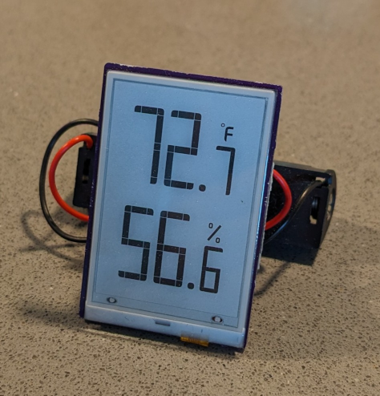
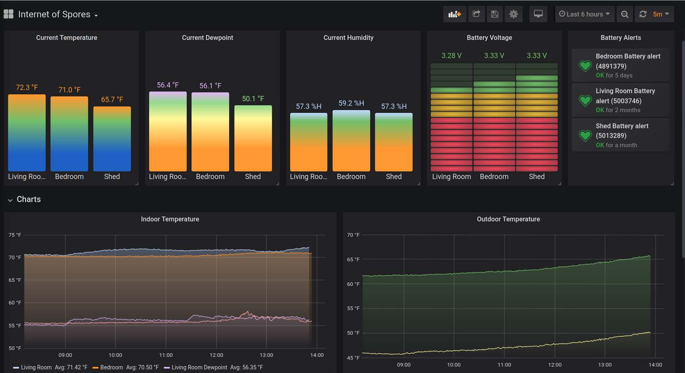

# Internet of Spores
IOT Sensor Platform for ESP8266 Arduino
Specifically targeting Lolin D1 Mini.

## Supported Sensors
* Temperature
  * SHT30
  * HP303B
* Relative Humidity
  * SHT30
* Barometric Pressure
  * HP303B
* Dust/Particle
  * PPD42NS

## Documentation (work-in-progress)
* [Developer Documentation](doc/README.md)
* [User Guide](doc/user_guide.md)

## Toolchain Setup and Library Dependencies

### ESP8266 Arduino
The ESP8266 Arduino toolchain is used to compile the code and provide basic
networking and multitasking services.
Project github: https://github.com/esp8266/Arduino

The toolchain can be installed via the Arduino board manager.
Instructions for this can be found [in their readme](https://github.com/esp8266/Arduino/blob/master/README.md).

#### Supported Version
I have thoroughly tested version 2.5.2 and 2.6.3. The latest version 3.0.2
required some changes to the code and I have not done the same level of testing
on these changes.
See the details below related to configurations/setting differences needed for
each version.

#### Board Setup
Most board settings can be left at their defaults.
* Don't forget to select your board type and COM port
* Need to configure some flash for SPIFFS
  * v2.5.2: select Flash Size "4M (1M SPIFFS)"
  * v2.6.3: select Flash Size "4MB (FS:1MB OTA:~1019KB)"
  * v3.0.2: select Flash Size "4MB (FS:1MB OTA:~1019KB)"

### WiFi Manager
There is a library dependency on WiFiManager by tzapu.
Project github: https://github.com/tzapu/WiFiManager

This can be installed via the library manager.
Please select a compatible version:
* v2.5.2: use WiFiManager version 0.14.0
* v2.6.3: use WiFiManager version 0.15.0-beta
* v3.0.2: use WiFiManager version 0.16.0

### Lolin HP303B Driver
There is a library dependency on the Lolin HP303B driver.
Project github: https://github.com/wemos/LOLIN_HP303B_Library

This is not available in the library manager so it will have to be installed
manually. Clone or download the library from the link above. Installation
instructions can be found [in this guide](https://www.arduino.cc/en/Guide/Libraries).

Tested version from commit 4deb5f.
