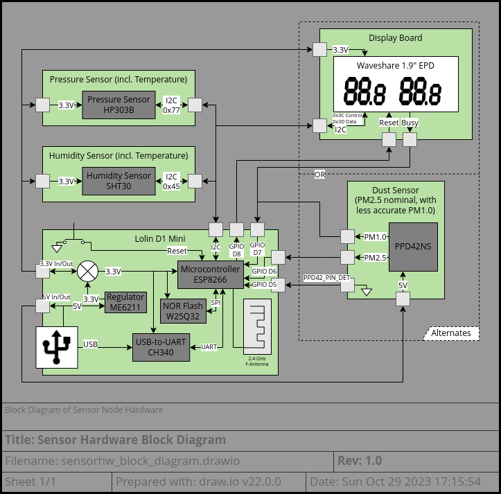
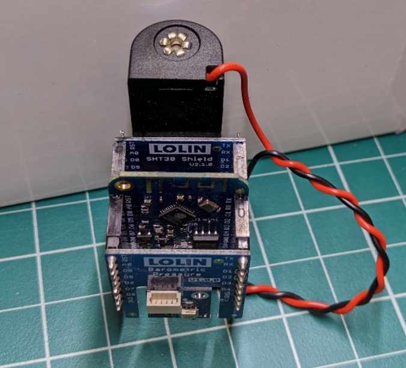
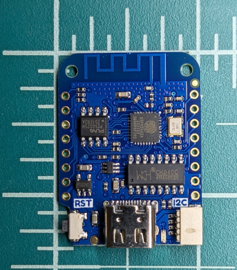
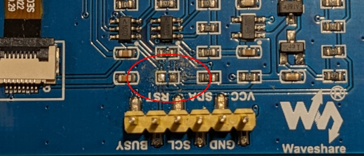

# Sensor Electronic Architecture and Design

## Table of Contents
* [Overview](#overview)
  - [Block Diagram](#block-diagram)
  - [Description](#description)
  - [Restrictions](#restrictions)
  - [Communication Interfaces](#communication-interfaces)
  - [Power Management](#power-management)
* [Schematic](#schematic)
* [Bill of Material](#bill-of-material)

---

## Overview
### Block Diagram

### Description
The sensor nodes are composed of several off-the-shelf boards available from Lolin (formerly Wemos). These boards are compact and have a standard pin-header arrangement allowing them to be easily stacked together. They primarily work from a single 3.3V power rail and a shared I2C bus.  

The main microcontroller board is the D1 Mini which has the bulk of the modules needed for a working IOT development kit.  
  
The onboard microcontroller is an Espressif ESP8266 which features a Tensilica Diamond Standard 106Micro 32-bit CPU core. The ESP8266 has built-in wireless communication in the form of an 802.11 b/g/n MAC with integrated transceiver, balun, and low-noise amplifier (LNA).

The additional supported sensors available from Lolin in this form-factor are:
* Lolin SHT30 Shield  
  
  - Includes Sensiron SHT30 Humidity and Temperature Sensor
* Lolin Barometric Pressure Shield  
  
  - Includes Hope Microelectronics HP303B Digital Pressure Sensor

These sensors also support temperature readout. (The SHT30 will be used in preference to the HP303B since it has higher precision.)

Additional devices outside of Lolin's system are supported:
* PPD42 Dust Sensor  
  
  - This sensor outputs individual "low-pulse occupancy time" (LPO) signals for PM2.5 detections and PM1.0 detections.
  - The differentiation between PM2.5 and PM1.0 should be considered highly suspect and it is recommended to ignore the PM1.0 signal entirely.
  - This sensor is much larger than the D1 mini and requires a custom wiring harness to:
    + Wire the LPO outputs to D6 and D7
    + Wire D5 to ground as a presence detection pin
* Waveshare 1.9" E-Paper Display (EPD)  
  
  - The display has an on-glass IST7134 120-segment EPD Driver
  - This display is available with or without a PCB and pin-header. A custom PCB described in this project can adapt it to the D1 Mini standard header. If purchased with a PCB, the following notes apply:
    + Wire the Reset signal to D8 and the Busy signal to D7
    + Remove the R9 pullup from the Waveshare PCB (see [Usage Restrictions](#usage-restrictions) below)

### Restrictions
#### Usage Restrictions
The PPD42 and EPD cannot both be used simultaneously due to sharing the D7 GPIO pin. Additionally, the PPD42 requires 5V power so it can only be used in "tethered" mode where power is supplied via the USB port.

The Waveshare 1.9" E-Paper Display will not enter low-power mode during deep-sleep if there is a pull-up resistor on its reset pin. R9 can be removed from the Waveshare PCB that comes with these displays to allow reset to function correctly.  
  
Location of R9 Resistor (after removal)

> ⚠️ Warning:
> * The EPD may break when it is dropped or bumped on a hard surface. Handle with care.
> * Should the display break, do not touch the electrophoretic material.
> * In case of contact with electrophoretic material, wash with water and soap.

#### Operating Restrictions
* Waveshare 1.9" EPD
  - Operating Temperature range: 0..50 °C
  - Maximum Relative Humidity: 70%
* ESP8266
  - Operating Temperature range: -40..125 °C
  - IO Pin Maximum Current: 12 mA
* ME6211
  - Operating Temperature range: -40..85 °C
* CH340
  - Operating Temperature range: -20..70 °C
  - Maximum Voltage on Any Pin: VCC+0.5V
* P25Q32SH
  - Operating Temperature range: -40..85 °C
  - Maximum Voltage on Any Pin: 4.1V
* SHT30
  - Operating Temperature range: -40..125 °C
  - Recommended Operating Temp: 5..60 °C
  - Recommended Operating Humidity: 20..80%
  - Maximum Voltage on Any Pin: VDD+0.5V
* HP303B
  - Operating Temperature range: -40..85 °C
  - Operating Pressure range: 300..1200 hPa
  - Maximum Voltage on Any Pin: 4V
* PPD42NS
  - Operating Voltage Ripple: < 30mV
  - Operating Temperature range: 0..45 °C
  - Maximum Relative Humidity: 95%

#### Storage Restrictions
* ME6211
  - Storage Temperature range: -55..125 °C
* CH340
  - Storage Temperature range: -55..125 °C
* P25Q32SH
  - Storage Temperature range: -65..150 °C
* Waveshare 1.9" EPD
  - Storage Temperature range: 0..50 °C
  - Maximum Relative Humidity: 70%
* HP303B
  - Storage Temperature range: -40..125 °C
* PPD42NS
  - Storage Temperature range: -30..60 °C

### Communication Interfaces
#### GPIO
* Inputs
  - D5 (GPIO14) - Presence Detection (PPD42)
  - D6 (GPIO12) - PM2.5 LPO (PPD42)
  - D7 (GPIO13) - Busy (EPD) / PM1.0 LPO (PPD42)
* Outputs
  - D8 (GPIO15) - Reset (EPD)

#### I2C
* SHT30 - Address 0x45
* HP303B - Address 0x77
* Waveshare 1.9" EPD
  - Control - Address 0x3C
  - Data - Address 0x3D

#### SPI
SD/SPI port is connected to the flash memory.
This uses SPI CS0 and utilizes quad-spi for faster transfer rates.
Interface is compatible with Winbond W25Q flash memories.  

#### UART
Debug output from ESP8266 is connected to CH340 USB-to-UART ASIC.
This is used for debugging, troubleshooting, and uploading new firmware.  

#### WiFi
The ESP8266 has a built-in 802.11 b/g/n MAC with support for WPA2.

### Power Management
#### Power Options
The Sensor Nodes can be powered either from USB or Battery power.  
USB 5V power input is fed through an LDO regulator to produce a 3.3V supply. Alternately, an external 5V power supply can be fed into the 5V pin header.  
A 3.3V external power supply can be fed into the 3V3 pin header.

> 🪧 Note:  
> The PPD42NS Dust Sensor require a 5V supply and cannot be powered from a 3.3V external supply.

A LiFePO₄ battery is suitable as an external supply via the 3V3 pin header.  
All ICs are compatible with the typical voltage range of a LiFePO₄ battery, which is 2.8-3.6V. See the [table below](#input-voltage-ranges) for more details.
While it is possible for a LiFePO₄ to exceed 3.6V, it would very quickly fall down below 3.5V as it discharges -- in practice this does not pose a problem.

> 🪧 Note:  
> It is probably best to avoid powering the sensor node from USB while a battery is connected. The 3.3V LDO will attempt to "charge" the battery which could exceed the current output rating of the LDO or damage the battery.

#### Input Voltage Ranges

Device/Node            | Min | Nom | Max (V)
-----------------------|-----|-----|--------
ESP8266 VCC            | 2.5 | 3.3 | 3.6
ME6211 VIN             | 4.3 | 5.0 | 6.5
CH340 VCC              | 3.1 | 3.3 | 3.6
P25Q32SH VCC           | 2.3 | 3.3 | 3.6
Waveshare 1.9" EPD VDD | 1.9 | 3.0 | 3.6
SHT30 VDD              | 2.4 | 3.3 | 5.5
HP303B                 | 1.7 | 3.3 | 3.6
PPD42NS                | 4.5 | 5.0 | 5.5
 
#### EPD Power Consumption
The Waveshare 1.9" EPD supports partial updates as long as it has not been reset. If it is reset however, updates to the display will involve a full refresh.  
Leaving the display running while the ESP8266 is in deep sleep results in a noticeable power draw (~310 μA). There is therefore a trade-off between the extra time taken to refresh the display with the 310 μA continuous current draw.

Note that a full display refresh causes a double impact -- not only does it consume a large amount of current (mA), it takes several seconds (2-6 s depending on temperature). During this time, everything on the sensor node is drawing power, not just the display. So, this actively inhibits the sensor node from getting to sleep quickly.

Waveshare recommend doing a full refresh of the display every 3 minutes, so the power savings of a partial refresh would only be achieved on ⅔ of the wake-up cycles. This 3 minute suggestion is probably overly conservative when the display is primarily used at room temperature. Nonetheless, this tips the balance in favor of keeping the display in reset during deep-sleep.

---

## Schematic
- Link to Lolin schematics
- Link to Particle Counter datasheet?
- E-Paper Board Schematic

---

## Bill of Material
- Link to AliExpress for Lolin components
- Link any datasheets
  + SPI Flash - Puya Semi P25Q32SH - https://www.puyasemi.com/uploadfiles/2021/08/202108231525172517.pdf
  + Espressif ESP8266 - https://www.espressif.com/sites/default/files/documentation/0a-esp8266ex_datasheet_en.pdf
  + MicrOne ME6211 - https://datasheet.lcsc.com/lcsc/1811131510_MICRONE-Nanjing-Micro-One-Elec-ME6211C33M5G-N_C82942.pdf  
    http://www.microne.com.cn/ProductDetail.aspx?id=4
  + WinChipHead CH340 - https://www.wch-ic.com/downloads/file/79.html
    https://www.mouser.com/datasheet/2/813/DS-16278-CH340E-1826268.pdf
- Link to datasheet for Particle Counter
- Link to datasheet for Waveshare display
- Table of E-Paper Board BOM

