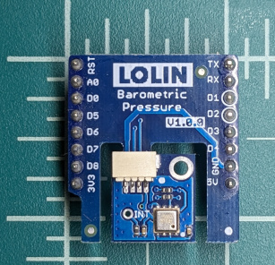
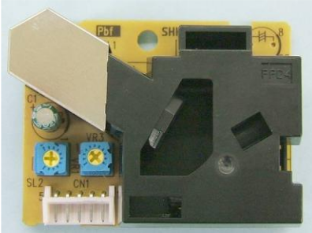

# Sensor Electronic Architecture
This outline is currently a work-in-progress.

## Table of Contents
* [Overview](#overview)
  - [Block Diagram](#block-diagram)
  - [Description](#description)
  - [Restrictions](#restrictions)
  - [Communication Interfaces](#communication-interfaces)
  - [Power Management](#power-management)
* [Schematic](#schematic)
* [Bill of Material](#bill-of-material)

---

## Overview
### Block Diagram

### Description
The sensor nodes are composed of several off-the-shelf boards available from Lolin (formerly Wemos). These boards are compact and have a standard pin-header arrangement allowing them to be easily stacked together. They primarily work from a single 3.3V power rail and a shared I2C bus.  

The main microcontroller board is the D1 Mini which has the bulk of the modules needed for a working IOT development kit.  

The additional supported sensors available from Lolin in this form-factor are:
* SHT30 Humidity Sensor  
  
* HP303B Barometric Pressure Sensor  
  

These sensors also support temperature readout; the SHT30 will be used in preference to the HP303B since it has higher precision.

Additional devices outside of Lolin's system are supported:
* PPD42 Dust Sensor  
    
  This sensor is much larger than the D1 mini and requires a custom wiring harness to:
  - Wire the low-pulse occupancy time (LPO) outputs to D6 and D7
  - Wire D5 to ground as a presence detection pin
* Waveshare 1.9" E-Paper Display (EPD)  
    
  This display is available with or without a PCB and pin-header. A custom PCB described in this project can adapt it to the D1 Mini standard header. If purchased with a PCB, the following notes apply:
  - Wire the Reset signal to D8 and the Busy signal to D7
  - Remove the R9 pullup from the Waveshare PCB to allow the display to enter reset when the ESP8266 is in deep-sleep mode

### Restrictions
The PPD42 and EPD cannot both be used simultaneously due to sharing the D7 GPIO pin. Additionally, the PPD42 requires 5V power so it can only be used in "tethered" mode where power is supplied via the USB port.

The Waveshare 1.9" E-Paper Display will not enter low-power mode during deep-sleep if there is a pull-up resistor on its reset pin. R9 can be removed from the Waveshare PCB that comes with these displays to allow reset to function correctly.

### Communication Interfaces
#### GPIO
* Inputs
  - D5 (GPIO14) - Presence Detection (PPD42)
  - D6 (GPIO12) - PM2.5 LPO (PPD42)
  - D7 (GPIO13) - Busy (EPD) / PM1.0 LPO (PPD42)
* Outputs
  - D8 (GPIO15) - Reset (EPD)

#### I2C
* SHT30 - Address 0x45
* HP303B - Address 0x77
* Waveshare 1.9" EPD
  - Control - Address 0x3C
  - Data - Address 0x3D

#### SPI
SD/SPI port is connected to the flash memory.
This uses SPI CS0 and utilizes quad-spi for faster transfer rates.
Interface is compatible with Winbond W25Q flash memories.  

#### UART
Debug output from ESP8266 is connected to CH340 USB-to-UART ASIC.
This is used for debugging, troubleshooting, and uploading new firmware.  

### Power Management
- USB/Battery Power
- LiFePO4 Suitability Analysis
- E-Paper Display Power Draw

---

## Schematic
- Link to Lolin schematics
- Link to Particle Counter datasheet?
- E-Paper Board Schematic

---

## Bill of Material
- Link to AliExpress for Lolin components
- Link any datasheets
  + SPI Flash - Puya Semi P25Q32SH - https://www.puyasemi.com/uploadfiles/2021/08/202108231525172517.pdf
- Link to datasheet for Particle Counter
- Link to datasheet for Waveshare display
- Table of E-Paper Board BOM

