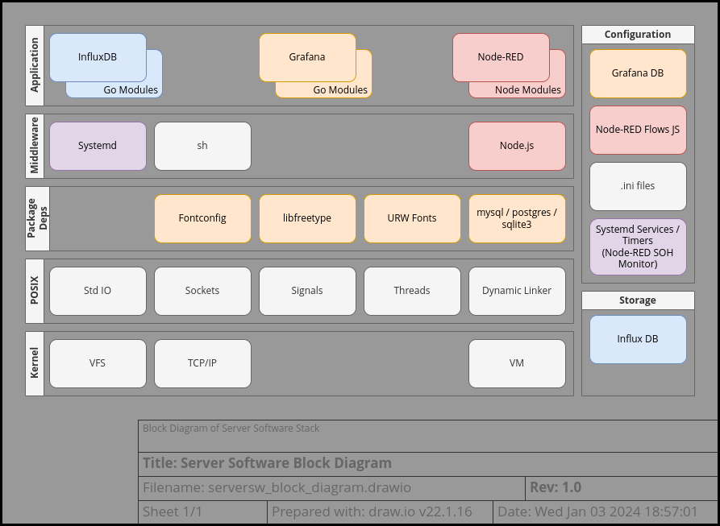

# Server Software Architecture
This outline is currently a work-in-progress.

## Table of Contents

* [Block Diagram](#block-diagram)
* [External Dependencies](#external-dependencies)
* [Component Description](#component-description)
  - [Packaged Applications](#packaged-applications)
    + [Node-RED](#node-red)
    + [InfluxDB](#influxdb)
    + [Grafana](#grafana)
  - [Node-RED Flows](#node-red-flows)
  - [Node-RED SOH Monitor](#node-red-soh-monitor)
* [Dynamic Behavior](#dynamic-behavior)
  - [Modes of Operation](#modes-of-operation)
* [Cybersecurity](#cybersecurity)
* [Error Handling](#error-handling)

--------------------------------------------------------------------------------

## Block Diagram

  
The server software is the most loosely defined part of the system. It is mostly
based on packaged software that can be configured by the end-user. The version
of the components used and even the operating system are largely immaterial.
And, there is broad flexibility to split up the components across multiple
physical or virtual computers.  
The above diagram shows an example configuration with a Linux kernel and all
server components running on a single system. This might be a Raspberry PI SBC
(single board computer) or a rack server running Ubuntu Server edition. Many of
the components are available via Docker, further increasing flexibility of
deployment.

At a high level, the software stack can be broken down into "applications" and
"system services".  
As long as the packaged applications have their dependencies met, the underlying
system services are relatively unimportant.  
In the above diagram, the "middleware", "package deps", "POSIX" API, and
"Kernel" layers are all part of the system services. These will be described
briefly here and in the [External Dependencies](#external-dependencies) section,
but detailed information on these is out-of-scope for this documentation.

The "applications" will be discussed in some additional detail in this document
but won't be covered in the [detailed design](server_design_detail.md) document
as these are packaged applications that have their own design documentation.

Likewise, the "configuration" and "storage" aspects of the diagram will not be
discussed further since this is up to the end user. The exception is the
[Node-RED Flows](#node-red-flows) and
[Node-RED SOH Monitor](#node-red-soh-monitor) (which is implemented via systemd
timers). These are the main contribution of this project to the server
configuration and will be discussed in detail here and in the
[detailed design](server_design_detail.md) document.

All of these applications are POSIX-based and require suitable system services
provided by the C library and kernel to support their operation.  
The block diagram has standard POSIX services listed alongside typical kernel
services provided by the OS. These are likely an incomplete list on both counts
and are merely suggestive of a typical software stack for the server.  
To elaborate, slightly:
* Std IO - file and stream IO
* Sockets - [Berkeley socket](https://en.wikipedia.org/wiki/Berkeley_sockets)
  implementation
* Signals - POSIX process and exception signalling
* Threads - POSIX pthread implementation
* Dynamic Linker - C API to provide dynamic loading (e.g. dlopen, etc.) as well
  as a runtime dynamic linker provided by the OS (e.g. ld.so)
* VFS - Virtual File System (Linux-specific file system namespace and structure)
* TCP/IP - stack provided by the OS for TCP/IP communication
* VM - Virtual Memory provided by the OS (e.g. system calls like mmap as well as
  separation of process memory)

Ultimately, the organization of the server applications provides 3 functions
that are useful to the overall system:
1. Management Logic for the sensor nodes (provided by [Node-RED](#node-red))
2. Database for storing sensor readings (provided by [InfluxDB](#influxdb))
3. Display of sensor readings (completely optional, but discussed here as
   [Grafana](#graphana))

Since the interface between these components is TCP/IP, they can be freely
moved, upgraded, and, to some extent, replaced.

--------------------------------------------------------------------------------

## External Dependencies

__Packaged Applications__  
These packaged applications are provided by 3rd parties. It should be stressed
that the version specified is not so important and the latest version should
work correctly.

| External Dependency | Tested Version | Link
|---------------------|----------------|------
| Node-RED            | 0.20.7         | https://nodered.org/
| InfluxDB            | 1.7.8          | https://www.influxdata.com/
| Grafana             | 6.5.2          | https://grafana.com/

These are used essentially in their stock configuration with the exception of
Node-RED. The provided Node-RED flows require a few community-supplied plugins.

__Package Dependencies__  
On my system, Grafana has the following dependencies on additional packages:

| External Dependency | Notes
|---------------------|------
| Bourne shell        | e.g. bash
| Init Service        | e.g. SysV init or systemd
| Fontconfig          | http://fontconfig.org/
| FreeType library    | https://freetype.org/
| urw-fonts           | open fonts package

This list will obviously differ from one operating system distribution to
another and should automatically be resolved by the Grafana installer or system
package manager.

__Additional Dependencies__

_Grafana_  
Grafana requires a back-end database to store its configuration. This can be
provided via MySQL, PostgreSQL, or SQLite3 (which is the default).  
The selection is configured via the configuration .ini file and the appropriate
system library needs to be available via dlopen call.

Since Grafana is written in [Go](https://go.dev/), it has dependencies on many
additional Go Modules. These are provided alongside the application and,
generally, don't require explicit installation.

_InfluxDB_

Since InfluxDB is written in [Go](https://go.dev/), it has dependencies on many
additional Go Modules. These are provided alongside the application and,
generally, don't require explicit installation.

_Node-RED_  

Since Node-RED is written in [Node.js](https://nodejs.org/), it requires the
Node.js interpreter and npm utility to be installed on the system.

| External Dependency | Tested Version | Link
|---------------------|----------------|------
| Node.js             | 10.16.3        | https://nodejs.org/
| npm                 | 6.9.0          | https://www.npmjs.com/

Likewise, it has dependencies on many additional Node.js Modules. These should
be installed alongside the application automatically using the npm package
manager. It is suggested to follow the installation instructions on the
[website](https://nodered.org/docs/getting-started/local).  
An option to install via docker or snap appears to be available, but these
options are untested by the author of this document.

__Additional Plugins__

The provided Node-RED flows require a few community-supplied plugins.
Again, the specific version is probably not so important and the latest version
should work.  
These need to be installed through the Node-RED UI.

| Node-RED Plugin           | Tested Version | Link
|---------------------------|----------------|------
| node-red-contrib-influxdb | 0.3.1          | https://flows.nodered.org/node/node-red-contrib-influxdb
| node-red-contrib-md5      | 1.0.4          | https://flows.nodered.org/node/node-red-contrib-md5
| node-red-contrib-readdir  | 1.0.1          | https://flows.nodered.org/node/node-red-contrib-readdir

Without these the provided Node-RED flows will not start.  
It may be possible to install these in an automated way (e.g. as part of your
docker script).

--------------------------------------------------------------------------------

## Component Description

### Packaged Applications

#### Node-RED

#### Influx DB

#### Grafana

### Node-RED Flows

### Node-RED SOH Monitor

--------------------------------------------------------------------------------

## Dynamic Behavior

### Modes of Operation
- Normal Mode
- Node-red SOH Failure

### Sensor Processing
Describe incoming sensor readings, their storage in influxdb, their presentation in grafana.

### OTA Update
Describe Node-red FW Update process.
Describe Node-red Calibration/configuration update process.

### Node-red SOH
Describe SOH monitoring for Node-red

--------------------------------------------------------------------------------

## Cybersecurity

--------------------------------------------------------------------------------

## Error Handling
- Grafana Sensor Alert (monitoring)
- Node-red packet parsing
- Node-red SOH monitoring
- Node-red debugging

