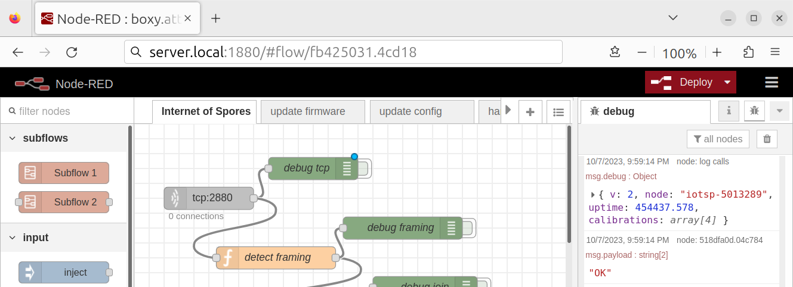

# Server Software Architecture

## Table of Contents

* [Overview and Block Diagram](#overview-and-block-diagram)
* [External Dependencies](#external-dependencies)
* [Component Description](#component-description)
  - [Packaged Applications](#packaged-applications)
    + [Node-RED](#node-red)
    + [InfluxDB](#influxdb)
    + [Grafana](#grafana)
  - [Node-RED Flows](#node-red-flows)
  - [Node-RED SOH Monitor](#node-red-soh-monitor)
* [Dynamic Behavior](#dynamic-behavior)
  - [Modes of Operation](#modes-of-operation)
* [Cybersecurity](#cybersecurity)
  - [Node-RED Security](#node-red-security)
  - [InfluxDB Security](#influxdb-security)
  - [Grafana Security](#grafana-security)
* [Error Handling](#error-handling)

--------------------------------------------------------------------------------

## Overview and Block Diagram

  
The server software is the most loosely defined part of the system. It is mostly
based on packaged software that can be configured by the end-user. The version
of the components used and even the operating system are largely immaterial.
And, there is broad flexibility to split up the components across multiple
physical or virtual computers.  
The above diagram shows an example configuration with a Linux kernel and all
server components running on a single system. This might be a Raspberry PI SBC
(single board computer) or a rack server running Ubuntu Server edition. Many of
the components are available via Docker, further increasing flexibility of
deployment.

At a high level, the software stack can be broken down into "applications" and
"system services".  
As long as the packaged applications have their dependencies met, the underlying
system services are relatively unimportant.  
In the above diagram, the "middleware", "package deps", "POSIX" API, and
"Kernel" layers are all part of the system services. These will be described
briefly here and in the [External Dependencies](#external-dependencies) section,
but detailed information on these is out-of-scope for this documentation.

The "applications" will be discussed in some additional detail in this document
but won't be covered in the [detailed design](server_design_detail.md) document
as these are packaged applications that have their own design documentation.

Likewise, the "configuration" and "storage" aspects of the diagram will not be
discussed further since this is up to the end user. The exception is the
[Node-RED Flows](#node-red-flows) and
[Node-RED SOH Monitor](#node-red-soh-monitor) (which is implemented via systemd
timers). These are the main contribution of this project to the server
configuration and will be discussed in detail here and in the
[detailed design](server_design_detail.md) document.

All of these applications are POSIX-based and require suitable system services
provided by the C library and kernel to support their operation.  
The block diagram has standard POSIX services listed alongside typical kernel
services provided by the OS. These are likely an incomplete list on both counts
and are merely suggestive of a typical software stack for the server.  
To elaborate, slightly:
* Std IO - file and stream IO
* Sockets - [Berkeley socket](https://en.wikipedia.org/wiki/Berkeley_sockets)
  implementation
* Signals - POSIX process and exception signalling
* Threads - POSIX pthread implementation
* Dynamic Linker - C API to provide dynamic loading (e.g. dlopen, etc.) as well
  as a runtime dynamic linker provided by the OS (e.g. ld.so)
* VFS - Virtual File System (Linux-specific file system namespace and structure)
* TCP/IP - stack provided by the OS for TCP/IP communication
* VM - Virtual Memory provided by the OS (e.g. system calls like mmap as well as
  separation of process memory)

Ultimately, the organization of the server applications provides 3 functions
that are useful to the overall system:
1. Management Logic for the sensor nodes (provided by [Node-RED](#node-red))
2. Database for storing sensor readings (provided by [InfluxDB](#influxdb))
3. Display of sensor readings (completely optional, but discussed here as
   [Grafana](#graphana))

Since the interface between these components is TCP/IP, they can be freely
moved, upgraded, and, to some extent, replaced.

--------------------------------------------------------------------------------

## External Dependencies

__Packaged Applications__  
These packaged applications are provided by 3rd parties. It should be stressed
that the version specified is not so important and the latest version should
work correctly.

| External Dependency | Tested Version | Link
|---------------------|----------------|------
| Node-RED            | 0.20.7         | https://nodered.org/
| InfluxDB            | 1.7.8          | https://www.influxdata.com/
| Grafana             | 6.5.2          | https://grafana.com/

These are used essentially in their stock configuration with the exception of
Node-RED. The provided Node-RED flows require a few community-supplied plugins.

__Package Dependencies__  
On my system, Grafana has the following dependencies on additional packages:

| External Dependency | Notes
|---------------------|------
| Bourne shell        | e.g. bash
| Init Service        | e.g. SysV init or systemd
| Fontconfig          | http://fontconfig.org/
| FreeType library    | https://freetype.org/
| urw-fonts           | open fonts package

This list will obviously differ from one operating system distribution to
another and should automatically be resolved by the Grafana installer or system
package manager.

__Additional Dependencies__

_Grafana_  
Grafana requires a back-end database to store its configuration. This can be
provided via MySQL, PostgreSQL, or SQLite3 (which is the default).  
The selection is configured via the configuration .ini file and the appropriate
system library needs to be available via dlopen call.

Since Grafana is written in [Go](https://go.dev/), it has dependencies on many
additional Go Modules. These are provided alongside the application and,
generally, don't require explicit installation.

An option to install via docker appears to be available, but this option is
untested by the author of this document.

_InfluxDB_

Since InfluxDB is written in [Go](https://go.dev/), it has dependencies on many
additional Go Modules. These are provided alongside the application and,
generally, don't require explicit installation.

_Node-RED_  

Since Node-RED is written in [Node.js](https://nodejs.org/), it requires the
Node.js interpreter and npm utility to be installed on the system.

| External Dependency | Tested Version | Link
|---------------------|----------------|------
| Node.js             | 10.16.3        | https://nodejs.org/
| npm                 | 6.9.0          | https://www.npmjs.com/

Likewise, it has dependencies on many additional Node.js Modules. These should
be installed alongside the application automatically using the npm package
manager. It is suggested to follow the installation instructions on the
[nodered.org website](https://nodered.org/docs/getting-started/local).  
An option to install via docker or snap appears to be available, but these
options are untested by the author of this document.

__Additional Plugins__

The provided Node-RED flows require a few community-supplied plugins.
Again, the specific version is probably not so important and the latest version
should work.  
These need to be installed through the Node-RED UI.

| Node-RED Plugin           | Tested Version | Link
|---------------------------|----------------|------
| node-red-contrib-influxdb | 0.3.1          | https://flows.nodered.org/node/node-red-contrib-influxdb
| node-red-contrib-md5      | 1.0.4          | https://flows.nodered.org/node/node-red-contrib-md5
| node-red-contrib-readdir  | 1.0.1          | https://flows.nodered.org/node/node-red-contrib-readdir

Without these the provided Node-RED flows will not start.  
It may be possible to install these in an automated way (e.g. as part of your
docker script).

--------------------------------------------------------------------------------

## Component Description

### Packaged Applications

These 3rd-party applications come packaged for the OS (or container system) and
have their own external detailed documentation. However, they don't generally
have an architectural overview available as part of their public documentation,
so there will be some discussion of these aspects in the next few chapters.

#### Node-RED

##### Description

  
[Node-RED](https://nodered.org/) is a [Node.js](https://nodejs.org/) application
that provides a flow-based, visual-programming environment for creating the
glue-logic that connects the networked IOT sensors to the backend database.

Public documentation for Node-RED, including installation instructions and API
reference can be found on [the nodered.org website](https://nodered.org/docs/).

##### Dependencies

See [External Dependencies](#external-dependencies) for notes about the
dependencies on Node.js and the additional Node-RED plugins needed.  

##### Configuration

Configuration of this component is provided via the settings.js file in its
runtime directory.  
See the
[documentation](https://nodered.org/docs/user-guide/runtime/settings-file)
on the nodered.org site for more details.

Additionally, the flows that will be executed are loaded from the same
directory. The flows to work with the sensor nodes in this project are provided
in [flows.json](../node-red/flows.json). More details about these flows are
described [below](#node-red-flows).

##### Public API

The Node-RED server listens on TCP port 1880 (by default).  
On this port, it will provide a standard web (HTTP) interface for access via a
web browser. With this interface, it provides access to the flow editor and
debug console.  


#### InfluxDB

##### Description

  
[InfluxDB](https://www.influxdata.com/) is a time series database used to store
the sensor readings received from the sensor nodes.  
Public documentation for InfluxDB, including installation instructions and API
reference can be found on
[the influxdata.com website](https://docs.influxdata.com/influxdb/v2/).

The use of InfluxDB in this system can be replaced with a different database
storage backend if the [Node-RED Flows](#node-red-flows) are updated
accordingly.

##### Dependencies

InfluxDB is generally installed with all of the dependencies it needs.  
A POSIX-compatible C library is assumed.

##### Configuration

Configuration of this component is provided via the influxdb.conf file in the
associated config directory.  
See the [InfluxDB configuration options](https://docs.influxdata.com/influxdb/v2/reference/config-options/)
for more details.

##### Public API

The InfluxDB server listens on TCP port 8086 (by default).  
On this port, it will provide a REST API for database queries.
See the [API documentation](https://docs.influxdata.com/influxdb/v2/api-guide/)
on the influxdata.com website for more details.

The InfluxDB server also listens on TCP port 8088 for interfacing with other
InfluxDB controllers. This functionality is not used within this system.

#### Grafana

##### Description

  
[Grafana](https://grafana.com/) is an interactive analytics and chart
visualization application which can be used to display the sensor data stored in
the [InfluxDB database](#influxdb).  
Public documentation for Grafana, including installation instructions can be
found on [the grafana.com website](https://grafana.com/oss/grafana/).

The use of Grafana in this system can be replaced with any suitable data
visualizer frontend that has support for InfluxDB.

##### Dependencies

See [External Dependencies](#external-dependencies) for notes about the
dependencies on system libraries and services. These will generally be resolved
by the installer or your package manager.

##### Configuration

Configuration of this component is provided via the grafana.ini file in the
associated config directory.  
See the [configuration options](https://grafana.com/docs/grafana/latest/setup-grafana/configure-grafana/)
for more details.

Additionally, the users of Grafana can create and configure dashboards according
to their needs. These are stored in a SQL database provided by a backend that is
configurable (sqlite by default).

##### Public API

The Grafana server listens on TCP port 3000 (by default).  
On this port, it will provide a standard web (HTTP) interface for access via a
web browser. With this interface, it provides access to the dashboards and data
source configuration  


### Node-RED Flows

##### Description

  
The [Node-RED Flows](../node-red/flows.json) provide the glue logic for the
system. By running these flows in [Node-RED](#node-red), the server will listen
for incoming connections on TCP port 2880 (by default) and process the request
to perform one of 3 actions:
1. Process sensor readings and store them in the configured InfluxDB database
2. Transmit a firmware update file
3. Transmit a configuration update file

To store the sensor readings, the readings are processed (to calculate an
absolute timestamp) and the InfluxDB API is used to transmit the data to
[InfluxDB](#influxdb) on TCP port 8086.  
The readings are transmitted as a json string for easy processing within
Node-RED.  
If the readings are stored successfully, an "OK" string is sent back to the
sensor node; otherwise an "error" string is returned. If there are available
firmware or configuration updates for the sensor node, ",config" or ",update"
are appended to the response string.

Normal POSIX directory and file operations are used to find relevant firmware
and configuration update files.

There is an additional flow for logging a heartbeat message, related to the
[Node-RED SOH Monitor](#node-red-soh-monitor).

##### Dependencies

The flows depend on [Node-RED](#node-red) and the corresponding Node.js
installation to execute.  
Refer also to the "Additional Plugins" sub-section of
[External Dependencies](#external-dependencies) for information about some
additional Node-RED plugins that need to be installed manually before the flows
will start.

##### Configuration

There are 3 main aspects of the flows that may need to be configured:
1. The level of debug logging that is displayed
2. The TCP port to listen on for incoming connections
3. The details of the InfluxDB database

1:  
To enable additional debug logging, simply click the green button next to one of
the debug nodes. There is no need to "deploy" the flows unless you want the
change to the setting to be remembered permanently.  


> 🪧 Note: The debug messages from the debug nodes show up in the debug
> side-panel and not in the console output or systemd journal.
> To log messages to the console, the `console.log()` function must be used
> explicitly from a javascript function node.

2:  
The TCP port to listen on can be configured by modifying the TCP node on the
first page of flows.  


3:  
The InfluxDB database details can be configured by modifying the influx batch
node (labeled "Home") on the "handle sensor readings" page.  


##### Public API

The API for interacting with Node-RED Flows is by sending a json string via TCP
port 2880. This is currently version 2 of the API.

There are 2 basic packet types: measurements and commands.  
For measurement, a type field identifies the type of measurement that is being
transmitted. The final measurement packet has some additional fields.  
Commands request the server to perform some function. The possible commands are:
"get_config", "delete_config", and "update"

###### Measurements

Most measurement packets have this format:
```json
{
  "version":2,
  "node":String,         #name of the sensor node
  "firmware":String,     #firmware name/identifier (preinit_magic)
  "measurements":
    [                    #array of sensor readings
      {                  #sensor reading object
        "type":String,   #name for the type of sensor reading
                         #possible values types are:
                         # "unknown",
                         # "temperature",
                         # "humidity",
                         # "pressure",
                         # "particles 1.0µm",
                         # "particles 2.5µm",
                         # "battery"
        "value":Number
      },
      ...
    ],
  "time_offset":Number   #The age in ms of the measurement
                         #Note: this should be expressed as a negative number
}
```

The final measurement packet should include the "uptime" measurement to trigger
the bulk transfer to InfluxDB. It also includes the sensor calibrations for
debugging purposes.
```json
{
  "version":2,
  "node":String,         #name of the sensor node
  "firmware":String,     #firmware name/identifier (preinit_magic)
  "measurements":
    [                    #array of sensor readings
      {                  #sensor reading Object
        "type":String,   #name for the type of sensor reading
                         #possible strings for type are:
                         # "unknown",
                         # "temperature",
                         # "humidity",
                         # "pressure",
                         # "particles 1.0µm",
                         # "particles 2.5µm",
                         # "battery"
        "value":Number
      },
      ...
      {
        "type":"uptime",
        "value":Number   #sensor node uptime in seconds
      }
    ],
  "calibrations":
    [                    #array of calibration vallues
      {                  #calibration Object
        "type":String,   #name for the type of calibration
                         #possible strings for type are:
                         # "temperature",
                         # "humidity",
                         # "pressure",
                         # "battery"
        "value":Number
      },
      ...
    ],
  "time_offset":Number   #The age in ms of the measurement
                         #Note: this should be expressed as a negative number
}
```

After receiving each measurement, the server will respond with a simple string composed of a comma separated list of response flags.  
If the measurement was parsed properly, it will respond with "OK", otherwise it
will respond with "error".  
If there is a firmware update available, the server will include ",update" in
its response. If there is a configuration file update available, the server will
include ",config" in its response.  
Finally, the server's response will end with a newline character `\n`.

###### Commands

**get_config**  
The get_config command requests the server to send a configuration update to the
sensor node.

```json
{
  "version":2,
  "node":String,          #name of the sensor node
  "firmware":String,      #firmware name/identifier (preinit_magic)
  "command":"get_config",
  "arg":String            #the filename requested
                          #possible strings for the filename arg are:
                          # "node_name",
                          # "report_host_name",
                          # "report_host_port",
                          # "clock_drift_calibration",
                          # "temperature_calibration",
                          # "humidity_calibration",
                          # "pressure_calibration",
                          # "battery_calibration",
                          # "sleep_time_ms",
                          # "high_water_slot"
}
```

If the server cannot find the relevant config file, it will respond with a
single newline character `\n`.

If the server is able to find the relevant config file, it will respond with 3
concatenated parameters:
1. The size of the file data (formatted as an ASCII string) followed by a
   newline character.
2. The md5sum of the file data followed by a newline character.
3. The byte data contents of the file.

Note that the final parameter is not a string and not terminated with a newline
character. In practice, the content of the config files will be ASCII strings,
but this response format is more general and could support binary data if
needed.

**delete_config**  
The delete_config command requests the server to delete a configuration update file and no longer inform the sensor node about it. This is used after the
sensor node has applied the configuration update.

```json
{
  "version":2,
  "node":String,             #name of the sensor node
  "firmware":String,         #firmware name/identifier (preinit_magic)
  "command":"delete_config",
  "arg":String               #the filename requested
                             #possible strings for the filename arg are:
                             # "node_name",
                             # "report_host_name",
                             # "report_host_port",
                             # "clock_drift_calibration",
                             # "temperature_calibration",
                             # "humidity_calibration",
                             # "pressure_calibration",
                             # "battery_calibration",
                             # "sleep_time_ms",
                             # "high_water_slot"
}
```

The server will respond with a single newline character `\n`.

**update**  
The update command requests the server to send the waiting firmware update.

```json
{
  "version":2,
  "node":String,      #name of the sensor node
  "firmware":String,  #firmware name/identifier (preinit_magic)
  "command":"update",
  "arg":String        #the firmware name for the sensor node
                      #typical strings for the firmware name arg are:
                      # "iotsp-battery",
                      # "iotsp-tethered"
}
```

If the server cannot find the relevant firmware update file, it will respond
with a the string, `0\n`.

If the server is able to find the relevant firmware update file, it will respond
with 3 concatenated parameters:
1. The size of the update file data (formatted as an ASCII string) followed by a
   newline character.
2. The md5sum of the update file data followed by a newline character.
3. The byte data contents of the firmware update file.

Note that the final parameter is not a string and not terminated with a newline
character. This will be binary file data directly transmitted.

### Node-RED SOH Monitor


--------------------------------------------------------------------------------

## Dynamic Behavior

### Modes of Operation
- Normal Mode
- Node-red SOH Failure

### Sensor Processing
Describe incoming sensor readings, their storage in InfluxDB, their presentation in Grafana.

### OTA Update
Describe Node-red FW Update process.
Describe Node-red Calibration/configuration update process.

### Node-red SOH Behavior
Describe SOH monitoring for Node-red

--------------------------------------------------------------------------------

## Cybersecurity

> ⚠️ Caution: Cybersecurity was not a primary design consideration for the
> system.  
> Using this system outside of a "hobbyist" environment is not recommended and
> any serious use would require a thorough threat analysis and risk assessment
> (TARA).  
> It is worth reviewing the
> [Cybersecurity](system_architecture.md#cybersecurity) section of the system
> architecture as a starting point.

### Node-RED Security

By default, the Node-RED flow editor is unsecured. Anyone with access to the network can modify its behavior and responses to the sensor nodes. Likewise, the
debug console can be used to monitor the incoming sensor readings.

> ⚠️ Caution: Only run Node-RED in a trusted local network environment.

This page, [Securing Node-RED](https://nodered.org/docs/user-guide/runtime/securing-node-red), provides some information on how to improve the security of Node-RED and add user-authentication. However, it is still probably unwise to expose Node-RED to the public internet.

The TCP connection on port 2880 between the sensor nodes and Node-RED is
unauthenticated. The sensor nodes will connect to any server and believe that it
is the correct destination.  
Further, the sensor nodes will obey any response received from the Node-RED
server -- including [firmware updates](#ota-update). This makes it relatively
trivial for an attacker with access to the WiFi network (or who can spoof the
network) to upload arbitrary firmware to the sensor nodes.

It may be possible to set up SSL certificates for the Node-RED server.  
The ESP8266 can make SSL connections and might even have some basic ability
for certificate pinning. The latter would probably be necessary to be able to
have any significant trust in the authentication of the server; unfortunately,
it would also require some code modifications to add support.

### InfluxDB Security

By default, the InfluxDB database is unsecured. Anyone with access to the
network can perform queries that inject or modify stored data. Likewise, users
with shell access to the host where the server is running can probably access
the InfluxDB console and perform arbitrary administrative operations.

> ⚠️ Caution: Only run InfluxDB in a trusted environment with appropriate
> firewall configuration.

The InfluxDB documentation provides some guidance for
[managing security and authorization](https://docs.influxdata.com/influxdb/v2/admin/security/).

### Grafana Security

By default, the Grafana server does not require user authentication. Anyone with
access to the local network can view the sensor readings.  
Typically, users can also create their own dashboards to execute arbitrary
queries to the InfluxDB database. The implications of this threat are unexplored
by the author of this document.

> ⚠️ Caution: Only run Grafana in a trusted local network environment.

This page, [Configure security](https://grafana.com/docs/grafana/latest/setup-grafana/configure-security/), provides some information about securing a Grafana instance. However, it is probably unwise to expose Grafana to the public internet.

--------------------------------------------------------------------------------

## Error Handling
- Grafana Sensor Alert (monitoring)
- Node-red packet parsing
- Node-red SOH monitoring
- Node-red debugging

### Node-RED Server Failure

The Node-RED server may freeze, crash, or get stuck in a busy-loop.
This is surely resolved in newer versions, but in v0.20.7 it occurs about once
per week.

Impact:  
The server will not be able to accept incoming connections.

Mitigation:  
The Node-RED flows include a periodic state-of-health message that is printed to
the console. The provided [soh-monitor.sh](../node-red/soh-monitor.sh) script
can monitor the systemd journal for these state-of-health messages and restart
the Node-RED server if a timeout is exceeded.

More details are provided above:
* [Node-RED SOH Monitor](#node-red-soh-monitor)
* [Node-RED SOH Behavior](#node-red-soh-behavior)
