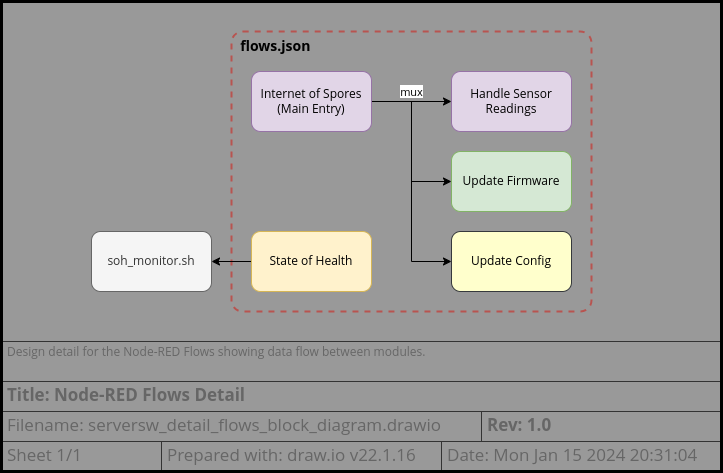
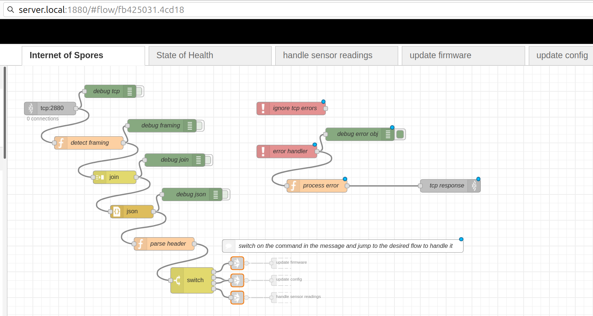
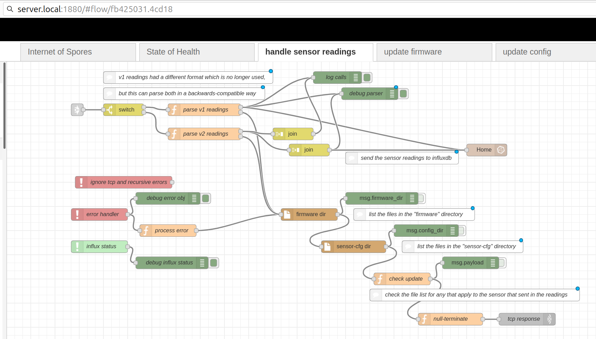
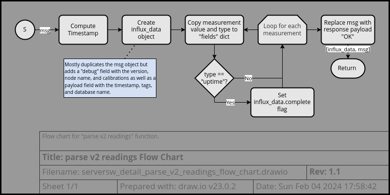
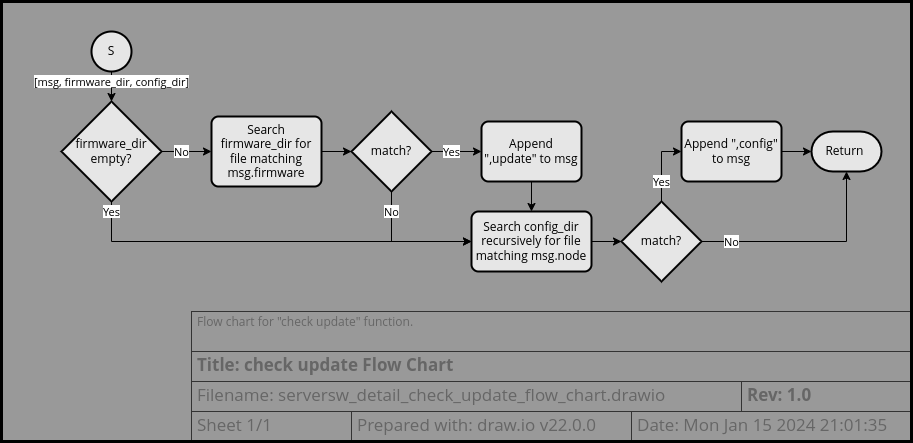
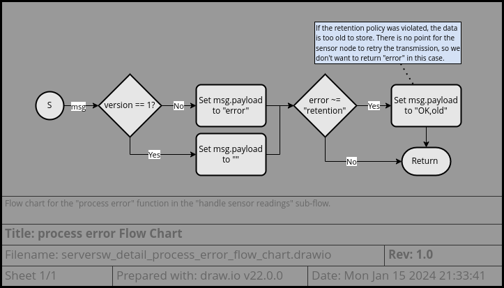
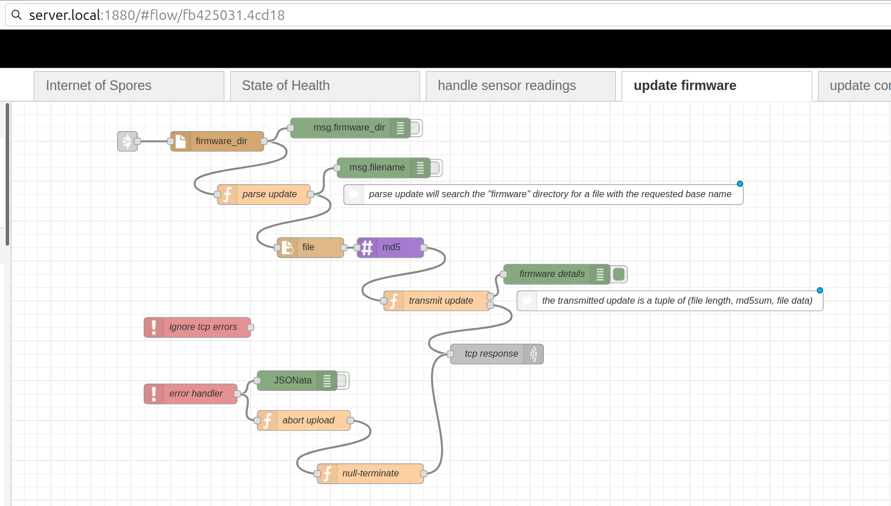
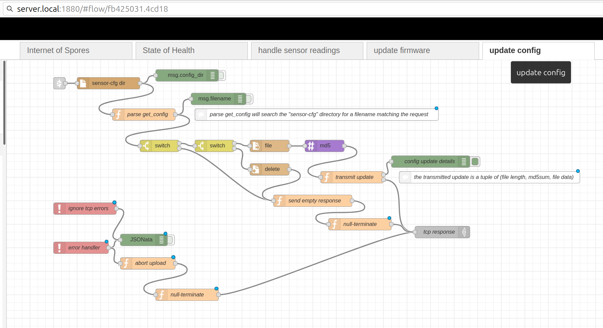
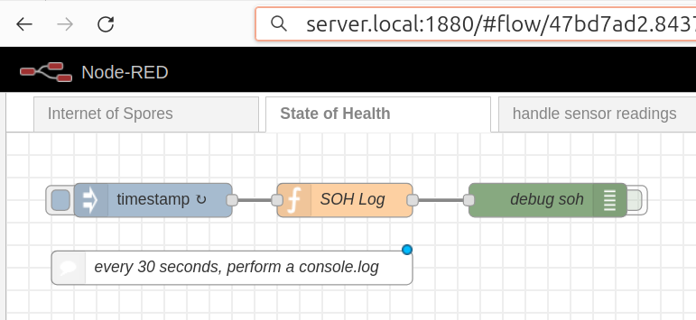

# Server Software Design
This outline is currently a work-in-progress.

## Table of Contents

* [Module Overview](#module-overview)
* [Project Configuration](#project-configuration)
* [Module Description](#module-description)
  - [Node-RED Flows](#node-red-flows)
    + [Main Entry](#main-entry)
    + [Handle Sensor Readings](#handle-sensor-readings)
    + [Update Firmware](#update-firmware)
    + [Update Config](#update-config)
    + [State of Health](#state-of-health)
  - [Node-RED SOH Monitor](#node-red-soh-monitor)
* [Debugging and Unit Testing](#debugging-and-unit-testing)

---

## Module Overview

  
The server software components are split into [Node-RED Flows](#node-red-flows)
and the [SOH monitor](#node-red-soh-monitor). The flows.json includes several
sub-flows (arranged on different tabs in the UI).  
Based on the command in the incoming packet, the [Main Entry](#main-entry)
handler will hand it off to the relevant sub-flow. The
[State of Health](#state-of-health) sub-flow executes periodically and is
monitored by the external [SOH Monitor](#node-red-soh-monitor) utility.

---

## Project Configuration

The content of this component are all interpreted scripts and no compilation
step is needed. See the [software architecture](server_architecture.md) for more
details.

Launching of the Node-RED server and SOH Monitor is performed at startup by
[systemd unit files](https://www.freedesktop.org/software/systemd/man/systemd.unit.html).
To some extent these are configurable, but the
[soh-monitor.sh](../node-red/soh-monitor.sh) script is currently expecting the
units to be run under the "user" service manager. This behavior should be made
more configurable. Likewise, the script expects to be communicating with
systemctl and journalctl. In order to support other init systems, these commands
should be made more easily configurable.

For reference the unit files are:
* [node-red.service](../node-red/node-red.service) - starts the Node-RED server
* [node-red-soh.service](../node-red/node-red-soh.service) - starts the SOH
  monitor script

---

## Module Description

### Node-RED Flows

The flows are found in [flows.json](../node-red/flows.json) and are split into
the following tabs:
+ [Main Entry](#main-entry)
+ [Handle Sensor Readings](#handle-sensor-readings)
+ [Update Firmware](#update-firmware)
+ [Update Config](#update-config)
+ [State of Health](#state-of-health)

#### Main Entry

  
The main flows listen on TCP port 2880 for incoming connections, collect
together fragmented packets, parse the packet as json, filter out the header
fields, and then pass the message on to the appropriate sub-flow based on the
command field.

The function nodes are relatively straightforward:
* "detect framing" looks for a null terminator in order to set the msg.complete
  flag
* "parse header" simply pulls out header fields from msg.payload and places them
  directly in the msg object
  - version
  - timestamp
  - node
  - firmware
* "process error" provides a TCP response of "error\0" for any error (except
  errors that it triggered with its own response)

The switch node works in the following way:
* If command == "update", transfers msg to the
  [update firmware sub-flow](#update-firmware)
* If command == "get_config" or "delete_config", transfers msg to the 
  [update config sub-flow](#update-config)
* If command is null, transfers msg to the
  [handle sensor readings sub-flow](#handle-sensor-readings)

#### Handle Sensor Readings

> 🪧 Note: this flow depends on the additional plugin modules:
> * [node-red-contrib-influxdb](https://flows.nodered.org/node/node-red-contrib-influxdb)
> * [node-red-contrib-readdir](https://flows.nodered.org/node/node-red-contrib-readdir)

When the msg is transferred to this sub-flow, it is first parsed to pull out the
sensor measurements. These measurements are then joined into a batch update to
be provided to the influxdb node.  
After each measurement is parsed, the response is generated - normally "OK". If
firmware updates or configuration updates are available, these flags will be
appended to the response.

The "influx status" node simply monitors status of the influxdb node and logs it
in the debug window.

**parse v2 readings**

**check update**

This function takes additionally as input msg.firmware_dir and msg.config_dir
which are provided by the preceding directory nodes.  These nodes can be
configured to modify the location of the respective firmware and sensor-cfg
directories, though it is probably easier to create softlinks in your Node-RED
runtime directory.

**null-terminate**

This function simply appends a "\0" character to the end of the response
message.

**process error**

As on the main tab, the "process error" function returns a basic error response
to the sensor node in case any error occurs. Likewise, it ignores errors
generated by the "tcp response" node as these would likely generate further
errors as we attempt to send the error response recursively.

The difference from the main tab is that this function also handles errors from
the influx node and we want to handle "retention" errors as though they were
successful.  
The retention error indicates that InfluxDB received the measurement correctly,
but isn't storing it because it violates the retention policy. Generally, this
means that the timestamp is too old. In this case, there is no point for the
sensor node to retransmit the measurement, so we send an "OK,old" response.

#### Update Firmware

> 🪧 Note: this flow depends on the additional plugin modules:
> * [node-red-contrib-readdir](https://flows.nodered.org/node/node-red-contrib-readdir)
> * [node-red-contrib-md5](https://flows.nodered.org/node/node-red-contrib-md5)

When the msg is transferred to this sub-flow, the filename is extracted from the
payload argument and used to find the matching firmware image in the "firmware"
directory.  
If the image fle is found, its md5 hash will be calculated and the update
package (length, md5, data) transmitted in the response.

**parse update**

This function searches the list of files provided by the "firmware_dir" node
to find any that match the filename provided.  
As an extra check, it will ignore any firmware file that already matches the
firmware "fingerprint" reported by the sensor node as there is no point sending
an update file if the sensor is already running that version of software.

**transmit update**

This function crafts a response octet-string by concatenating the metadata and
content of the file:
* file length
* "\n"
* md5sum
* "\n"
* file data

> 🪧 Note: a final "\n" or "\0" is not included in this message as the file data
> will be processed by the ESP SDK firmware update functionality which expects
> a simple IO Stream with the file data only.  
> Additional framing would disturb the md5 checksum calculation.

**null-terminate**

This function simply appends a "\0" character to the end of the response
message.

**process error**

This function provides a TCP response of "0\n" for any error (except errors that
it triggered with its own response). 

#### Update Config

(TODO: configuration options, flow charts, fault tolerance, notes, dependencies-influx,md5,readdir)

#### State of Health

### Node-red SOH Monitor

---

## Debugging and Unit Testing

- Debugging
- console.log
- Fault tolerance
- run soh monitor from the command line

---

## Future Improvements

-find some way to make the tabs more modular so they can be included into an existing set of flows or so they can be expanded upon but still have an easy upgrade path