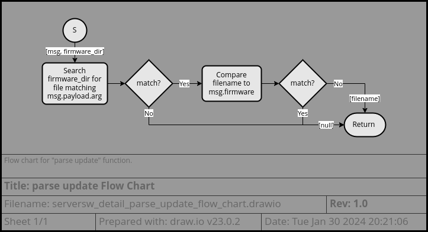
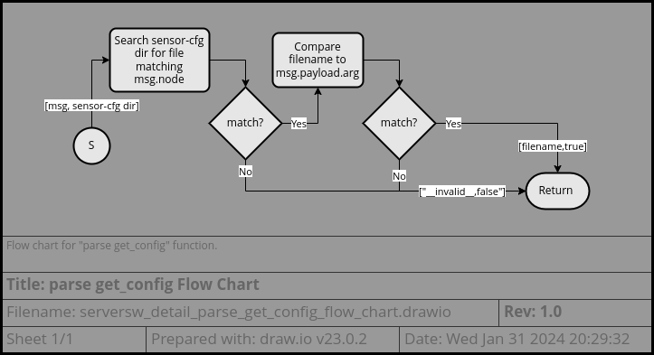
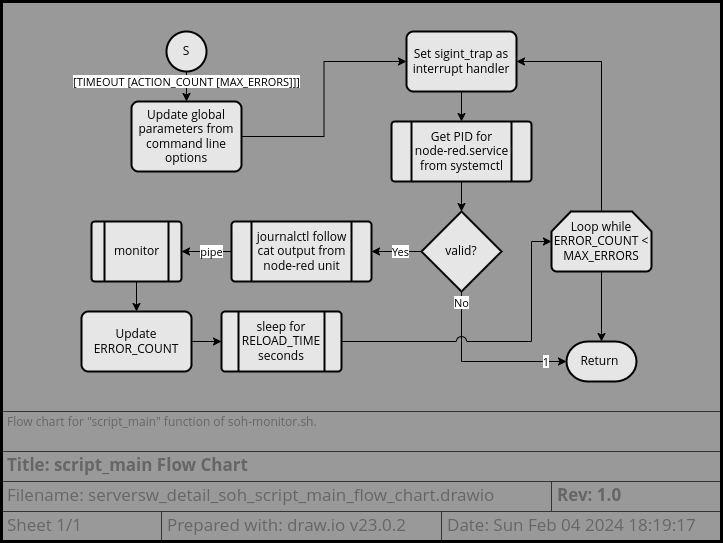

# Server Software Design
This outline is currently a work-in-progress.

## Table of Contents

* [Module Overview](#module-overview)
* [Project Configuration](#project-configuration)
* [Module Description](#module-description)
  - [Node-RED Flows](#node-red-flows)
    + [Main Entry](#main-entry)
    + [Handle Sensor Readings](#handle-sensor-readings)
    + [Update Firmware](#update-firmware)
    + [Update Config](#update-config)
    + [State of Health](#state-of-health)
  - [Node-RED SOH Monitor](#node-red-soh-monitor)
* [Debugging and Unit Testing](#debugging-and-unit-testing)

---

## Module Overview

  
The server software components are split into [Node-RED Flows](#node-red-flows)
and the [SOH monitor](#node-red-soh-monitor). The flows.json includes several
sub-flows (arranged on different tabs in the UI).  
Based on the command in the incoming packet, the [Main Entry](#main-entry)
handler will hand it off to the relevant sub-flow. The
[State of Health](#state-of-health) sub-flow executes periodically and is
monitored by the external [SOH Monitor](#node-red-soh-monitor) utility.

---

## Project Configuration

The content of this component are all interpreted scripts and no compilation
step is needed. See the [software architecture](server_architecture.md) for more
details.

Launching of the Node-RED server and SOH Monitor is performed at startup by
[systemd unit files](https://www.freedesktop.org/software/systemd/man/systemd.unit.html).
To some extent these are configurable, but the
[soh-monitor.sh](../node-red/soh-monitor.sh) script is currently expecting the
units to be run under the "user" service manager. This behavior should be made
more configurable. Likewise, the script expects to be communicating with
systemctl and journalctl. In order to support other init systems, these commands
should be made more easily configurable.

For reference the unit files are:
* [node-red.service](../node-red/node-red.service) - starts the Node-RED server
* [node-red-soh.service](../node-red/node-red-soh.service) - starts the SOH
  monitor script

---

## Module Description

### Node-RED Flows

The flows are found in [flows.json](../node-red/flows.json) and are split into
the following tabs:
+ [Main Entry](#main-entry)
+ [Handle Sensor Readings](#handle-sensor-readings)
+ [Update Firmware](#update-firmware)
+ [Update Config](#update-config)
+ [State of Health](#state-of-health)

#### Main Entry

  
The main flows listen on TCP port 2880 for incoming connections, collect
together fragmented packets, parse the packet as json, filter out the header
fields, and then pass the message on to the appropriate sub-flow based on the
command field.

The function nodes are relatively straightforward:
* "detect framing" looks for a null terminator in order to set the msg.complete
  flag
* "parse header" simply pulls out header fields from msg.payload and places them
  directly in the msg object
  - version
  - timestamp
  - node
  - firmware
* "process error" provides a TCP response of "error\0" for any error (except
  errors that it triggered with its own response)

The switch node works in the following way:
* If command == "update", transfers msg to the
  [update firmware sub-flow](#update-firmware)
* If command == "get_config" or "delete_config", transfers msg to the 
  [update config sub-flow](#update-config)
* If command is null, transfers msg to the
  [handle sensor readings sub-flow](#handle-sensor-readings)

#### Handle Sensor Readings

> 🪧 Note: this flow depends on the additional plugin modules:
> * [node-red-contrib-influxdb](https://flows.nodered.org/node/node-red-contrib-influxdb)
> * [node-red-contrib-readdir](https://flows.nodered.org/node/node-red-contrib-readdir)

When the msg is transferred to this sub-flow, it is first parsed to pull out the
sensor measurements. These measurements are then joined into a batch update to
be provided to the influxdb node.  
After each measurement is parsed, the response is generated - normally "OK". If
firmware updates or configuration updates are available, these flags will be
appended to the response.

The "influx status" node simply monitors status of the influxdb node and logs it
in the debug window.

**parse v2 readings**

**check update**

This function takes additionally as input msg.firmware_dir and msg.config_dir
which are provided by the preceding directory nodes.  These nodes can be
configured to modify the location of the respective firmware and sensor-cfg
directories, though it is probably easier to create softlinks in your Node-RED
runtime directory.

**null-terminate**

This function simply appends a "\0" character to the end of the response
message.

**process error**

As on the main tab, the "process error" function returns a basic error response
to the sensor node in case any error occurs. Likewise, it ignores errors
generated by the "tcp response" node as these would likely generate further
errors as we attempt to send the error response recursively.

The difference from the main tab is that this function also handles errors from
the influx node and we want to handle "retention" errors as though they were
successful.  
The retention error indicates that InfluxDB received the measurement correctly,
but isn't storing it because it violates the retention policy. Generally, this
means that the timestamp is too old. In this case, there is no point for the
sensor node to retransmit the measurement, so we send an "OK,old" response.

#### Update Firmware

> 🪧 Note: this flow depends on the additional plugin modules:
> * [node-red-contrib-readdir](https://flows.nodered.org/node/node-red-contrib-readdir)
> * [node-red-contrib-md5](https://flows.nodered.org/node/node-red-contrib-md5)

When the msg is transferred to this sub-flow, the filename is extracted from the
payload argument and used to find the matching firmware image in the "firmware"
directory.  
If the image file is found, its md5 hash will be calculated and the update
package (length, md5, data) transmitted in the response.

**parse update**

This function searches the list of files provided by the "firmware_dir" node
to find any that match the filename provided.  
As an extra check, it will ignore any firmware file that already matches the
firmware "fingerprint" reported by the sensor node as there is no point sending
an update file if the sensor is already running that version of software.

**transmit update**

This function crafts a response octet-string by concatenating the metadata and
content of the file:
* file length
* "\n"
* md5sum
* "\n"
* file data

> 🪧 Note: a final "\n" or "\0" is not included in this message as the file data
> will be processed by the ESP SDK firmware update functionality which expects
> a simple IO Stream with the file data only.  
> Additional framing would disturb the md5 checksum calculation.

**process error**

This function provides a TCP response of "0\n" for any error (except errors that
it triggered with its own response). 

**null-terminate**

This function simply appends a "\0" character to the end of the response
message.

#### Update Config

> 🪧 Note: this flow depends on the additional plugin modules:
> * [node-red-contrib-readdir](https://flows.nodered.org/node/node-red-contrib-readdir)
> * [node-red-contrib-md5](https://flows.nodered.org/node/node-red-contrib-md5)

When the msg is transferred to this sub-flow, the filename is extracted from the
payload argument and used to find the matching configuration file in the
"sensor-cfg" directory.  
Depending on whether the command is "get_config" or "delete_config", the file
will be returned to the sensor node or deleted, respectively.

**parse get_config**

This function searches the list of files provided by the "firmware-cfg dir" node
to find any that match the node name and filename provided. For example, the
configuration update files might be in organized in subdirectories by node name
(sensor-cfg/node_name/cfg_file), but other schemes are possible
(sensor-cfg/node_name-cfg_file).

**transmit update**

This function crafts a response octet-string by concatenating the metadata and
content of the file:
* file length
* "\n"
* md5sum
* "\n"
* file data

**send empty response**

This function provides a TCP response of "\n" if no matching file was found.

**abort upload**

This function provides a TCP response of "0\n" for any error (except errors that
it triggered with its own response). 

**null-terminate**

This function simply appends a "\0" character to the end of the response
message.

#### State of Health

This flow executes asynchronously every 30 seconds (starting 3 seconds after the
flows are started).

**SOH Log**

This function performs a console.log of the string "@SOH report@" + the
timestamp.

### Node-red SOH Monitor

The SOH Monitor script is located in
[soh-monitor.sh](../node-red/soh-monitor.sh).

The main configuration interface is via command line parameters.
These are optional:
* If 1 parameter is supplied, it is: timeout
* If 2 parameters are supplied: timeout, action count
* If 3 parameters are supplied: timeout, action count, max errors

The defaults for these (along with the additional RELOAD_TIME parameter) can be
adjusted at the top of the script.

This script depends on bash -- simpler bourne shells will probably fail in an
unexpected way. Additionally, it depends on systemd utilities: systemctl and
journalctl.

> 🪧 Note: The script expects Node-RED to be running under the "user" service
> manager rather than the "system" service manager. This should probably be
> made more configurable or allow some level of auto-detection.

There are 3 basic parts to the script:
* [Signal Traps](#signal-traps)
* [script_main](#script_main)
* [monitor](#monitor)

#### script_main

The `script_main` function parses the command line parameters, which allow overriding the default values of several parameters (as mentioned above).

It then sets up a trap for the interrupt signal and gets the process ID of the
Node-RED Server from systemd.

After that it executes `journalctl` in follow mode, filtering on the node-red
unit and outputting only the message content (cat mode). This output is piped
into the `monitor` function.  
The `monitor` function will only return if the maximum error count is exceeded,
if the input file descriptor (from `journalctl`) is closed, or if it took action
to restart the Node-RED service.  
When it returns, the return value will be the updated error count.

Assuming the max error count is not exceeded, `script_main` will wait for a few
seconds to let Node-RED finish restarting and then it will loop to the beginning
and get the new PID, start `journalctl` and pipe it into `monitor`, etc.

Most parameters are configurable on the command line, except for `RELOAD_TIME`,
which is the time that the script waits for the Node-RED service to restart.  
This is merely an oversight. For now, if you wish to modify this parameter, you
will just have to edit the [soh-monitor.sh](../node-red/soh-monitor.sh) script.

#### monitor

(TODO: configuration options, flow charts, fault tolerance, notes, dependencies)

#### Signal Traps

(TODO: configuration options, flow charts, fault tolerance, notes, dependencies)

---

## Debugging and Unit Testing

- Debugging
- console.log
- Fault tolerance
- run soh monitor from the command line

---

## Future Improvements

**Node-RED Flows**

It would be good to find some way to make the tabs more modular so they can be
included into an existing set of flows or so they can be expanded upon but still
have an easy upgrade path.  
It seems like the import and export of "libraries" should make this possible.
Likewise, the use of "subflows" might offer a modular solution or at least make
the inclusion of the libraries more straightforward.

**Node-RED SOH Monitor**

It might be good to reduce the reliance on systemd in order to support other
init systems.  The availability of systemd services could likely be
auto-detected and, if not present, fallback on standard syslog monitoring and
"service" helper utilities.

Currently, the script hardcodes the `--user` parameter to systemctl and
journalctl. This should be made configurable or allow for some sort of
auto-detection mechanism.  
It seems like systemctl has enough introspection capabilities to allow for
auto-detection.
