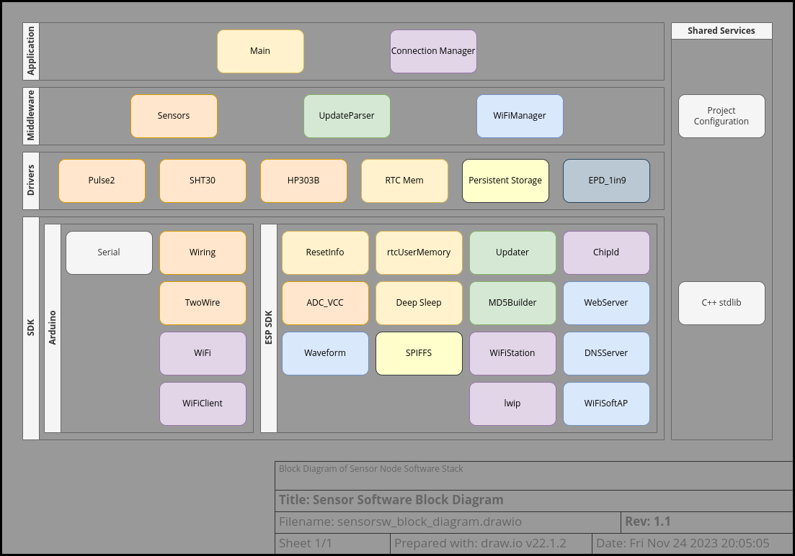
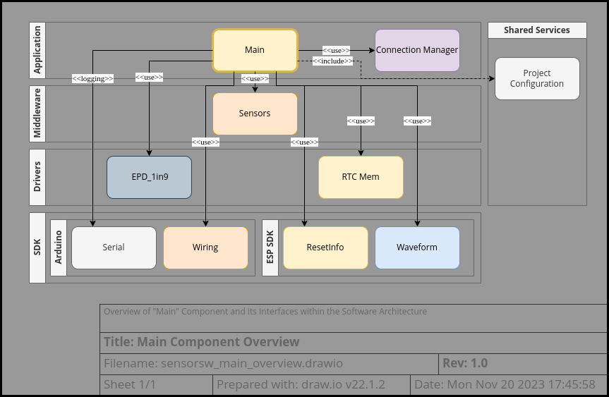
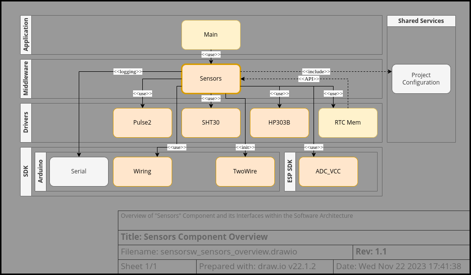
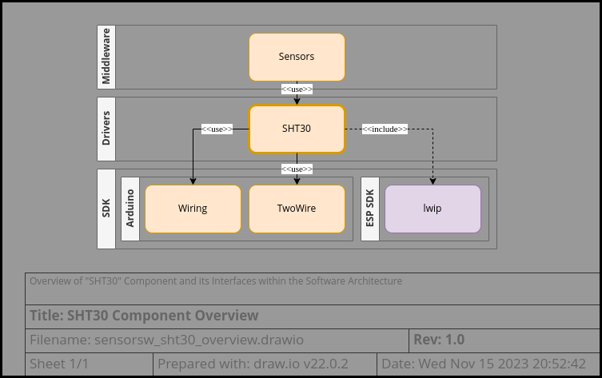
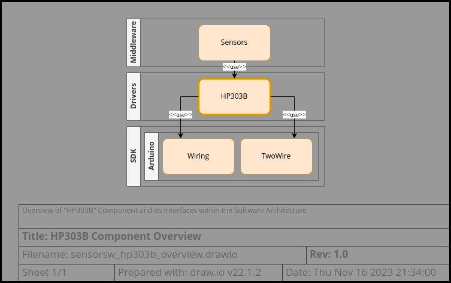
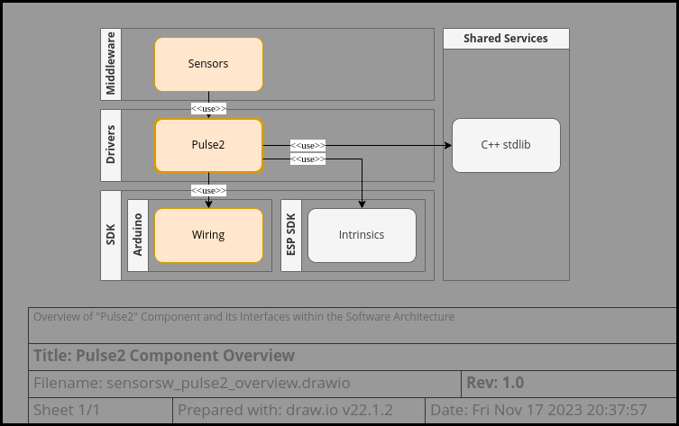
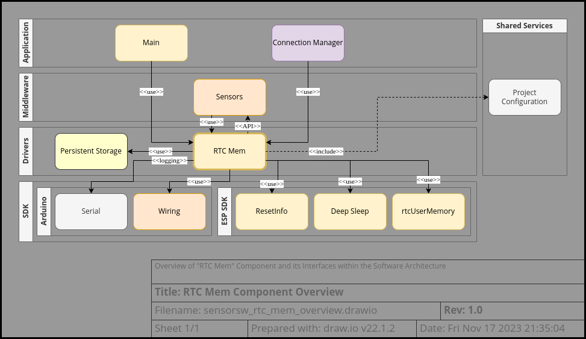
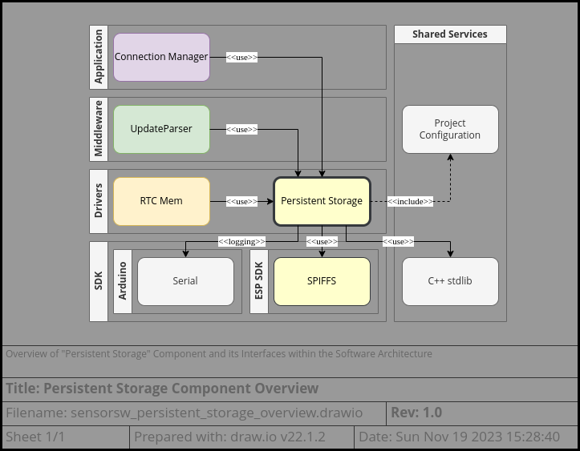
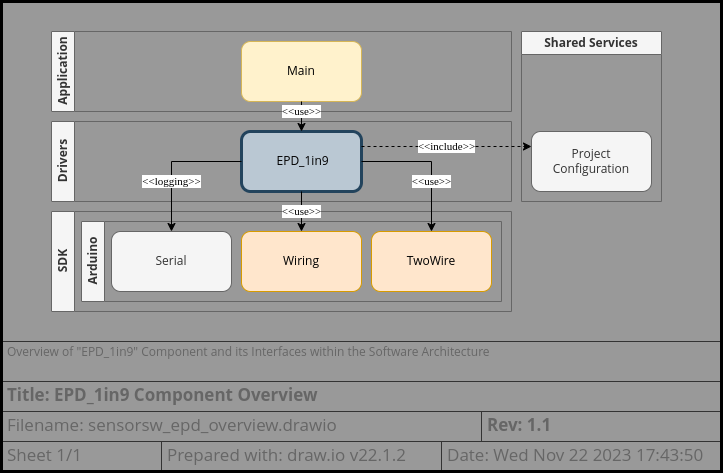

# Sensor Software Architecture
This outline is currently a work-in-progress.

## Table of Contents
* [Block Diagram](#block-diagram)
* [External Dependencies](#external-dependencies)
* [Component Description](#component-description)
  - [Main](#main)
  - [Project Configuration](#project-configuration)
  - [Connectivity](#connectivity)
    + [Connection Manager](#connection-manager)
    + [Update Parser](#update-parser)
    + [WiFi Manager](#wifi-manager)
  - [Sensors](#sensors)
    + [SHT30](#sht30)
    + [HP303B](#hp303b)
    + [Pulse2](#pulse2)
  - [RTC Mem](#rtc-mem)
  - [Persistent Storage](#persistent-storage)
  - [E-Paper Display](#e-paper-display)
* [Dynamic Behavior](#dynamic-behavior)

---

## Block Diagram
  
The sensor node software can be roughly decomposed into a software stack including applications, middleware, drivers, and SDK (which includes low-level drivers).  
There are 2 main applications: Main, which handles normal business logic of the sensor; and the Connection Manager, which handles connection to the WiFi network and interaction with the Node-RED server.  
A third application is the WiFiManager, which is more properly located in the middleware layer since its behavior and configuration are managed by the Connection Manager.  
The driver layer is composed of high-level drivers that are implemented using the Arduino and ESP SDK functionalities.  
The SDK layer provides Arduino HAL functionalities as well as ESP8266-specific low-level drivers.

---

## External Dependencies
| External Dependency | Tested Version | Link
|---------------------|----------------|------
| Arduino IDE         | 2.0.3          | https://www.arduino.cc/
| ESP SDK             | 3.0.2          | https://github.com/esp8266/Arduino
| WiFi Manager        | 0.16.0         | https://github.com/tzapu/WiFiManager
| Lolin HP303B        | commit 4deb5f  | https://github.com/wemos/LOLIN_HP303B_Library

---

## Component Description

### Main

##### Description
  
The Main component provides the familiar entry point functions for the Arduino framework, setup and loop.  
It orchestrates the sensor collection and display of sensor readings as well as changes between modes of operation for the sensor node.

##### Dependencies
| Component             | Interface Type     | Description
|-----------------------|--------------------|-------------
| Connection Manager    | function           | Connectivity API
| Sensors               | function           | Sensor readings API
| RTC Mem               | function, global   | Sleep API, RTC Memory API
| EPD_1in9              | function           | E-Paper Display API
| ResetInfo             | function           | Reset reason detects double-press of reset button
| Waveform              | function           | Blink LED at constant rate
| Wiring                | function           | GPIO API, delay API
| Project Configuration | preprocessor macro | Configuration settings
| Serial                | class              | Logging printf

##### Configuration
Configuration of this component is done through preprocessor defines set in project_config.h.

| Configuration            | Type          | Description
|--------------------------|---------------|-------------
| EXTRA_DEBUG              | bool          | Enables additional debug logging
| TETHERED_MODE            | bool          | Enables PPD42 sensor
| VCC_CAL_MODE             | bool          | Builds for VCC Calibration mode (allows quick reading of VCC ADC to assist with calibration)
| SERIAL_SPEED             | unsigned long | Baud rate for the logging serial port
| LOW_BATTERY_VOLTAGE      | float         | Voltage level at which the low battery icon will be set on the display
| CRIT_BATTERY_VOLTAGE     | float         | Voltage level at which the critically low battery message will be displayed
| DISP_CONNECT_FAIL_COUNT  | unsigned int  | Number of failed connections that will trigger the connection error message to be displayed
| MAX_ESP_SLEEP_TIME_MS    | uint64_t      | Value that represents an "infinite" sleep time
| PPD42_PIN_DET            | uint8_t       | Pin # used to detect presence of PPD42 sensor
| EPD_FULL_REFRESH_TIME_MS | uint64_t      | Period between full display refreshes in milliseconds
| EPD_RST_PIN              | uint8_t       | Pin number for the EPD reset pin
| EPD_RST_POLARITY         | bool          | Indicates whether reset pin is active high or low
| EPD_FAHRENHEIT           | bool          | Indicates whether display temp is in °F rather than °C
| SIMULATE_GOOD_CONNECTION | bool          | Enables debug mode where upload is not actually performed

##### Public API

###### Types and Enums
None

###### Functions
preinit
> Called before global class instances are initialized.  
> Calls connectivity_preinit to disable the modem before it gets initialized.
>
> 🪧 Note: This function is only used in non-tethered mode.
> In tethered mode, the WiFi radio is left active permanently.
>
> | Parameter     | Direction | Type          | description
> |---------------|-----------|---------------|-------------
> |               | return    | void          |

setup
> Called before the main processing loop starts.  
> Initializes the Serial port and RTC Memory.  
> Checks the reset reason and decides whether to start WiFi Manager or
> run the normal sensor processing.
>
> | Parameter     | Direction | Type          | description
> |---------------|-----------|---------------|-------------
> |               | return    | void          |

loop
> Executes the normal sensor processing.  
> Despite the name, this function normally does not loop.
> In battery mode, it always ends in a deep sleep.
> In tethered mode, it may or may not enter deep sleep depending on how long
> the sensor processing and upload process took.
>
> | Parameter     | Direction | Type          | description
> |---------------|-----------|---------------|-------------
> |               | return    | void          |

##### Critical Sections
None

### Project Configuration

PREINIT_MAGIC description

### Connectivity
#### Connection Manager

#### Update Parser

#### WiFi Manager

### Sensors
##### Description
  
The Sensors component manages the different sensors attached to the sensor node and stores their readings in RTC memory. It can store the following types of sensor readings:
* SENSOR_TEMPERATURE
* SENSOR_HUMIDITY
* SENSOR_PRESSURE
* SENSOR_PARTICLE_1_0
* SENSOR_PARTICLE_2_5
* SENSOR_BATTERY_VOLTAGE

Additionally, the pseudo-sensor type SENSOR_TIMESTAMP_OFFS, is used to store a correlated timestamp with each batch of readings.

##### Dependencies
| Component             | Interface Type     | Description
|-----------------------|--------------------|-------------
| Pulse2                | class              | GPIO pulse duration measurement for PPD42 LPO sensor
| SHT30                 | function           | I2C driver for SHT30 sensor
| HP303B                | class              | I2C driver for HP303B sensor
| RTC Mem               | global, function   | Storage for sensor readings, uptime calculation
| Wiring                | function           | GPIO HAL
| TwoWire               | class              | I2C initialization
| ADC_VCC               | function           | VCC (battery) Voltage sensor HAL
| Project Configuration | preprocessor macro | Configuration settings
| Serial                | class              | Logging printf

##### Configuration
Configuration of this component is done through preprocessor defines set in project_config.h.

| Configuration | Type    | Description
|---------------|---------|-------------
| EXTRA_DEBUG   | bool    | Enables additional debug logging
| TETHERED_MODE | bool    | Enables PPD42 sensor
| SHT30_ADDR    | uint8_t | I2C Address for the SHT30 sensor
| PPD42_PIN_DET | uint8_t | Pin # used to detect presence of PPD42 sensor
| PPD42_PIN_1_0 | uint8_t | Pin # used as LPO output of PPD42 sensor for PM1.0 detections
| PPD42_PIN_2_5 | uint8_t | Pin # used as LPO output of PPD42 sensor for PM2.5 detections

##### Public API

###### Types and Enums
sensor_type_t
> This enum provides labels for the different types of sensor readings.
>
> Enumerations:
> * SENSOR_UNKNOWN
> * SENSOR_TEMPERATURE
> * SENSOR_HUMIDITY
> * SENSOR_PRESSURE
> * SENSOR_PARTICLE_1_0
> * SENSOR_PARTICLE_2_5
> * SENSOR_BATTERY_VOLTAGE
> * SENSOR_TIMESTAMP_OFFS

###### Functions
sensors_init
> Initialize module. 
>
> | Parameter     | Direction | Type          | description
> |---------------|-----------|---------------|-------------
> |               | return    | void          |

read_ppd42
> Read and store values from the PPD42 particle sensor.
> This measurement is recommended to take 30 seconds.
>
> 🪧 Note: The sensor requires a 3 minute warm-up time so this function is only available in tethered mode
> 
> | Parameter     | Direction | Type          | description
> |---------------|-----------|---------------|-------------
> |               | return    | void          |
> | sampletime_us | in        | unsigned long | measurement time for the sensor in μs

read_sht30
> Read and store values from the SHT30 temperature and humidity sensor.
>
> | Parameter     | Direction | Type          | description
> |---------------|-----------|---------------|-------------
> |               | return    | void          |
> | perform_store | in        | bool          | If true, the average of the sensor readings collected so far will be stored to RTC memory

read_hp303b
>Read and store values from the HP303B barometric pressure sensor.
>
> | Parameter     | Direction | Type          | description
> |---------------|-----------|---------------|-------------
> |               | return    | void          |
> | measure_temp  | in        | bool          | If true, the temperature will also be measured using this sensor and stored

read_vcc
> Read and store the ESP VCC voltage level (battery).
>
> | Parameter     | Direction | Type          | description
> |---------------|-----------|---------------|-------------
> |               | return    | void          |
> | perform_store | in        | bool          | If true, the average of the voltage readings collected so far will be stored to RTC memory

store_uptime
> Store the current uptime as an offset from RTC_MEM_DATA_TIMEBASE.
> 
> | Parameter     | Direction | Type          | description
> |---------------|-----------|---------------|-------------
> |               | return    | void          |

get_temp
> Return the current temperature.
>
> 🪧 Note: The temperature must have already been stored by calling read_sht30 or read_hp303b.  
> Otherwise, NAN will be returned.
>
> | Parameter     | Direction | Type          | description
> |---------------|-----------|---------------|-------------
> |               | return    | float         | The current temperature (°C)

get_humidity
> Return the current relative humidity.
>
> 🪧 Note: The humidity must have already been stored by calling read_sht30.  
> Otherwise, NAN will be returned.
>
> | Parameter     | Direction | Type          | description
> |---------------|-----------|---------------|-------------
> |               | return    | float         | The current relative humidity (%)

get_battery
> Return the current battery voltage.
>
> 🪧 Note: The battery voltage must have already been stored by calling read_vcc.  
> Otherwise, NAN will be returned.
>
> | Parameter     | Direction | Type          | description
> |---------------|-----------|---------------|-------------
> |               | return    | float         | The current battery voltage

##### Critical Sections
None

> 🪧 Note: Many of the functions in this component use static data and are not reentrant.

#### SHT30
##### Description
  
The SHT30 driver provides a simple interface to retrieve sensor readings from one or more SHT30 sensors and helper functions for parsing the data returned.

##### Dependencies
| Component             | Interface Type     | Description
|-----------------------|--------------------|-------------
| Wiring                | function           | delay API
| TwoWire               | class              | I2C API
| lwip                  | preprocessor macro | ntohs

##### Configuration
There is no static configuration for this component.

##### Public API

###### Types and Enums
sht30_repeatability_t
> This enum provides options for the single-shot capture mode of the sensor.
> Higher repeatability will result in longer duration spent capturing the measurement.
>
> Enumerations:
> * SHT30_RPT_LOW
> * SHT30_RPT_MED
> * SHT30_RPT_HIGH


sht30_data_t
> This structure represents the data format returned by the sensor.
>
> Fields:
> * uint16_t temp
> * uint8_t temp_check
> * uint16_t humidity
> * uint8_t humidity_check


###### Functions
sht30_get
> Retrieve a measurement in single-shot mode.
>
> | Parameter | Direction | Type                  | description
> |-----------|-----------|-----------------------|-------------
> |           | return    | int                   | 0 for success, non-0 for failure
> | addr      | in        | uint8_t               | I2C Address for the sensor
> | type      | in        | sht30_repeatability_t | Measurement type
> | data_out  | out       | sht30_data_t*         | Data structure to return the measurement in - won't be modified on failure

sht30_parse_temp_c
> Convert the data reading into a float temperature value (°C)
> 
> | Parameter | Direction | Type         | description
> |-----------|-----------|--------------|-------------
> |           | return    | float        | Temperature in °C
> | data      | in        | sht30_data_t | Data structure with the measurement to convert

sht30_parse_temp_f
> Convert the data reading into a float temperature value (°F)
> 
> | Parameter | Direction | Type         | description
> |-----------|-----------|--------------|-------------
> |           | return    | float        | Temperature in °F
> | data      | in        | sht30_data_t | Data structure with the measurement to convert

sht30_parse_humidity
> Convert the data reading into a float humidity value (RH%)
> 
> | Parameter | Direction | Type         | description
> |-----------|-----------|--------------|-------------
> |           | return    | float        | Relative humidity
> | data      | in        | sht30_data_t | Data structure with the measurement to convert

sht30_check_temp
> Check the data reading temperature CRC
> 
> | Parameter | Direction | Type         | description
> |-----------|-----------|--------------|-------------
> |           | return    | bool         | True if CRC OK
> | data      | in        | sht30_data_t | Data structure with the measurement to check

sht30_check_humidity
> Check the data reading humidity CRC
> 
> | Parameter | Direction | Type         | description
> |-----------|-----------|--------------|-------------
> |           | return    | bool         | True if CRC OK
> | data      | in        | sht30_data_t | Data structure with the measurement to check

##### Critical Sections
None

> 🪧 Note: It isn't recommended to call sht30_get from different CPU cores simultaneously.
> The behavior of the underlying TwoWire library is likely to be undefined in this situation.

#### HP303B
##### Description
  
The HP303B driver provides a class object to interface with an HP303B sensors via I2C or SPI.  
This component is provided as an external dependency developed by Lolin.

##### Dependencies
| Component             | Interface Type     | Description
|-----------------------|--------------------|-------------
| Wiring                | function           | delay API (and GPIO for SPI chipselect)
| TwoWire               | class              | I2C API
| SPI                   | class              | SPI API (unused in this project)

##### Configuration
There is no static configuration for this component.

##### Public API

###### Types and Enums
LOLIN_HP303B
> This class provides public interfaces for accessing the sensor.

###### Functions
> 🪧 Note: For brevity only used interfaces are shown here. For the complete API see https://github.com/wemos/LOLIN_HP303B_Library/blob/master/src/LOLIN_HP303B.h.

LOLIN_HP303B::LOLIN_HP303B
> Void Constructor

LOLIN_HP303B::~LOLIN_HP303B
> Destructor

LOLIN_HP303B::begin
> Function to initialize the sensor using default I2C interface.
>
> | Parameter    | Direction | Type    | description
> |--------------|-----------|---------|-------------
> |              | return    | void    |
> | slaveAddress | in        | uint8_t | I2C Address for the sensor (defaults to 0x77U)


LOLIN_HP303B::end
> Function to return the sensor to standby.
>
> | Parameter        | Direction | Type     | description
> |------------------|-----------|----------|-------------
> |                  | return    | void     |

LOLIN_HP303B::measureTempOnce
> Function to measure the temperature in one-shot mode with selected oversampling (2^n averages).
>
> | Parameter        | Direction | Type     | description
> |------------------|-----------|----------|-------------
> |                  | return    | int16_t  | 0 for success, non-0 for failure
> | result           | out       | int32_t& | Temperature result (°C)
> | oversamplingRate | in        | uint8_t  | Selected oversampling level 

LOLIN_HP303B::measurePressureOnce
> Function to measure the pressure in one-shot mode with selected oversampling (2^n averages).
>
> | Parameter        | Direction | Type     | description
> |------------------|-----------|----------|-------------
> |                  | return    | int16_t  | 0 for success, non-0 for failure
> | result           | out       | int32_t& | Pressure result (pascal)
> | oversamplingRate | in        | uint8_t  | Selected oversampling level 

##### Critical Sections
None

#### Pulse2
##### Description
  
The Pulse2 driver provides a class object to monitor multiple GPIO pins and accurately measure their pulse-width.  
In this project, the Pulse2 driver is used to monitor the LPO output pins of the PPD42 particle sensor.

> 🪧 Note: This class is only used in the project when it is configured for tethered mode.

##### Dependencies
| Component             | Interface Type     | Description
|-----------------------|--------------------|-------------
| Wiring                | function           | Interrupt, IO, and timing API
| ESP Intrinsics        | function           | Enable/Disable Interrupts
| libstdc++             | function,class     | bind API

##### Configuration
The following static configuration parameters can be modified in the pulse2.h header file:

| Configuration      | Type   | Description 
|--------------------|--------|-------------
| PULSE2_MAX_PINS    | size_t | max number of pins that can be watched
| PULSE2_WATCH_DEPTH | size_t | max number of pulses that can be stored for each pin

##### Public API

###### Types and Enums
Pulse2
> This class provides public interfaces for registering and monitoring input pins.

###### Functions
Pulse2::Pulse2
> Void Constructor

Pulse2::~Pulse2
> Destructor - automatically deregisters any pins

Pulse2::register_pin
> Function to add (or overwrite) a monitor activity for a particular pin to pulse in a given direction.
>
> | Parameter    | Direction | Type    | description
> |--------------|-----------|---------|-------------
> |              | return    | bool    | Returns false if PULSE2_MAX_PINS have already been registered
> | pin          | in        | uint8_t | GPIO pin identifier
> | direction    | in        | uint8_t | Direction of pulse to monitor for

Pulse2::unregister_pin
> Function to add (or overwrite) a monitor activity for a particular pin to pulse in a given direction.
>
> | Parameter    | Direction | Type    | description
> |--------------|-----------|---------|-------------
> |              | return    | void    |
> | pin          | in        | uint8_t | GPIO pin identifier

Pulse2::watch
> Block (with timeout) until one of the pins is triggered.
>
> | Parameter | Direction | Type           | description
> |-----------|-----------|----------------|-------------
> |           | return    | uint8_t        | Returns pin number on success or PULSE2_NO_PIN if the timeout is reached
> | result    | out       | unsigned long* | On success, pulse length is stored in this variable
> | timeout   | in        | unsigned long  | Max time to monitor for in μsec (default is 1000000L == 1 second)

Pulse2::reset
> Function to reset the state machines and throw out any existing results.
> Does not unregister any pins.
>
> | Parameter    | Direction | Type    | description
> |--------------|-----------|---------|-------------
> |              | return    | void    |

##### Critical Sections
While monitoring the pins in the Pulse2::watch function, the GPIO interrupts are periodically disabled to check the results stored by the interrupt handlers.

> 🪧 Note: The use of the class object from multiple CPU cores is not threadsafe.
> No attempt is made to protect the data structures during register/unregister operations and it would certainly be problematic to call Pulse2::watch on multiple cores simultaneously.  
> It is also recommended to unregister pins before re-registering them with a different pin direction.

### RTC Mem

##### Description
  
The rtc_mem driver provides an interface to the RTC User Memory and Deep Sleep functionalities of the ESP8266.  
It provides several helper functions for managing the sensor readings in the RTC User Memory and entering deep sleep; and is the source of truth for the uptime of the system.

> ☝️‍🎗️ Note: this component exhibits high coupling and should be refactored - ideally as a C++ class.

##### Dependencies
| Component             | Interface Type     | Description
|-----------------------|--------------------|-------------
| Sensors               | type definition    | sensor_type_t
| Persistent Storage    | function           | Initialization from NVM parameters
| Wiring                | function           | millis API
| ResetInfo             | function           | getResetReason API
| Deep Sleep            | function           | deepSleepInstant API
| rtcUserMemory         | function           | RTC User Memory read/write API
| Project Configuration | preprocessor macro | Configuration settings
| Serial                | class              | Logging printf

##### Configuration
Configuration of this component is done through preprocessor defines set in project_config.h.

| Configuration              | Type               | Description
|----------------------------|--------------------|-------------
| EXTRA_DEBUG                | bool               | Enables additional debug logging
| TETHERED_MODE              | bool               | Leaves RF Block powered during deep sleep
| MAX_ESP_SLEEP_TIME_MS      | unsigned long long | Clamps requested sleep time since there is a bug if the value is too large
| NUM_STORAGE_SLOTS          | size_t             | Maximum number of sensor readings that can be stored in RTC Memory
| PERSISTENT_CLOCK_CALIB     | const char*        | Filename where the clock calibration (bootup time and sleep drift correction) is stored in SPIFFS
| PERSISTENT_TEMP_CALIB      | const char*        | Filename where the temperature calibration is stored in SPIFFS
| PERSISTENT_HUMIDITY_CALIB  | const char*        | Filename where the humidity calibration is stored in SPIFFS
| PERSISTENT_BATTERY_CALIB   | const char*        | Filename where the battery (VCC ADC) calibration is stored in SPIFFS
| PERSISTENT_SLEEP_TIME_MS   | const char*        | Filename where the sleep time configuration is stored in SPIFFS
| PERSISTENT_HIGH_WATER_SLOT | const char*        | Filename where the high water slot (upload trigger) configuration is stored in SPIFFS
| DEFAULT_SLEEP_CLOCK_ADJ    | int                | Default clock calibration if no value stored in SPIFFS
| DEFAULT_TEMP_CALIB         | float              | Default temperature calibration if no value stored in SPIFFS
| DEFAULT_HUMIDITY_CALIB     | float              | Default humidity calibration if no value stored in SPIFFS
| DEFAULT_BATTERY_CALIB      | float              | Default battery calibration (VCC ADC) if no value stored in SPIFFS
| DEFAULT_SLEEP_TIME_MS      | unsigned long long | Default sleep time if no value stored in SPIFFS
| DEFAULT_HIGH_WATER_SLOT    | size_t             | Default high water slot (upload trigger) if no value stored in SPIFFS

##### Public API

###### Global Externs
rtc_mem
> Array with RTC memory contents (shadow copy of ESP RTC User Memory)
>
> Type: uint32_t[RTC_MEM_MAX]

preinit_magic
> Firmware fingerprint used to detect if RTC memory is inconsistent with the software version.
> Changes each time the software is built.
>
> Type: const uint32_t

###### Types and Enums
RTC_DATA_TIMEBASE_SHIFT
> Preprocessor define indicating how much to shift the data timebase from which
> sensor readings are offset (each sensor reading can only store a 24-bit timestamp
> (~4.5 hours)).
> It represents a tradeoff between maximum timestamp that can be represented and
> sensor timestamp accuracy. A value of 8 represents approximately 0.250 second
> precision in the measurements (which directly impacts measurement
> accuracy). Conversely, it allows an uptime of nearly 35 years rather than less
> than 50 days.
>
> Usage:
> ```
> uint64_t millis = ((uint64_t)rtc_mem[RTC_MEM_DATA_TIMEBASE] << RTC_DATA_TIMEBASE_SHIFT);
> ```

flags_time_t
> Structure that combines various flags with the device uptime into 2 32-bit RTC memory entries.
>
> Fields:
> * uint64_t flags :5 - various condition flags (see below)
> * uint64_t fail_count :3 - keep track of wifi connection failures
> * uint64_t clock_cal :16 - calibration for clock drift during suspend in ms
> * uint64_t millis :40 - uptime in ms tracked over suspend cycles
>
> Currently 3 flags are defined:
> * FLAG_BIT_CONNECT_NEXT_WAKE - bit 0
> * FLAG_BIT_NORMAL_UPLOAD_COND - bit 1
> * FLAG_BIT_LOW_BATTERY - bit 2

sensor_reading_t
> Structure of a sensor reading.
>
> Fields:
> * sensor_type_t type :8 - type of sensor reading
> * int32_t value :24 - value of the sensor reading

sleep_params_t
> Structure to combine custom sleep time and high-water slot into a single 32-bit RTC memory entry.
>
> Fields:
> * uint32_t high_water_slot :8 - configuration for upload threshold
> * uint32_t sleep_time_ms :24 - configuration for sleep duration

boot_count_t
> Structure to combine boot count and E-Paper Display refresh cycle count
> into a single 32-bit RTC memory entry.
>
> Fields:
> * uint32_t epd_partial_refresh_count :8
> * uint32_t boot_count :24

rtc_mem_fields_e
> Enum to provide field names for each of the positions in the RTC memory array.
>
> Enumerations:
> * RTC_MEM_CHECK - Magic value/Header checksum (see preinit_magic)
> * RTC_MEM_BOOT_COUNT - boot_count_t
> * RTC_MEM_FLAGS_TIME - flags_time_t
> * RTC_MEM_FLAGS_TIME_END - flags_time_t
> * RTC_MEM_DATA_TIMEBASE - Timestamp (upper 32 bits) from which sensor readings are stored as offsets
> * RTC_MEM_NUM_READINGS - Number of occupied slots
> * RTC_MEM_FIRST_READING - Slot that has the oldest reading
> * RTC_MEM_TEMP_CAL - (float) Store the temperature calibration
> * RTC_MEM_HUMIDITY_CAL - (float) Store the humidity calibration
> * RTC_MEM_BATTERY_CAL - (float) Store the battery (VCC ADC) calibration
> * RTC_MEM_SLEEP_PARAMS - (sleep_params_t) Store the user's sleep configuration
> * RTC_MEM_DATA - (sensor_reading_t) Beginning of the circular buffer of sensor readings
> * RTC_MEM_DATA_END (sensor_reading_t) End of the array of sensor readings
> * RTC_MEM_MAX - Total number of elements in the RTC memory (not to exceed 128)

###### Functions
load_rtc_memory
> Function to load RTC User Memory into the shadow copy (rtc_mem) at startup.
> Performs some housekeeping and prints some debug.
>
> | Parameter    | Direction | Type    | description
> |--------------|-----------|---------|-------------
> |              | return    | bool    | Returns false if RTC memory had to be reformatted (see preinit_magic)

invalidate_rtc
> Clear and RTC User Memory and re-initialize the shadow copy (rtc_mem).
>
> | Parameter    | Direction | Type    | description
> |--------------|-----------|---------|-------------
> |              | return    | void    |

uptime
> Return the system uptime, which is tracked across sleep cycles (unlike millis).
>
> | Parameter    | Direction | Type     | description
> |--------------|-----------|----------|-------------
> |              | return    | uint64_t | System uptime in ms

save_rtc
> Helper for storing the shadow copy (rtc_mem) back to RTC User Memory before entering sleep.
> Updates checksum in RTC_MEM_CHECK and stores increments the uptime.
>
> | Parameter     | Direction | Type     | description
> |---------------|-----------|----------|-------------
> |               | return    | void     |
> | sleep_time_us | in        | uint64_t | Optional sleep time (in μs) to add to the uptime. Defaults to 0 in case of saving without entering sleep.

deep_sleep
> Helper for entering sleep.
> Calls save_rtc to store the RTC memory.
>
> | Parameter     | Direction | Type     | description
> |---------------|-----------|----------|-------------
> |               | return    | void     |
> | time_us       | in        | uint64_t | Desired sleep duration (in μs)

store_reading
> Helper for storing a sensor reading in the RTC_MEM_DATA circular buffer.
>
> | Parameter | Direction | Type          | description
> |-----------|-----------|---------------|-------------
> |           | return    | void          |
> | type      | in        | sensor_type_t | Type of the sensor reading
> | val       | in        | in32_t        | Value of the sensor reading

clear_readings
> Helper for removing readings from the RTC_MEM_DATA circular buffer.
>
> | Parameter | Direction | Type          | description
> |-----------|-----------|---------------|-------------
> |           | return    | void          |
> | num       | in        | unsigned int  | Optional number of readings to remove (oldest first), defaults to all readings

dump_readings
> Prints out all the sensor readings in the circular buffer
>
> 🪧 Note: only functions if EXTRA_DEBUG is enabled.
>
> | Parameter | Direction | Type          | description
> |-----------|-----------|---------------|-------------
> |           | return    | void          |

##### Critical Sections
None

> ⚠️ Caution: This component is not threadsafe.  
> The functions of this component are not reentrant.  
> Accessing rtc_mem from a context that might be preempted by callers of this
> component could result in reading inconsistent values.

### Persistent Storage


##### Description
  
The Persistent Storage driver provides an interface for reading and writing key-value pairs in the SPI Flash File System (SPIFFS).  
It abstracts the interface of working with POSIX-style file handles and allows SPIFFS initialization to be performed on-demand.

##### Dependencies
| Component             | Interface Type     | Description
|-----------------------|--------------------|-------------
| libstdc++             | class              | String class
| SPIFFS                | class              | SPI Flash File System API
| Project Configuration | preprocessor macro | Configuration settings
| Serial                | class              | Logging printf

##### Configuration
Configuration of this component is done through preprocessor defines set in project_config.h.

| Configuration              | Type               | Description
|----------------------------|--------------------|-------------
| EXTRA_DEBUG                | bool               | Enables additional debug logging

##### Public API

###### Types and Enums
None

###### Functions
persistent_init
> Function to initialize SPIFFS.  
> Normally, SPIFFS will be initialized on-demand. However, it can be
> initialized manually by calling this function. This may be useful if
> you want your first call to the other API functions to run more quickly.
>
> | Parameter    | Direction | Type    | description
> |--------------|-----------|---------|-------------
> |              | return    | void    |

persistent_read
> Function to read a value from a particular file.  
> Values are stored as strings. However, the function is overloaded to
> provide automatic conversion to int or float.
>
> 1) Fundamental Prototype:
>
> | Parameter    | Direction | Type        | description
> |--------------|-----------|-------------|-------------
> |              | return    | String      | Returns a String object representing the contents of the file or ""
> | filename     | in        | const char* | The filename to read from
>
> 2) Default String Prototype:
>
> | Parameter     | Direction | Type        | description
> |---------------|-----------|-------------|-------------
> |               | return    | String      | Returns a String object representing the contents of the file or the provided default_value
> | filename      | in        | const char* | The filename to read from
> | default_value | in        | String      | The default value to return if the file does not exist or if the contents of the file are "", " ", or "default"
>
> 3) Default int Prototype:
>
> | Parameter     | Direction | Type        | description
> |---------------|-----------|-------------|-------------
> |               | return    | int         | Returns the contents of the file after integer conversion or the provided default_value
> | filename      | in        | const char* | The filename to read from
> | default_value | in        | int         | The default value to return if the file does not exist or if integer conversion fails
>
> 4) Default float Prototype:
>
> | Parameter     | Direction | Type        | description
> |---------------|-----------|-------------|-------------
> |               | return    | float       | Returns the contents of the file after float conversion or the provided default_value
> | filename      | in        | const char* | The filename to read from
> | default_value | in        | float       | The default value to return if the file does not exist or if float conversion fails

persistent_write
> Function to store a string to a particular file.  
> It is overloaded to provide storage for strings or arbitrary byte arrays.
>
> 1) String Prototype:
>
> | Parameter     | Direction | Type        | description
> |---------------|-----------|-------------|-------------
> |               | return    | bool        | Returns false if the data is not properly stored in the file
> | filename      | in        | const char* | The filename to write to
> | data          | in        | String      | The value to be written
>
> 2) Byte Array Prototype:
>
> | Parameter | Direction | Type           | description
> |-----------|-----------|----------------|-------------
> |           | return    | bool           | Returns false if the data is not properly stored in the file
> | filename  | in        | const char*    | The filename to write to
> | buf       | in        | const uint8_t* | The data buffer to be written
> | size      | in        | size_t         | The size of the data buffer

##### Critical Sections
None

> 🪧 Note: One assumes that the underlying SPIFFS SDK is written in a thread-safe way, but I have not investigated this detail myself.

### E-Paper Display
  
The E-Paper Display (EPD) driver controls the Waveshare 1.9" E-Paper Display via I2C.

The driver comes from https://www.waveshare.com/w/upload/f/f8/E-Paper-Segment-Code2.zip, but some modifications have been made.

##### Dependencies
| Component             | Interface Type     | Description
|-----------------------|--------------------|-------------
| TwoWire               | class              | I2C API
| Wiring                | function           | GPIO and delay API
| Project Configuration | preprocessor macro | Configuration settings
| Serial                | class              | Logging printf

##### Configuration
Configuration of this component is done through preprocessor defines set in project_config.h.

| Configuration      | Type    | Description
|--------------------|---------|-------------
| EPD_BUSY_PIN       | uint8_t | Pin number for the EPD busy pin
| EPD_RST_PIN        | uint8_t | Pin number for the EPD reset pin
| EPD_RST_POLARITY   | bool    | Indicates whether reset pin is active high or low

Additional static configuration is possible by modifying EPD_1in9.h, but not expected to be useful.

| Configuration      | Type    | Description
|--------------------|---------|-------------
| adds_com           | uint8_t | I2C address for display commands
| adds_data          | uint8_t | I2C address for display data

##### Public API

###### Types and Enums
None

###### Functions

> 🪧 Note: The driver code exports all of its functions.
> For brevity only used interfaces are shown here.  
> For the complete API see [EPD_1in9.h](../EPD_1in9.h), though it is poorly documented.

EPD_1in9_GPIOInit
> Initialize GPIO pins.  
> Should be called before EPD_1in9_init.
>
> | Parameter    | Direction | Type    | description
> |--------------|-----------|---------|-------------
> |              | return    | void    |

EPD_1in9_init
> Initialize the display via I2C.  
> This function also calls EPD_1in9_Temperature.  
> Should be called after EPD_1in9_GPIOInit.
>
> | Parameter    | Direction | Type    | description
> |--------------|-----------|---------|-------------
> |              | return    | uint8_t | Returns any error result from the I2C

EPD_1in9_Set_Temp
> Store the current temperature.  
> 🪧 Note: This function has no immediate side effects. It is safe to
> call it before EPD_1in9_init. The stored temperature is used by
> EPD_1in9_Temperature (and, indirectly, by EPD_1in9_init).
>
> | Parameter | Direction | Type          | description
> |-----------|-----------|---------------|-------------
> |           | return    | void          |
> | temp      | in        | unsigned char | Temperature in °C

EPD_1in9_Temperature
> Update the display refresh timings based on the stored temperature.  
> The stored temperature can be updated by calling EPD_1in9_Set_Temp  
> This function is called by EPD_1in9_init.
>
> | Parameter | Direction | Type          | description
> |-----------|-----------|---------------|-------------
> |           | return    | void          |

EPD_1in9_Clear_Screen
> Performs a full clear of the screen.  
> It is recommended to perform this action periodically.
>
> | Parameter | Direction | Type          | description
> |-----------|-----------|---------------|-------------
> |           | return    | void          |

EPD_1in9_Easy_Write_Full_Screen
> Helper function to build up a full buffer from individual parameters
> and write it to the display.
>
> | Parameter        | Direction | Type  | description
> |------------------|-----------|-------|-------------
> |                  | return    | void  |
> | temp             | in        | float | Temperature to display
> | humidity         | in        | float | Humidity to display
> | fahrenheit       | in        | bool  | True to indicate °F rather than °C
> | connect          | in        | bool  | True to light the Bluetooth icon
> | connection_error | in        | bool  | True to display "Conn Err" rather than the temperature and humidity
> | low_battery      | in        | bool  | True to display the empty battery icon
> | critical_battery | in        | bool  | True to display "Lo Bat" rather than the temperature and humidity

EPD_1in9_sleep
> Command the display to enter deep sleep and also assert the reset pin.
>
> | Parameter | Direction | Type          | description
> |-----------|-----------|---------------|-------------
> |           | return    | void          |

##### Critical Sections
None

## Dynamic Behavior
### Interrupts

### Modes of Operation
- Static Modes
  - Development Mode
  - Tethered Mode
  - VCC Cal Mode
- Dynamic Modes
  - Configuration Mode (WiFi Manager)
  - Init Mode
  - Sleep Mode
  - Normal Mode
  - Connectivity Mode

### Configuration
- Describe double-press reset
- Describe WiFi Manager operation

### Initialization
- Describe init mode (first time boot)

### Sensor Operation
- Describe normal transitions between normal mode and sleep mode
- Describe reset behavior

### Sensor Connectivity
- Describe upload operation
- Describe result processing
- Describe OTA FW and calibration

## Error Handling
- Server Connectivity
- Sensor Upload
- OTA Failures
- Persistent Storage Failures
- Low Battery
- Low Temperature

