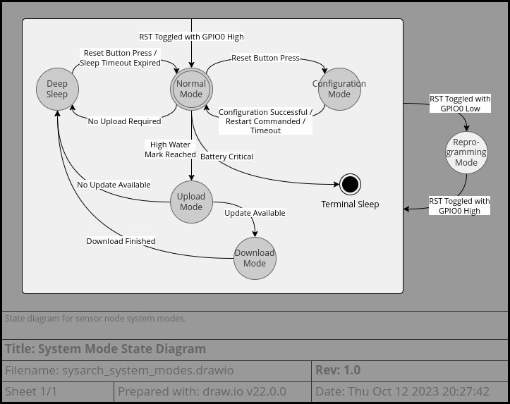
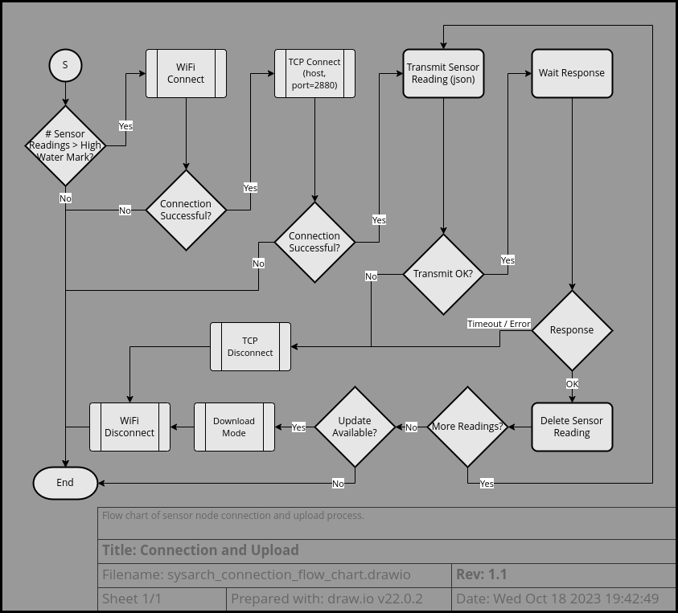
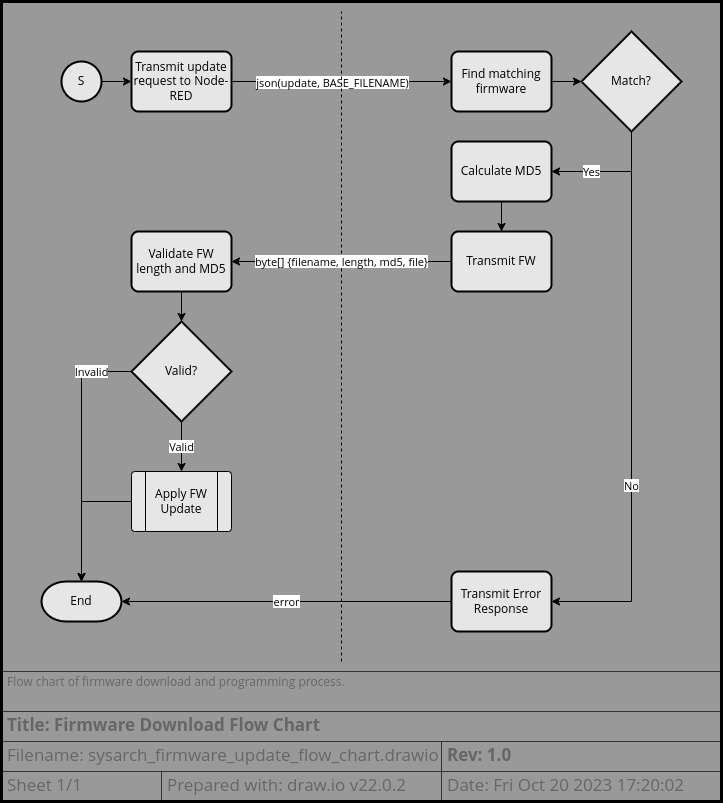
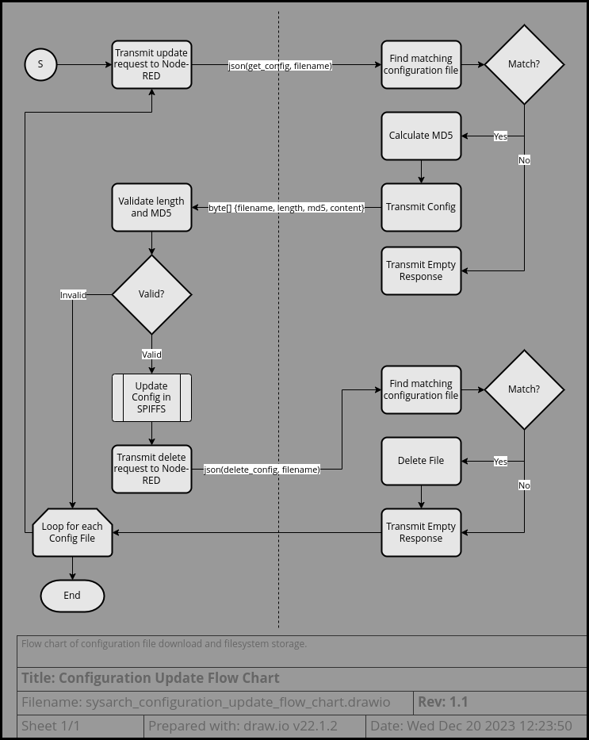

# Sensor Software Architecture

## Table of Contents
* [Block Diagram](#block-diagram)
* [External Dependencies](#external-dependencies)
* [Component Description](#component-description)
  - [Main](#main)
  - [Project Configuration](#project-configuration)
  - [Connectivity](#connectivity)
    + [Connection Manager](#connection-manager)
    + [Update Parser](#update-parser)
    + [WiFi Manager](#wifi-manager)
  - [Sensors](#sensors)
    + [SHT30](#sht30)
    + [HP303B](#hp303b)
    + [Pulse2](#pulse2)
  - [RTC Mem](#rtc-mem)
  - [Persistent Storage](#persistent-storage)
  - [E-Paper Display](#e-paper-display)
* [Dynamic Behavior](#dynamic-behavior)
  - [Interrupts](#interrupts)
  - [Modes of Operation](#modes-of-operation)
    + [Static Modes](#static-modes)
      * [Development Mode](#development-mode)
      * [Battery Mode](#battery-mode)
      * [Tethered Mode](#tethered-mode)
      * [VCC Cal Mode](#vcc-cal-mode)
    + [Dynamic Modes](#dynamic-modes)
      * [Configuration Mode](#configuration-mode)
      * [Initialization](#initialization)
      * [Normal Mode](#normal-mode)
      * [Deep Sleep](#deep-sleep)
      * [Connectivity Mode](#connectivity-mode)
* [Cybersecurity](#cybersecurity)
* [Error Handling](#error-handling)

---

## Block Diagram

  
The sensor node software can be roughly decomposed into a software stack
including applications, middleware, drivers, and SDK (which includes low-level
drivers).  
There are 2 main applications: Main, which handles normal business logic of the
sensor; and the Connection Manager, which handles connection to the WiFi network
and interaction with the Node-RED server.  
A third application is the WiFi Manager, which is more properly located in the
middleware layer since its behavior and configuration are managed by the
Connection Manager.  
The driver layer is composed of high-level drivers that are implemented using
the Arduino and ESP SDK functionalities.  
The SDK layer provides Arduino HAL functionalities as well as ESP8266-specific
low-level drivers.

---

## External Dependencies

| External Dependency | Tested Version | Link
|---------------------|----------------|------
| Arduino IDE         | 2.0.3          | https://www.arduino.cc/
| ESP SDK             | 3.0.2          | https://github.com/esp8266/Arduino
| * lwIP              | 2.1.2          | Part of ESP SDK - website: https://www.nongnu.org/lwip
| WiFi Manager        | 0.16.0         | https://github.com/tzapu/WiFiManager
| Lolin HP303B        | commit 4deb5f  | https://github.com/wemos/LOLIN_HP303B_Library

---

## Component Description

### Main

##### Description

  
The Main component provides the familiar entry point functions for the Arduino
framework (e.g. `setup` and `loop`).  
It orchestrates the collection and display of sensor readings as well as
changes between modes of operation for the sensor node.

##### Dependencies

| Component             | Interface Type     | Description
|-----------------------|--------------------|-------------
| Connection Manager    | function           | Connectivity API
| Sensors               | function           | Sensor readings API
| RTC Mem               | function, global   | Sleep API, RTC Memory API
| EPD_1in9              | function           | E-Paper Display API
| ResetInfo             | function           | Reset reason detects double-press of reset button
| Waveform              | function           | Blink LED at constant rate
| Wiring                | function           | GPIO API, delay API
| Project Configuration | preprocessor macro | Configuration settings
| Serial                | class              | Logging printf

##### Configuration

Configuration of this component is done through preprocessor defines set in
[project_config.h](../project_config.h).

| Configuration            | Type          | Description
|--------------------------|---------------|-------------
| EXTRA_DEBUG              | bool          | Enables additional debug logging
| TETHERED_MODE            | bool          | Enables PPD42 sensor
| VCC_CAL_MODE             | bool          | Builds for VCC Calibration mode (allows quick reading of VCC ADC to assist with calibration)
| SERIAL_SPEED             | unsigned long | Baud rate for the logging serial port
| LOW_BATTERY_VOLTAGE      | float         | Voltage level at which the low battery icon will be set on the display
| CRIT_BATTERY_VOLTAGE     | float         | Voltage level at which the critically low battery message will be displayed
| DISP_CONNECT_FAIL_COUNT  | unsigned int  | Number of failed connections that will trigger the connection error message to be displayed
| MAX_ESP_SLEEP_TIME_MS    | uint64_t      | Value that represents an "infinite" sleep time
| PPD42_PIN_DET            | uint8_t       | Pin # used to detect presence of PPD42 sensor
| EPD_FULL_REFRESH_TIME_MS | uint64_t      | Period between full display refreshes in milliseconds
| EPD_RST_PIN              | uint8_t       | Pin number for the EPD reset pin
| EPD_RST_POLARITY         | bool          | Indicates whether reset pin is active high or low
| EPD_FAHRENHEIT           | bool          | Indicates whether display temp is in °F rather than °C
| SIMULATE_GOOD_CONNECTION | bool          | Enables debug mode where upload is not actually performed

##### Public API

###### Types and Enums
None

###### Functions

preinit
> Called before global class instances are initialized.  
> Calls `connectivity_preinit` to disable the modem before it gets initialized.
>
> 🪧 Note: This function is only used in non-tethered mode.
> In tethered mode, the WiFi radio is left active permanently.
>
> | Parameter     | Direction | Type          | Description
> |---------------|-----------|---------------|-------------
> |               | return    | void          |

setup
> Called before the main processing loop starts.  
> Initializes the Serial port and RTC Memory.  
> Checks the reset reason and decides whether to start WiFi Manager or
> run the normal sensor processing.
>
> | Parameter     | Direction | Type          | Description
> |---------------|-----------|---------------|-------------
> |               | return    | void          |

loop
> Executes the normal sensor processing.  
> Despite the name, this function normally does not loop.
> In battery mode, it always ends in a deep sleep.
> In tethered mode, it may or may not enter deep sleep depending on how long
> the sensor processing and upload process took.
>
> | Parameter     | Direction | Type          | Description
> |---------------|-----------|---------------|-------------
> |               | return    | void          |

##### Critical Sections

None

### Project Configuration

  
The Project Configuration header, [project_config.h](../project_config.h),
provides a central location for configuring the behavior of the sensor node.

##### Dependencies

None

##### Configuration

There are 4 main configurations that can be set in this file to control high-
level behavior of the sensor node:

| Configuration     | Type | Description
|-------------------|------|-------------
| EXTRA_DEBUG       | bool | Enables additional debug logging
| TETHERED_MODE     | bool | Configures the Sensor to run from an unlimited power supply -- enables PPD42 sensor and uploads sensor readings to the server every cycle
| DEVELOPMENT_BUILD | bool | Enables settings helpful for the developer or for debugging -- enables EXTRA_DEBUG, reduces sleep time and number of storage slots, and disables remote firmware updates
| VCC_CAL_MODE      | bool | Enables a mode for calibrating the VCC ADC -- this combines `DEVELOPMENT_BUILD` with `TETHERED_MODE` to provide rapid feedback about the battery voltage

There are additional configurations that may be changed based on user
preferrence:

| Configuration           | Type          | Description
|-------------------------|---------------|-------------
| SERIAL_SPEED            | unsigned long | Baud rate for the logging serial port
| REPORT_RESPONSE_TIMEOUT | unsigned long | Timeout period (in milliseconds) to wait for a response from the Node-RED server
| LOW_BATTERY_VOLTAGE     | float         | Voltage level at which the low battery icon will be set on the display
| DISP_CONNECT_FAIL_COUNT | unsigned int  | Number of failed connections that will trigger the connection error message to be displayed
| FIRMWARE_NAME           | const char*   | Prefix for the firmware file name that will be communicated to the Node-RED server (must match the filename of the firmware files stored on the server)
| EPD_FAHRENHEIT          | bool          | Indicates whether display temp is in °F rather than °C
| SLEEP_TIME_MS           | int           | Default time to sleep between sensor readings in milliseconds (note: configurable through WiFi Manager)

**The remaining configurations in this file are mostly things that you would not
have a need to change.**

There are several hardware-specific configurations that would need to be changed
if different or modified hardware was used:

| Configuration    | Type    | Description
|------------------|---------|-------------
| SHT30_ADDR       | uint8_t | I2C Address for the SHT30 sensor
| PPD42_PIN_DET    | uint8_t | Pin # used to detect presence of PPD42 sensor
| PPD42_PIN_1_0    | uint8_t | Pin # used as LPO output of PPD42 sensor for PM1.0 detections
| PPD42_PIN_2_5    | uint8_t | Pin # used as LPO output of PPD42 sensor for PM2.5 detections
| EPD_BUSY_PIN     | uint8_t | Pin number for the EPD busy pin
| EPD_RST_PIN      | uint8_t | Pin number for the EPD reset pin
| EPD_RST_POLARITY | bool    | Indicates whether reset pin is active high or low

The file names and default values used in persistent storage are configurable,
but you would mostly not want to change these as the values are intended to be
updated through WiFi Manager as an end-user setup step:

| Configuration               | Type        | Description
|-----------------------------|-------------|-------------
| PERSISTENT_NODE_NAME        | const char* | Filename where the node name is stored in SPIFFS
| PERSISTENT_REPORT_HOST_NAME | const char* | Filename where the Node-RED server hostname is stored in SPIFFS
| PERSISTENT_REPORT_HOST_PORT | const char* | Filename where the Node-RED server port number is stored in SPIFFS
| PERSISTENT_CLOCK_CALIB      | const char* | Filename where the clock calibration (bootup time and sleep drift correction) is stored in SPIFFS
| PERSISTENT_TEMP_CALIB       | const char* | Filename where the temperature calibration is stored in SPIFFS
| PERSISTENT_HUMIDITY_CALIB   | const char* | Filename where the humidity calibration is stored in SPIFFS
| PERSISTENT_PRESSURE_CALIB   | const char* | Filename where the pressure calibration is stored in SPIFFS
| PERSISTENT_BATTERY_CALIB    | const char* | Filename where the battery (VCC ADC) calibration is stored in SPIFFS
| PERSISTENT_SLEEP_TIME_MS    | const char* | Filename where the sleep time configuration is stored in SPIFFS
| PERSISTENT_HIGH_WATER_SLOT  | const char* | Filename where the high water slot (upload trigger) configuration is stored in SPIFFS
| DEFAULT_NODE_BASE_NAME      | const char* | Prefix string for default node name (ESP serial number is appended) if no value stored in SPIFFS
| DEFAULT_REPORT_HOST_NAME    | const char* | Default hostname for the Node-RED server if no value stored in SPIFFS
| DEFAULT_REPORT_HOST_PORT    | int         | Default port number for the Node-RED server if no value stored in SPIFFS
| DEFAULT_SLEEP_CLOCK_ADJ     | int         | Default clock calibration if no value stored in SPIFFS
| DEFAULT_TEMP_CALIB          | float       | Default temperature calibration if no value stored in SPIFFS
| DEFAULT_HUMIDITY_CALIB      | float       | Default humidity calibration if no value stored in SPIFFS
| DEFAULT_PRESSURE_CALIB      | float       | Default pressure calibration if no value stored in SPIFFS
| DEFAULT_BATTERY_CALIB       | float       | Default battery calibration (VCC ADC) if no value stored in SPIFFS
| DEFAULT_SLEEP_TIME_MS       | int         | Default sleep time if no value stored in SPIFFS
| DEFAULT_HIGH_WATER_SLOT     | size_t      | Default high water slot (upload trigger) if no value stored in SPIFFS

The remaining configurations do impact the behavior of the software but the need
to change them is dubious (and in some cases would require changes in the
software modules that use them):

| Configuration            | Type               | Description
|--------------------------|--------------------|-------------
| CONFIG_SERVER_MAX_TIME   | unsigned long      | Timeout period (in seconds) for the WiFi Manager configuration portal
| WIFI_CONNECT_TIMEOUT     | unsigned long      | Timeout period (in milliseconds) for connecting to the WiFi
| CRIT_BATTERY_VOLTAGE     | float              | Voltage level at which the critically low battery message will be displayed
| DISP_CONNECT_FAIL_COUNT  | unsigned int       | Number of failed connections that will trigger the connection error message to be displayed
| MAX_ESP_SLEEP_TIME_MS    | unsigned long long | Clamps requested sleep time since there is a bug if the value is too large; represents an "infinite" sleep time
| DISABLE_FW_UPDATE        | bool               | Ignores firmware update notices from the Node-RED server -- useful for development since you will always have an "unknown" software version (unless debugging the firmware update process is your goal)
| SIMULATE_GOOD_CONNECTION | bool               | Enables debug mode where upload is not actually performed -- may need to be disabled when debugging connection and upload issues during development
| NUM_STORAGE_SLOTS        | size_t             | Maximum number of sensor readings that can be stored in RTC Memory
| HIGH_WATER_SLOT          | size_t             | Determines the threshold for collected sensor readings that triggers an upload process

##### Public API

###### Types and Enums

PREINIT_MAGIC
> This preprocessor definition is not really configurable, but serves as a
> "fingerprint" for the software. It is created by hashing the build timestamp
> with a magic number.  
> The goal is to be able to provide a software "version" without any semantics
> behind it. The git commit hash would probably be better
> for this purpose, but the build system in Arduino is not particularly
> accessible for injecting this kind of information into the preprocessor.
>
> This fingerprint is used to detect when the existing RTC Mem contents are
> out-of-date (for example after a firmware update or on a cold boot).
>
> The Node-RED server will use this fingerprint to determine if an update needs
> to be sent to the sensor node and will also store it with the sensor readings
> in the database in case it would be useful for filtering later.

###### Functions

None

##### Critical Sections

None

### Connectivity


Connection Manager and WiFi Manager are the main components that make up the
Connectivity Subsystem. These rely on Arduino WiFi APIs and ESP8266
implementations of WiFiStation and WiFiSoftAP, respectively, to handle WiFi
connectivity aspects.

Connection Manager is the main entry point to the Connectivity Subsystem
regardless of the type of activity to be performed. Typically, it is triggered
to upload sensor readings to the Node-RED server periodically. When starting the
configuration mode, the Connection Manager configures WiFi Manager and
establishes various callback functions before handing off control to it to
create the captive configuration portal. These callback functions will handle
updates to the configuration by storing the new values in persistent storage.

Update Parser handles interactions with the Node-RED server to update the
firmware or configurations.

#### Connection Manager

##### Description

  
The Connection Manager component handles the upload of sensor readings to the
Node-RED server. If there are firmware or configuration updates, it hands the
connection off to the Update Parser to handle these.  
When the user requests to enter configuration mode via a double press of the
reset button, Main informs the Connection Manager and it configures WiFi Manager
to create a captive configuration portal. WiFi Manager provides results in the
form of a callback function and Connection Manager implements this callback by
updating the values in persistent storage.

> ☝‍🎗 Note: this component exhibits high coupling and should be refactored by
> splitting-out config-mode handling and update parser functionality.

##### Dependencies

| Component             | Interface Type     | Description
|-----------------------|--------------------|-------------
| libstdc++             | class              | `String` class
| ChipId                | function           | API for getting the Chip ID (serial number)
| UpdateParser          | function           | Handle firmware and configuration updates from the Node-RED server
| WiFiManager           | class              | WiFi Manager configuration
| Persistent Storage    | function           | Read and Write configuration parameters to SPIFFS
| RTC Mem               | global, function   | Sensor readings management, uptime calculation
| WiFi                  | class              | High-level WiFi configuration API
| WiFiClient            | class              | High-level Socket connection API
| WiFiGenericClass      | class              | `preinitWiFiOff` API
| WiFiStation           | function           | `station_config` APIs
| Wiring                | function           | `delay`, `millis` API
| Project Configuration | preprocessor macro | Configuration settings
| Serial                | class              | Logging printf

##### Configuration

Configuration of this component is done through preprocessor defines set in
[project_config.h](../project_config.h).

| Configuration               | Type          | Description
|-----------------------------|---------------|-------------
| EXTRA_DEBUG                 | bool          | Enables additional debug logging
| TETHERED_MODE               | bool          | Determines whether to auto-enable WiFi at startup
| REPORT_RESPONSE_TIMEOUT     | unsigned long | Timeout period (in milliseconds) to wait for a response from the Node-RED server after uploading readings
| WIFI_CONNECT_TIMEOUT        | unsigned long | Timeout period (in milliseconds) for connecting to the WiFi
| NUM_STORAGE_SLOTS           | size_t        | Maximum number of sensor readings that can be stored in RTC Memory
| PERSISTENT_NODE_NAME        | const char*   | Used to retreive the sensor node hostname from SPIFFS
| PERSISTENT_REPORT_HOST_NAME | const char*   | Used to retreive the hostname of the Node-RED server from SPIFFS
| PERSISTENT_REPORT_HOST_PORT | const char*   | Used to retrieve the port number of the Node-RED server from SPIFFS
| PERSISTENT_TEMP_CALIB       | const char*   | Used to retrieve the temperature calibration from SPIFFS
| PERSISTENT_HUMIDITY_CALIB   | const char*   | Used to retrieve the humidity calibration from SPIFFS
| PERSISTENT_PRESSURE_CALIB   | const char*   | Used to retrieve the pressure calibration from SPIFFS
| PERSISTENT_BATTERY_CALIB    | const char*   | Used to retrieve the battery calibration from SPIFFS
| DEFAULT_NODE_BASE_NAME      | const char*   | Prefix string for default node hostname (ESP serial number is appended) if no value stored in SPIFFS
| DEFAULT_REPORT_HOST_NAME    | const char*   | Default hostname for the Node-RED server if no value stored in SPIFFS
| DEFAULT_REPORT_HOST_PORT    | int           | Default port number for the Node-RED server if no value stored in SPIFFS
| DEFAULT_TEMP_CALIB          | float         | Default temperature calibration if no value stored in SPIFFS
| DEFAULT_HUMIDITY_CALIB      | float         | Default humidity calibration if no value stored in SPIFFS
| DEFAULT_PRESSURE_CALIB      | float         | Default pressure calibration if no value stored in SPIFFS
| DEFAULT_BATTERY_CALIB       | float         | Default battery calibration if no value stored in SPIFFS


Additionally, the following preprocessor defines are used to modify the configuration of WiFi Manager:

| Configuration            | Type               | Description
|--------------------------|--------------------|-------------
| CONFIG_SERVER_MAX_TIME   | unsigned long      | Timeout period (in seconds) for the WiFi Manager configuration portal
| MAX_ESP_SLEEP_TIME_MS    | unsigned long long | Clamps requested sleep time configuration

Also, each of the PERSISTENT_* and DEFAULT_* persistent storage preprocessor
defines are used to initialize the current value shown by the WiFi Manager
configuration page and used by the callback implementation to write the updated
values back to SPIFFS.

##### Public API

###### Types and Enums
None

###### Functions

connectivity_preinit
> Calls `ESP8266WiFiClass::preinitWiFiOff` to disable the modem before it gets
> initialized.  
> Expected to be called from the pre-init function before global class instances
> are initialized.
>
> 🪧 Note: This function is only used in non-tethered mode.
> In tethered mode, the WiFi radio is left active permanently.
>
> | Parameter     | Direction | Type          | Description
> |---------------|-----------|---------------|-------------
> |               | return    | void          |

connectivity_init
> Initializes the Connection Manager
>
> | Parameter     | Direction | Type          | Description
> |---------------|-----------|---------------|-------------
> |               | return    | void          |

connectivity_disable
> Shuts down WiFi
>
> | Parameter     | Direction | Type          | Description
> |---------------|-----------|---------------|-------------
> |               | return    | void          |

connect_wifi
> Connects to the stored WiFi Access Point
>
> | Parameter     | Direction | Type          | Description
> |---------------|-----------|---------------|-------------
> |               | return    | bool          | Returns false if there was a connection error or timeout

enter_config_mode
> Start the WiFi Manager configuration mode
>
> | Parameter     | Direction | Type          | Description
> |---------------|-----------|---------------|-------------
> |               | return    | void          |

upload_readings
> Collates and uploads readings to the report server.
>
> ☝‍🎗 Note: this function exhibits high coupling with the RTC Memory and should
> be refactored.
>
> | Parameter     | Direction | Type          | Description
> |---------------|-----------|---------------|-------------
> |               | return    | void          |

##### Critical Sections

None

> ⚠️ Caution: This component is not threadsafe.  
> The functions of this component are not reentrant.  
> Calling `upload_readings` from a context that might be preempted by callers
> of the RTC Mem component could result in corruption of the sensor reading
> circular buffer.

#### Update Parser

##### Description

  
The Update Parser component retrieves firmware or configuration updates from the
Node-RED server and applies them to the program flash or persistent storage
filesystem, respectively.

> ☝‍🎗 Note: this component exhibits high coupling and should be refactored as a
> separate module.

##### Dependencies

| Component             | Interface Type     | Description
|-----------------------|--------------------|-------------
| libstdc++             | class              | `String` class
| Persistent Storage    | function           | Write configuration parameter updates to SPIFFS
| RTC Mem               | global, function   | Update configuration parameters in RTC memory, invalidate RTC memory on firmware update
| MD5Builder            | class              | Calculate md5sum
| Updater               | class, function    | Performs firmware update
| WiFiClient            | class              | High-level Socket connection API
| Wiring                | function           | `delay` API
| Project Configuration | preprocessor macro | Configuration settings
| Serial                | class              | Logging printf

##### Configuration

Configuration of this component is done through preprocessor defines set in
[project_config.h](../project_config.h).

| Configuration               | Type               | Description
|-----------------------------|--------------------|-------------
| EXTRA_DEBUG                 | bool               | Enables additional debug logging
| DISABLE_FW_UPDATE           | bool               | Disables firmware update functionality
| FIRMWARE_NAME               | const char*        | Prefix for the firmware file name that will be requested from the Node-RED server
| MAX_ESP_SLEEP_TIME_MS       | unsigned long long | Clamps requested sleep time configuration
| NUM_STORAGE_SLOTS           | size_t             | Maximum number of sensor readings that can be stored in RTC Memory
| PERSISTENT_NODE_NAME        | const char*        | Filename where the node name is stored in SPIFFS
| PERSISTENT_REPORT_HOST_NAME | const char*        | Filename where the Node-RED server hostname is stored in SPIFFS
| PERSISTENT_REPORT_HOST_PORT | const char*        | Filename where the Node-RED server port number is stored in SPIFFS
| PERSISTENT_CLOCK_CALIB      | const char*        | Filename where the clock calibration (bootup time and sleep drift correction) is stored in SPIFFS
| PERSISTENT_TEMP_CALIB       | const char*        | Filename where the temperature calibration is stored in SPIFFS
| PERSISTENT_HUMIDITY_CALIB   | const char*        | Filename where the humidity calibration is stored in SPIFFS
| PERSISTENT_PRESSURE_CALIB   | const char*        | Filename where the pressure calibration is stored in SPIFFS
| PERSISTENT_BATTERY_CALIB    | const char*        | Filename where the battery (VCC ADC) calibration is stored in SPIFFS
| PERSISTENT_SLEEP_TIME_MS    | const char*        | Filename where the sleep time configuration is stored in SPIFFS
| PERSISTENT_HIGH_WATER_SLOT  | const char*        | Filename where the high water slot (upload trigger) configuration is stored in SPIFFS
| DEFAULT_TEMP_CALIB          | float              | Default temperature calibration if no value stored in SPIFFS
| DEFAULT_HUMIDITY_CALIB      | float              | Default humidity calibration if no value stored in SPIFFS
| DEFAULT_BATTERY_CALIB       | float              | Default battery calibration (VCC ADC) if no value stored in SPIFFS
| DEFAULT_SLEEP_TIME_MS       | int                | Default sleep time if no value stored in SPIFFS
| DEFAULT_HIGH_WATER_SLOT     | size_t             | Default high water slot (upload trigger) if no value stored in SPIFFS

##### Public API

###### Types and Enums

None

###### Functions

update_config
> Performs the configuration update procedure by requesting the configuration
> files from the Node-RED server along with their size and MD5 checksum.
> Updates the files in SPIFFS if the MD5 checksum passes.
>
> | Parameter | Direction | Type        | Description
> |-----------|-----------|-------------|-------------
> |           | return    | bool        | Returns false if there was an error during the update process.
> | client    | in        | WiFiClient& | Client connection to the Node-RED server. Used to send and receive communication with the server.

update_firmware
> Performs the firmware update procedure by requesting the firmware file from
> the Node-RED server along with its size and MD5 checksum.
>
> ⚠️ Caution: There is no security check performed on this firmware update. An
> attacker could easily pretend to be the Node-RED server and signal the
> presence of an update and then provide their own firmware binary which will be
> flashed into the sensor node without any verification.
>
> | Parameter | Direction | Type        | Description
> |-----------|-----------|-------------|-------------
> |           | return    | bool        | Returns false if the update failed. Does not return if the update succeeded.
> | client    | in        | WiFiClient& | Client connection to the Node-RED server. Used to send and receive communication with the server.

##### Critical Sections

None

> 🪧 Note: One assumes that the underlying ESP.updateSketch SDK is written in a
> thread-safe way, but I have not investigated this detail myself.

#### WiFi Manager

##### Description

  
The WiFi Manager component implements a configuration interface for the user by
acting as a WiFi access point with a captive portal.  
This component is provided as an external dependency developed by
[@tzapu](https://github.com/tzapu).
See https://github.com/tzapu/WiFiManager for more details.

##### Dependencies

| Component             | Interface Type     | Description
|-----------------------|--------------------|-------------
| libstdc++             | class              | `String`, `<memory>`
| ChipId                | function           | API for getting the Chip ID (serial number)
| DNSServer             | class              | DNS Server used to implement captive portal
| WebServer             | class              | Web Server used to provide configuration page via the captive portal
| WiFi                  | class              | High-level WiFi configuration API
| WiFiSoftAP            | class              | WiFi Software Access Point implementation
| Wiring                | function           | `delay`, `millis` API

##### Configuration

WIFI_MANAGER_MAX_PARAMS
> This parameter defines the initial memory allocated for parameters.
> If memory is tight it may be useful to configure this before including the
> `WiFiManager.h` header.

##### Public API

###### Types and Enums

WiFiManagerParameter
> Class to create custom parameters that can be added to the WiFiManager setup
> web page.

WiFiManager
> Class to configure and interact with the WiFiManager.

###### Functions

> 🪧 Note: For brevity only used interfaces are shown here. For the complete API
> see https://github.com/tzapu/WiFiManager/blob/master/README.md.

WiFiManagerParameter::WiFiManagerParameter
> Constructor for a custom parameter
>
> | Parameter    | Direction | Type        | Description
> |--------------|-----------|-------------|-------------
> | id           | in        | const char* | Unique ID used for HTTP queries and must not contain spaces nor other special characters
> | placeholder  | in        | const char* | "hint" text that will be shown in the input form
> | defaultValue | in        | const char* | Initial value to be placed in the input form
> | length       | in        | int         | Maximum length for the form input
> | custom       | in        | const char* | Custom HTML to be added into the input form

WiFiManagerParameter::getValue
> Function to return the value stored in the custom parameter.
>
> | Parameter | Direction | Type        | Description
> |-----------|-----------|-------------|-------------
> |           | return    | const char* | The value stored in the custom parameter (either the defaultValue or NULL, or the value entered by the user in the input form)

WiFiManager::WiFiManager
> Void constructor

WiFiManager::~WiFiManager
> Destructor

WiFiManager::addParameter
> Adds a custom parameter.
>
> | Parameter | Direction | Type                  | Description
> |-----------|-----------|-----------------------|-------------
> |           | return    | bool                  | Returns false on failure
> | p         | in        | WiFiManagerParameter* | The parameter to add

WiFiManager::setConfigPortalTimeout
> Sets timeout before webserver loop ends and exits even if there has been no
> setup. Useful for devices that failed to connect at some point and got stuck
> in a webserver loop.
>
> | Parameter | Direction | Type          | Description
> |-----------|-----------|---------------|-------------
> |           | return    | void          |
> | seconds   | in        | unsigned long | The timeout after which the webserver will return back to the host software automatically

WiFiManager::setBreakAfterConfig
> Configures WiFiManager to exit after the user submits the updated
> configuration settings, even if connection is unsuccessful.
>
> | Parameter   | Direction | Type    | Description
> |-------------|-----------|---------|-------------
> |             | return    | void    |
> | shouldBreak | in        | boolean | Indicates whether the portal should exit even if the connection to the access point is unsuccessful

WiFiManager::setSaveConfigCallback
> Sets a callback for when settings have been saved by the user.
>
> | Parameter | Direction | Type           | Description
> |-----------|-----------|----------------|-------------
> |           | return    | void           |
> | func      | in        | void (*)(void) | The callback function to register

WiFiManager::startConfigPortal
> Manually starts the config portal without trying to connect first.
>
> | Parameter  | Direction | Type        | Description
> |------------|-----------|-------------|-------------
> |            | return    | boolean     | Indicates whether the connection to the saved access point was successful
> | apName     | in        | char const* | The SSID for the soft AP (defaults to "ESP" + chip ID)
> | apPassword | in        | char const* | Password for the soft AP (defaults to NULL)

### Sensors

##### Description

  
The Sensors component manages the different sensors attached to the sensor node
and stores their readings in RTC memory. It can store the following types of
sensor readings:
* SENSOR_TEMPERATURE
* SENSOR_HUMIDITY
* SENSOR_PRESSURE
* SENSOR_PARTICLE_1_0
* SENSOR_PARTICLE_2_5
* SENSOR_BATTERY_VOLTAGE

Additionally, the pseudo-sensor type SENSOR_TIMESTAMP_OFFS, is used to store a
correlated timestamp with each batch of readings.

##### Dependencies

| Component             | Interface Type     | Description
|-----------------------|--------------------|-------------
| Pulse2                | class              | GPIO pulse duration measurement of LPO from PPD42 particle sensor
| SHT30                 | function           | I2C driver for SHT30 sensor
| HP303B                | class              | I2C driver for HP303B sensor
| RTC Mem               | global, function   | Storage for sensor readings, uptime calculation
| Wiring                | function           | GPIO HAL
| TwoWire               | class              | I2C initialization
| ADC_VCC               | function           | VCC (battery) Voltage sensor HAL
| Project Configuration | preprocessor macro | Configuration settings
| Serial                | class              | Logging printf

##### Configuration

Configuration of this component is done through preprocessor defines set in
[project_config.h](../project_config.h).

| Configuration | Type    | Description
|---------------|---------|-------------
| EXTRA_DEBUG   | bool    | Enables additional debug logging
| TETHERED_MODE | bool    | Enables PPD42 sensor
| SHT30_ADDR    | uint8_t | I2C Address for the SHT30 sensor
| PPD42_PIN_DET | uint8_t | Pin # used to detect presence of PPD42 sensor
| PPD42_PIN_1_0 | uint8_t | Pin # used as LPO output of PPD42 sensor for PM1.0 detections
| PPD42_PIN_2_5 | uint8_t | Pin # used as LPO output of PPD42 sensor for PM2.5 detections

##### Public API

###### Types and Enums

sensor_type_t
> This enum provides labels for the different types of sensor readings.
>
> Enumerations:
> * SENSOR_UNKNOWN
> * SENSOR_TEMPERATURE
> * SENSOR_HUMIDITY
> * SENSOR_PRESSURE
> * SENSOR_PARTICLE_1_0
> * SENSOR_PARTICLE_2_5
> * SENSOR_BATTERY_VOLTAGE
> * SENSOR_TIMESTAMP_OFFS

###### Functions

sensors_init
> Initialize module. 
>
> | Parameter     | Direction | Type          | Description
> |---------------|-----------|---------------|-------------
> |               | return    | void          |

read_ppd42
> Read and store values from the PPD42 particle sensor.
> This measurement is recommended to take 30 seconds.
>
> 🪧 Note: The sensor requires a 3 minute warm-up time so this function is only
> available in tethered mode
> 
> | Parameter     | Direction | Type          | Description
> |---------------|-----------|---------------|-------------
> |               | return    | void          |
> | sampletime_us | in        | unsigned long | measurement time for the sensor in μs

read_sht30
> Read and store values from the SHT30 temperature and humidity sensor.
>
> | Parameter     | Direction | Type          | Description
> |---------------|-----------|---------------|-------------
> |               | return    | void          |
> | perform_store | in        | bool          | If true, the average of the sensor readings collected so far will be stored to RTC memory

read_hp303b
>Read and store values from the HP303B barometric pressure sensor.
>
> | Parameter     | Direction | Type          | Description
> |---------------|-----------|---------------|-------------
> |               | return    | void          |
> | measure_temp  | in        | bool          | If true, the temperature will also be measured using this sensor and stored

read_vcc
> Read and store the ESP VCC voltage level (battery).
>
> | Parameter     | Direction | Type          | Description
> |---------------|-----------|---------------|-------------
> |               | return    | void          |
> | perform_store | in        | bool          | If true, the average of the voltage readings collected so far will be stored to RTC memory

store_uptime
> Store the current uptime as an offset from `RTC_MEM_DATA_TIMEBASE`.
> 
> | Parameter     | Direction | Type          | Description
> |---------------|-----------|---------------|-------------
> |               | return    | void          |

get_temp
> Return the current temperature.
>
> 🪧 Note: The temperature must have already been stored by calling `read_sht30`
> or `read_hp303b`.  
> Otherwise, NAN will be returned.
>
> | Parameter     | Direction | Type          | Description
> |---------------|-----------|---------------|-------------
> |               | return    | float         | The current temperature (°C)

get_humidity
> Return the current relative humidity.
>
> 🪧 Note: The humidity must have already been stored by calling `read_sht30`.  
> Otherwise, NAN will be returned.
>
> | Parameter     | Direction | Type        | Description
> |---------------|-----------|-------------|-------------
> |               | return    | float       | The current relative humidity (%)

get_battery
> Return the current battery voltage.
>
> 🪧 Note: The battery voltage must have already been stored by calling
> `read_vcc`.  
> Otherwise, NAN will be returned.
>
> | Parameter     | Direction | Type          | Description
> |---------------|-----------|---------------|-------------
> |               | return    | float         | The current battery voltage

##### Critical Sections

None

> 🪧 Note: Many of the functions in this component use static data and are not
> reentrant.

#### SHT30

##### Description

  
The SHT30 driver provides a simple interface to retrieve sensor readings from
one or more SHT30 sensors and helper functions for parsing the data returned.

##### Dependencies

| Component             | Interface Type     | Description
|-----------------------|--------------------|-------------
| Wiring                | function           | delay API
| TwoWire               | class              | I2C API
| lwip                  | preprocessor macro | ntohs

##### Configuration

There is no static configuration for this component.

##### Public API

###### Types and Enums

sht30_repeatability_t
> This enum provides options for the single-shot capture mode of the sensor.
> Higher repeatability will result in longer duration spent capturing the
> measurement.
>
> Enumerations:
> * SHT30_RPT_LOW
> * SHT30_RPT_MED
> * SHT30_RPT_HIGH


sht30_data_t
> This structure represents the data format returned by the sensor.
>
> Fields:
> * uint16_t temp
> * uint8_t temp_check
> * uint16_t humidity
> * uint8_t humidity_check


###### Functions

sht30_get
> Retrieve a measurement in single-shot mode.
>
> | Parameter | Direction | Type                  | Description
> |-----------|-----------|-----------------------|-------------
> |           | return    | int                   | 0 for success, non-0 for failure
> | addr      | in        | uint8_t               | I2C Address for the sensor
> | type      | in        | sht30_repeatability_t | Measurement type
> | data_out  | out       | sht30_data_t*         | Data structure to return the measurement in - won't be modified on failure

sht30_parse_temp_c
> Convert the data reading into a float temperature value (°C)
> 
> | Parameter | Direction | Type         | Description
> |-----------|-----------|--------------|-------------
> |           | return    | float        | Temperature in °C
> | data      | in        | sht30_data_t | Data structure with the measurement to convert

sht30_parse_temp_f
> Convert the data reading into a float temperature value (°F)
> 
> | Parameter | Direction | Type         | Description
> |-----------|-----------|--------------|-------------
> |           | return    | float        | Temperature in °F
> | data      | in        | sht30_data_t | Data structure with the measurement to convert

sht30_parse_humidity
> Convert the data reading into a float humidity value (RH%)
> 
> | Parameter | Direction | Type         | Description
> |-----------|-----------|--------------|-------------
> |           | return    | float        | Relative humidity
> | data      | in        | sht30_data_t | Data structure with the measurement to convert

sht30_check_temp
> Check the data reading temperature CRC
> 
> | Parameter | Direction | Type         | Description
> |-----------|-----------|--------------|-------------
> |           | return    | bool         | True if CRC OK
> | data      | in        | sht30_data_t | Data structure with the measurement to check

sht30_check_humidity
> Check the data reading humidity CRC
> 
> | Parameter | Direction | Type         | Description
> |-----------|-----------|--------------|-------------
> |           | return    | bool         | True if CRC OK
> | data      | in        | sht30_data_t | Data structure with the measurement to check

##### Critical Sections

None

> 🪧 Note: It isn't recommended to call `sht30_get` from different CPU cores
> simultaneously.
> The behavior of the underlying TwoWire library is likely to be undefined in
> this situation.

#### HP303B

##### Description

  
The HP303B driver provides a class object to interface with an HP303B sensors
via I2C or SPI.  
This component is provided as an external dependency developed by Lolin.

##### Dependencies

| Component             | Interface Type     | Description
|-----------------------|--------------------|-------------
| Wiring                | function           | `delay` API (and GPIO for SPI chipselect)
| TwoWire               | class              | I2C API
| SPI                   | class              | SPI API (unused in this project)

##### Configuration

There is no static configuration for this component.

##### Public API

###### Types and Enums

LOLIN_HP303B
> This class provides public interfaces for accessing the sensor.

###### Functions

> 🪧 Note: For brevity only used interfaces are shown here. For the complete API see https://github.com/wemos/LOLIN_HP303B_Library/blob/master/src/LOLIN_HP303B.h.

LOLIN_HP303B::LOLIN_HP303B
> Void Constructor

LOLIN_HP303B::~LOLIN_HP303B
> Destructor

LOLIN_HP303B::begin
> Function to initialize the sensor using default I2C interface.
>
> | Parameter    | Direction | Type    | Description
> |--------------|-----------|---------|-------------
> |              | return    | void    |
> | slaveAddress | in        | uint8_t | I2C Address for the sensor (defaults to 0x77U)

LOLIN_HP303B::end
> Function to return the sensor to standby.
>
> | Parameter        | Direction | Type     | Description
> |------------------|-----------|----------|-------------
> |                  | return    | void     |

LOLIN_HP303B::measureTempOnce
> Function to measure the temperature in one-shot mode with selected
> oversampling (2^n averages).
>
> | Parameter        | Direction | Type     | Description
> |------------------|-----------|----------|-------------
> |                  | return    | int16_t  | 0 for success, non-0 for failure
> | result           | out       | int32_t& | Temperature result (°C)
> | oversamplingRate | in        | uint8_t  | Selected oversampling level 

LOLIN_HP303B::measurePressureOnce
> Function to measure the pressure in one-shot mode with selected oversampling
> (2^n averages).
>
> | Parameter        | Direction | Type     | Description
> |------------------|-----------|----------|-------------
> |                  | return    | int16_t  | 0 for success, non-0 for failure
> | result           | out       | int32_t& | Pressure result (pascal)
> | oversamplingRate | in        | uint8_t  | Selected oversampling level 

##### Critical Sections

None

#### Pulse2

##### Description

  
The Pulse2 driver provides a class object to monitor multiple GPIO pins and
accurately measure their pulse-width.  
In this project, the Pulse2 driver is used to monitor the LPO output pins of the
PPD42 particle sensor.

> 🪧 Note: This class is only used in the project when it is configured for
> tethered mode.

##### Dependencies

| Component             | Interface Type     | Description
|-----------------------|--------------------|-------------
| Wiring                | function           | Interrupt, IO, and timing API
| ESP Intrinsics        | function           | Enable/Disable Interrupts
| libstdc++             | function,class     | bind API

##### Configuration

The following static configuration parameters can be modified in the
[pulse2.h](../pulse2.h) header file:

| Configuration      | Type   | Description 
|--------------------|--------|-------------
| PULSE2_MAX_PINS    | size_t | max number of pins that can be watched
| PULSE2_WATCH_DEPTH | size_t | max number of pulses that can be stored for each pin

##### Public API

###### Types and Enums

Pulse2
> This class provides public interfaces for registering and monitoring input
> pins.

###### Functions

Pulse2::Pulse2
> Void Constructor

Pulse2::~Pulse2
> Destructor - automatically deregisters any pins

Pulse2::register_pin
> Function to add (or overwrite) a monitor activity for a particular pin to
> pulse in a given direction.
>
> | Parameter    | Direction | Type    | Description
> |--------------|-----------|---------|-------------
> |              | return    | bool    | Returns false if `PULSE2_MAX_PINS` have already been registered
> | pin          | in        | uint8_t | GPIO pin identifier
> | direction    | in        | uint8_t | Direction of pulse to monitor for

Pulse2::unregister_pin
> Function to add (or overwrite) a monitor activity for a particular pin to
> pulse in a given direction.
>
> | Parameter    | Direction | Type    | Description
> |--------------|-----------|---------|-------------
> |              | return    | void    |
> | pin          | in        | uint8_t | GPIO pin identifier

Pulse2::watch
> Block (with timeout) until one of the pins is triggered.
>
> | Parameter | Direction | Type           | Description
> |-----------|-----------|----------------|-------------
> |           | return    | uint8_t        | Returns pin number on success or PULSE2_NO_PIN if the timeout is reached
> | result    | out       | unsigned long* | On success, pulse length is stored in this variable
> | timeout   | in        | unsigned long  | Max time to monitor for in μsec (default is 1000000L == 1 second)

Pulse2::reset
> Function to reset the state machines and throw out any existing results.
> Does not unregister any pins.
>
> | Parameter    | Direction | Type    | Description
> |--------------|-----------|---------|-------------
> |              | return    | void    |

##### Critical Sections

While monitoring the pins in the `Pulse2::watch` function, the GPIO interrupts
are periodically disabled to check the results stored by the interrupt handlers.

> 🪧 Note: The use of the class object from multiple CPU cores is not
> threadsafe.  
> No attempt is made to protect the data structures during register/unregister
> operations and it would certainly be problematic to call `Pulse2::watch` on
> multiple cores simultaneously.  
> It is also recommended to unregister pins before re-registering them with a
> different pin direction.

### RTC Mem

##### Description

  
The rtc_mem driver provides an interface to the RTC User Memory and Deep Sleep
functionalities of the ESP8266.  
It provides several helper functions for managing the sensor readings in the RTC
User Memory and entering deep sleep; and is the source of truth for the uptime
of the system.

> ☝‍🎗 Note: this component exhibits high coupling and should be refactored -
> ideally as a C++ class.

##### Dependencies

| Component             | Interface Type     | Description
|-----------------------|--------------------|-------------
| Sensors               | type definition    | `sensor_type_t`
| Persistent Storage    | function           | Initialization from NVM parameters
| Wiring                | function           | `millis` API
| ResetInfo             | function           | `getResetReason` API
| Deep Sleep            | function           | `deepSleepInstant` API
| rtcUserMemory         | function           | RTC User Memory read/write API
| Project Configuration | preprocessor macro | Configuration settings
| Serial                | class              | Logging printf

##### Configuration

Configuration of this component is done through preprocessor defines set in
[project_config.h](../project_config.h).

| Configuration              | Type               | Description
|----------------------------|--------------------|-------------
| EXTRA_DEBUG                | bool               | Enables additional debug logging
| TETHERED_MODE              | bool               | Leaves RF Block powered during deep sleep
| MAX_ESP_SLEEP_TIME_MS      | unsigned long long | Clamps requested sleep time since there is a bug if the value is too large
| NUM_STORAGE_SLOTS          | size_t             | Maximum number of sensor readings that can be stored in RTC Memory
| PERSISTENT_CLOCK_CALIB     | const char*        | Filename where the clock calibration (bootup time and sleep drift correction) is stored in SPIFFS
| PERSISTENT_TEMP_CALIB      | const char*        | Filename where the temperature calibration is stored in SPIFFS
| PERSISTENT_HUMIDITY_CALIB  | const char*        | Filename where the humidity calibration is stored in SPIFFS
| PERSISTENT_BATTERY_CALIB   | const char*        | Filename where the battery (VCC ADC) calibration is stored in SPIFFS
| PERSISTENT_SLEEP_TIME_MS   | const char*        | Filename where the sleep time configuration is stored in SPIFFS
| PERSISTENT_HIGH_WATER_SLOT | const char*        | Filename where the high water slot (upload trigger) configuration is stored in SPIFFS
| DEFAULT_SLEEP_CLOCK_ADJ    | int                | Default clock calibration if no value stored in SPIFFS
| DEFAULT_TEMP_CALIB         | float              | Default temperature calibration if no value stored in SPIFFS
| DEFAULT_HUMIDITY_CALIB     | float              | Default humidity calibration if no value stored in SPIFFS
| DEFAULT_BATTERY_CALIB      | float              | Default battery calibration (VCC ADC) if no value stored in SPIFFS
| DEFAULT_SLEEP_TIME_MS      | int                | Default sleep time if no value stored in SPIFFS
| DEFAULT_HIGH_WATER_SLOT    | size_t             | Default high water slot (upload trigger) if no value stored in SPIFFS

##### Public API

###### Global Externs

rtc_mem
> Array with RTC memory contents (shadow copy of ESP RTC User Memory)
>
> Type: uint32_t[RTC_MEM_MAX]
>
> Use the rtc_mem_fields_e enum to access the values of this array. Example:
> ```C
> boot_count_t *boot_count = (boot_count_t*) &rtc_mem[RTC_MEM_BOOT_COUNT];
> ```

preinit_magic
> Firmware fingerprint used to detect if RTC memory is inconsistent with the
> software version.  
> Changes each time the software is built.
>
> Type: const uint32_t

###### Types and Enums

RTC_DATA_TIMEBASE_SHIFT
> Preprocessor define indicating how much to shift the data timebase from which
> sensor readings are offset (each sensor reading can only store a 24-bit
> timestamp (~4.5 hours)).
> It represents a tradeoff between maximum timestamp that can be represented and
> sensor timestamp accuracy. A value of 8 represents approximately 0.250 second
> precision in the measurements (which directly impacts measurement
> accuracy). Conversely, it allows an uptime of nearly 35 years rather than less
> than 50 days.
>
> Usage:
> ```C
> uint64_t millis = ((uint64_t)rtc_mem[RTC_MEM_DATA_TIMEBASE] << RTC_DATA_TIMEBASE_SHIFT);
> ```

flags_time_t
> Structure that combines various flags with the device uptime into 2 32-bit RTC
> memory entries.
>
> Fields:
> * uint64_t flags :5 - various condition flags (see below)
> * uint64_t fail_count :3 - keep track of wifi connection failures
> * uint64_t clock_cal :16 - calibration for clock drift during suspend in ms
> * uint64_t millis :40 - uptime in ms tracked over suspend cycles
>
> Currently 3 flags are defined:
> * FLAG_BIT_CONNECT_NEXT_WAKE - bit 0
> * FLAG_BIT_NORMAL_UPLOAD_COND - bit 1
> * FLAG_BIT_LOW_BATTERY - bit 2

sensor_reading_t
> Structure of a sensor reading.
>
> Fields:
> * sensor_type_t type :8 - type of sensor reading
> * int32_t value :24 - value of the sensor reading

sleep_params_t
> Structure to combine custom sleep time and high-water slot into a single
> 32-bit RTC memory entry.
>
> Fields:
> * uint32_t high_water_slot :8 - configuration for upload threshold
> * uint32_t sleep_time_ms :24 - configuration for sleep duration

boot_count_t
> Structure to combine boot count and E-Paper Display refresh cycle count
> into a single 32-bit RTC memory entry.
>
> Fields:
> * uint32_t epd_partial_refresh_count :8
> * uint32_t boot_count :24

rtc_mem_fields_e
> Enum to provide field names for each of the positions in the RTC memory array.
>
> Enumerations:
> * RTC_MEM_CHECK - Magic value/Header checksum (see preinit_magic)
> * RTC_MEM_BOOT_COUNT - `boot_count_t`
> * RTC_MEM_FLAGS_TIME - `flags_time_t`
> * RTC_MEM_FLAGS_TIME_END - `flags_time_t`
> * RTC_MEM_DATA_TIMEBASE - Timestamp (upper 32 bits) from which sensor readings are stored as offsets
> * RTC_MEM_NUM_READINGS - Number of occupied slots
> * RTC_MEM_FIRST_READING - Slot that has the oldest reading
> * RTC_MEM_TEMP_CAL - (float) Store the temperature calibration
> * RTC_MEM_HUMIDITY_CAL - (float) Store the humidity calibration
> * RTC_MEM_BATTERY_CAL - (float) Store the battery (VCC ADC) calibration
> * RTC_MEM_SLEEP_PARAMS - (`sleep_params_t`) Store the user's sleep configuration
> * RTC_MEM_DATA - (`sensor_reading_t`) Beginning of the circular buffer of sensor readings
> * RTC_MEM_DATA_END (`sensor_reading_t`) End of the array of sensor readings
> * RTC_MEM_MAX - Total number of elements in the RTC memory (not to exceed 128)

###### Functions

load_rtc_memory
> Function to load RTC User Memory into the shadow copy (`rtc_mem`) at startup.
> Performs some housekeeping and prints some debug.
>
> | Parameter    | Direction | Type    | Description
> |--------------|-----------|---------|-------------
> |              | return    | bool    | Returns false if RTC memory had to be reformatted (see preinit_magic)

invalidate_rtc
> Clear the RTC User Memory and re-initialize the shadow copy (`rtc_mem`).
>
> | Parameter    | Direction | Type    | Description
> |--------------|-----------|---------|-------------
> |              | return    | void    |

uptime
> Return the system uptime, which is tracked across sleep cycles (unlike
> `millis`).
>
> | Parameter    | Direction | Type     | Description
> |--------------|-----------|----------|-------------
> |              | return    | uint64_t | System uptime in ms

save_rtc
> Helper for storing the shadow copy (`rtc_mem`) back to RTC User Memory before
> entering sleep.
> Updates checksum in `RTC_MEM_CHECK` and stores increments the uptime.
>
> | Parameter     | Direction | Type     | Description
> |---------------|-----------|----------|-------------
> |               | return    | void     |
> | sleep_time_us | in        | uint64_t | Optional sleep time (in μs) to add to the uptime. Defaults to 0 in case of saving without entering sleep.

deep_sleep
> Helper for entering sleep.
> Calls `save_rtc` to store the RTC memory.
>
> | Parameter     | Direction | Type     | Description
> |---------------|-----------|----------|-------------
> |               | return    | void     |
> | time_us       | in        | uint64_t | Desired sleep duration (in μs)

store_reading
> Helper for storing a sensor reading in the `RTC_MEM_DATA` circular buffer.
>
> | Parameter | Direction | Type          | Description
> |-----------|-----------|---------------|-------------
> |           | return    | void          |
> | type      | in        | sensor_type_t | Type of the sensor reading
> | val       | in        | in32_t        | Value of the sensor reading

clear_readings
> Helper for removing readings from the `RTC_MEM_DATA` circular buffer.
>
> | Parameter | Direction | Type          | Description
> |-----------|-----------|---------------|-------------
> |           | return    | void          |
> | num       | in        | unsigned int  | Optional number of readings to remove (oldest first), defaults to all readings

dump_readings
> Prints out all the sensor readings in the circular buffer
>
> 🪧 Note: only functions if `EXTRA_DEBUG` is enabled.
>
> | Parameter | Direction | Type          | Description
> |-----------|-----------|---------------|-------------
> |           | return    | void          |

##### Critical Sections

None

> ⚠️ Caution: This component is not threadsafe.  
> The functions of this component are not reentrant.  
> Accessing `rtc_mem` from a context that might be preempted by callers of this
> component could result in reading inconsistent values.

### Persistent Storage

##### Description

  
The Persistent Storage driver provides an interface for reading and writing
key-value pairs in the SPI Flash File System (SPIFFS).  
It abstracts the interface of working with POSIX-style file handles and allows
SPIFFS initialization to be performed on-demand.

##### Dependencies

| Component             | Interface Type     | Description
|-----------------------|--------------------|-------------
| libstdc++             | class              | `String` class
| SPIFFS                | class              | SPI Flash File System API
| Project Configuration | preprocessor macro | Configuration settings
| Serial                | class              | Logging printf

##### Configuration

Configuration of this component is done through preprocessor defines set in
[project_config.h](../project_config.h).

| Configuration              | Type               | Description
|----------------------------|--------------------|-------------
| EXTRA_DEBUG                | bool               | Enables additional debug logging

##### Public API

###### Types and Enums

None

###### Functions

persistent_init
> Function to initialize SPIFFS.  
> Normally, SPIFFS will be initialized on-demand. However, it can be
> initialized manually by calling this function. This may be useful if
> you want your first call to the other API functions to run more quickly.
>
> | Parameter    | Direction | Type    | Description
> |--------------|-----------|---------|-------------
> |              | return    | void    |

persistent_read
> Function to read a value from a particular file.  
> Values are stored as strings. However, the function is overloaded to
> provide automatic conversion to int or float.
>
> 1) Fundamental Prototype:
>
> | Parameter    | Direction | Type        | Description
> |--------------|-----------|-------------|-------------
> |              | return    | String      | Returns a String object representing the contents of the file or ""
> | filename     | in        | const char* | The filename to read from
>
> 2) Default String Prototype:
>
> | Parameter     | Direction | Type        | Description
> |---------------|-----------|-------------|-------------
> |               | return    | String      | Returns a String object representing the contents of the file or the provided default_value
> | filename      | in        | const char* | The filename to read from
> | default_value | in        | String      | The default value to return if the file does not exist or if the contents of the file are "", " ", or "default"
>
> 3) Default int Prototype:
>
> | Parameter     | Direction | Type        | Description
> |---------------|-----------|-------------|-------------
> |               | return    | int         | Returns the contents of the file after integer conversion or the provided default_value
> | filename      | in        | const char* | The filename to read from
> | default_value | in        | int         | The default value to return if the file does not exist or if integer conversion fails
>
> 4) Default float Prototype:
>
> | Parameter     | Direction | Type        | Description
> |---------------|-----------|-------------|-------------
> |               | return    | float       | Returns the contents of the file after float conversion or the provided default_value
> | filename      | in        | const char* | The filename to read from
> | default_value | in        | float       | The default value to return if the file does not exist or if float conversion fails

persistent_write
> Function to store a string to a particular file.  
> It is overloaded to provide storage for strings or arbitrary byte arrays.
>
> 1) String Prototype:
>
> | Parameter     | Direction | Type        | Description
> |---------------|-----------|-------------|-------------
> |               | return    | bool        | Returns false if the data is not properly stored in the file
> | filename      | in        | const char* | The filename to write to
> | data          | in        | String      | The value to be written
>
> 2) Byte Array Prototype:
>
> | Parameter | Direction | Type           | Description
> |-----------|-----------|----------------|-------------
> |           | return    | bool           | Returns false if the data is not properly stored in the file
> | filename  | in        | const char*    | The filename to write to
> | buf       | in        | const uint8_t* | The data buffer to be written
> | size      | in        | size_t         | The size of the data buffer

##### Critical Sections

None

> 🪧 Note: One assumes that the underlying SPIFFS SDK is written in a thread-
> safe way, but I have not investigated this detail myself.

### E-Paper Display

  
The E-Paper Display (EPD) driver controls the Waveshare 1.9" E-Paper Display via
I2C.

The driver comes from https://www.waveshare.com/w/upload/f/f8/E-Paper-Segment-Code2.zip,
but some modifications have been made.

##### Dependencies

| Component             | Interface Type     | Description
|-----------------------|--------------------|-------------
| TwoWire               | class              | I2C API
| Wiring                | function           | GPIO and `delay` API
| Project Configuration | preprocessor macro | Configuration settings
| Serial                | class              | Logging printf

##### Configuration

Configuration of this component is done through preprocessor defines set in
[project_config.h](../project_config.h).

| Configuration      | Type    | Description
|--------------------|---------|-------------
| EPD_BUSY_PIN       | uint8_t | Pin number for the EPD busy pin
| EPD_RST_PIN        | uint8_t | Pin number for the EPD reset pin
| EPD_RST_POLARITY   | bool    | Indicates whether reset pin is active high or low

Additional static configuration is possible by modifying
[EPD_1in9.h](../EPD_1in9.h), but not expected to be useful.

| Configuration      | Type    | Description
|--------------------|---------|-------------
| adds_com           | uint8_t | I2C address for display commands
| adds_data          | uint8_t | I2C address for display data

##### Public API

###### Types and Enums

None

###### Functions

> 🪧 Note: The driver code exports all of its functions.
> For brevity only used interfaces are shown here.  
> For the complete API see [EPD_1in9.h](../EPD_1in9.h), though it is poorly
> documented.

EPD_1in9_GPIOInit
> Initialize GPIO pins.  
> Should be called before `EPD_1in9_init`.
>
> | Parameter    | Direction | Type    | Description
> |--------------|-----------|---------|-------------
> |              | return    | void    |

EPD_1in9_init
> Initialize the display via I2C.  
> This function also calls `EPD_1in9_Temperature`.  
> Should be called after `EPD_1in9_GPIOInit`.
>
> | Parameter    | Direction | Type    | Description
> |--------------|-----------|---------|-------------
> |              | return    | uint8_t | Returns any error result from the I2C

EPD_1in9_Set_Temp
> Store the current temperature.  
> 🪧 Note: This function has no immediate side effects. It is safe to
> call it before `EPD_1in9_init`. The stored temperature is used by
> `EPD_1in9_Temperature` (and, indirectly, by `EPD_1in9_init`).
>
> | Parameter | Direction | Type          | Description
> |-----------|-----------|---------------|-------------
> |           | return    | void          |
> | temp      | in        | unsigned char | Temperature in °C

EPD_1in9_Temperature
> Update the display refresh timings based on the stored temperature.  
> The stored temperature can be updated by calling `EPD_1in9_Set_Temp`.  
> This function is called by `EPD_1in9_init`.
>
> | Parameter | Direction | Type          | Description
> |-----------|-----------|---------------|-------------
> |           | return    | void          |

EPD_1in9_Clear_Screen
> Performs a full clear of the screen.  
> It is recommended to perform this action periodically.
>
> | Parameter | Direction | Type          | Description
> |-----------|-----------|---------------|-------------
> |           | return    | void          |

EPD_1in9_Easy_Write_Full_Screen
> Helper function to build up a full buffer from individual parameters
> and write it to the display.
>
> | Parameter        | Direction | Type  | Description
> |------------------|-----------|-------|-------------
> |                  | return    | void  |
> | temp             | in        | float | Temperature to display
> | humidity         | in        | float | Humidity to display
> | fahrenheit       | in        | bool  | True to indicate °F rather than °C
> | connect          | in        | bool  | True to light the Bluetooth icon
> | connection_error | in        | bool  | True to display "Conn Err" rather than the temperature and humidity
> | low_battery      | in        | bool  | True to display the empty battery icon
> | critical_battery | in        | bool  | True to display "Lo Bat" rather than the temperature and humidity

EPD_1in9_sleep
> Command the display to enter deep sleep and also assert the reset pin.
>
> | Parameter | Direction | Type          | Description
> |-----------|-----------|---------------|-------------
> |           | return    | void          |

##### Critical Sections

None

---

## Dynamic Behavior

### Interrupts

The interrupts provided by the ESP8266 are relatively limited and are managed by
the closed-source firmware (ETS SYS).

Summary of interrupts used:
* Free running counter Timer 1
  - Wiring: `delay` implementation
  - Wiring: `micros` overflow detection
  - TwoWire: Bus error timer
  - Waveform: Software PWM implementation
    + `LED_BUILTIN` blink during configuration mode
* GPIO interrupts
  - TwoWire: Software I2C implementation
  - Pulse2: pin monitoring
    + `PPD42_PIN_1_0` LPO time measurement
    + `PPD42_PIN_2_5` LPO time measurement
* UART interrupt
  - Serial: UART0 Rx ISR
  - Flasher Stub: UART0 Rx ISR for firmware update

It seems likely that the internal (closed-source) firmware has interrupts for
WiFi and possibly for the QSPI Flash (though, it looks like the chip probably
only has SPI Slave interrupts).  
The capture compare timer 0 also appears to be available to the HAL, but doesn't
seem to be used for anything.

### Modes of Operation

#### Static Modes

These are not dynamic modes of operation as such. They are statically configured
at compile time and result in different firmware binaries that can be loaded.  
However, they do impact the behavior of the Node-RED server as it will choose a
corresponding firmware image to send when performing a firmware update.

##### Development Mode

Development mode tunes the behavior of the sensor node for development and
debugging purposes.  
To enable development mode, set `DEVELOPMENT_BUILD` to 1 in
[project_config.h](../project_config.h) and then recompile and upload the
firmware.

In development mode, the following configuration changes will apply:
* `EXTRA_DEBUG` will be enabled to turn on additional serial debug logging
* `SLEEP_TIME_MS` is reduced so that sleep process and overall behavior can be observed more readily
* `NUM_STORAGE_SLOTS` is reduced so that filling of the circular buffer will occur more quickly
* `HIGH_WATER_SLOT` is reduced so that upload processing will occur more often

The following values may also be set, but will likely need to be adjusted
in [project_config.h](../project_config.h) based on the debugging task:
* `DISABLE_FW_UPDATE` will prevent the update command from the Node-RED server being processed
* `SIMULATE_GOOD_CONNECTION` will prevent an actual WiFi connection and upload from occurring

##### Battery Mode

Battery mode is the default/normal configuration for the sensor node firmware.
It is ideal for battery-powered hardware configurations.  
To enable battery mode, ensure `TETHERED_MODE` is set to 0 in
[project_config.h](../project_config.h) and then recompile and upload the
firmware.

In battery mode, the `FIRMWARE_NAME` will be set to "iotsp-battery". This is the
prefix that should be used for the firmware filename when storing the firmware
binary on the Node-RED server. Based on this filename, the server will
automatically distribute firmware updates to the sensor nodes when they connect.

> 🪧 Note: in battery mode, the PPD42 sensor is disabled since it requires
> continuous power for its heating element.

##### Tethered Mode

Tethered mode is an alternative firmware configuration for the sensor node.
It is useful for hardware configurations where the sensor is permanently powered from a 5-volt or USB AC adapter.  
To enable tethered mode, ensure `TETHERED_MODE` is set to 1 in
[project_config.h](../project_config.h) and then recompile and upload the
firmware.

In tethered mode, several changes will be made to the behavior of the sensor:
* the PPD42 sensor will be enabled
* the WiFi modem will be left enabled during deep sleep
* `HIGH_WATER_SLOT` will be set to 1 to enable upload of sensor readings on every boot

> 🪧 Note: the EPD and PPD42 sensor cannot be used simultaneously.  
> No reconfiguration is needed to support either of these, the software will
> detect whether a PPD42 is present at startup and disable the EPD.

In tethered mode, the `FIRMWARE_NAME` will be set to "iotsp-tethered". This is
the prefix that should be used for the firmware filename when storing the firmware binary on the Node-RED server. Based on this filename, the server will
automatically distribute firmware updates to the sensor nodes when they connect.

##### VCC Cal Mode

The VCC cal mode is used for calibration of the VCC ADC.  
To enable VCC cal mode, ensure `VCC_CAL_MODE` is set to 1 in
[project_config.h](../project_config.h) and then recompile and upload the
firmware.

This mode is sort of a combination of [development mode](#development-mode) and
[tethered mode](#tethered-mode). The sensor will reboot at a faster than normal
rate and take a measurement of the VCC voltage. Several readings will be taken
and averaged. Other sensors will not be read. The averaged VCC reading will then
be output on the debug serial port.

The output VCC reading can be compared with a calibrated meter to determine if
there is some offset in the ADC reading. This offset can be stored by booting
into [configuration mode](#configuration-mode) and updating the calibration
setting there.

#### Dynamic Modes

These modes represent the dynamic behavior of the software.  
They mostly align with the system modes described in the
[system architecture document](system_architecture.md#system-modes):  


Reprogramming mode is not discussed here since it is handled by the flasher stub
and esptool. More details can be found [here](https://docs.espressif.com/projects/esptool/en/latest/esp8266/esptool/index.html).

##### Configuration Mode

Pressing the reset button while the firmware is awake in normal mode will
trigger it to enter the [WiFi Manager](#wifi-manager) application. The sensor
node usually spends most of its time asleep, so this will feel to the user like
a "double press" of the reset button. The first press wakes the sensor and the
second press enters configuration mode.

Since configuration mode is almost entirely handled by the
[WiFi Manager library](#external-dependencies), the behavior will not be further
described here except to mention the basic transfer of control:
1. [Main](#main) initially starts off by checking the reset reason
2. If it was triggered by an external reset button press, main will immediately transfer control to the [connection manager](#connection-manager)
3. Connection manager will then initialize and start [WiFi Manager](#wifi-manager)

Further details can be found in the
[system architecture document](system_architecture.md#configuration-mode) and in
the [WiFi Manager Documentation](https://github.com/tzapu/WiFiManager).

##### Initialization

At bootup, several activities are performed:  
1. ROM Firmware determines whether to boot from UART or SPI Flash
2. ETS SYS initialization is performed
3. Arduino framework initialization is performed
4. Control handoff to [Main](#main)
    + `preinit` API called
    + `setup` API called
      - Disable built-in LED
      - Initialize serial port
      - Initialize I2C and GPIO
      - Load RTC memory
      - Increment boot count
      - Evaluate reset reason


The behavior of RTC memory on initial boot and after firmware updates is handled
specially here. The `load_rtc_memory` function will compare `RTC_MEM_CHECK`
against `RTC_MEM_BOOT_COUNT` and `preinit_magic` to determine whether the RTC
memory needs to be initialized.  
When the sensor node is undergoing a cold boot, RTC memory will be empty and
this check will fail. [RTC Mem](#rtc-mem) will then initialize the data
structures as needed so that the check will pass on subsequent resets.  
When the firmware has been updated, even though `RTC_MEM_CHECK` will have a
value stored, the comparison against `preinit_magic` will no longer pass. Since
the new firmware may have a different format for the RTC data structures, they
will need to be re-initialized.

##### Normal Mode

Normal mode represents the normal runtime and business logic of the sensor node.
Normal mode is entered after initialization when not entering configuration
mode.

Main activities of normal mode:
1. Detect and sample available sensors
2. Display sensor readings
3. Check against `HIGH_WATER_SLOT` and switch to [Connectivity Mode](#connectivity-mode)
4. Enter [Deep Sleep](#deep-sleep)


##### Deep Sleep

The transition from normal mode to deep sleep is done primarily to save battery
power.  
In [tethered mode](#tethered-mode) it is also performed at the end of the sensor
reading loop just to keep the behavior relatively consistent. The main
difference is that, in battery mode, the `SLEEP_TIME_MS` represents a minimum
time between sensor readings; in tethered mode it represents a target time
between sensor readings and the sleep duration is adjusted to account for any
time spent taking and uploading the readings from the current cycle. For
example, if it takes 30 seconds to read the PPD42 sensor and another 3 seconds
to upload the readings to the Node-RED server, the sensor will sleep for 27
seconds so that sensor readings will be 1 minute apart on average (a typical
value for `SLEEP_TIME_MS`).

During deep sleep, the previously recorded sensor readings are stored in a
ring-buffer maintained by [RTC Mem](#rtc-mem). This RTC SRAM is retained
during deep sleep, but is limited in size. If power is lost, the RTC will be
cleared.

After the desired sleep time is reached, the RTC will wake the CPU and it will
progress through the ROM boot sequence and experience normal software
[initialization](#initialization). That is to say, it will not wake up at the
point in the code where it went to sleep but will essentially treat it the same
as a cold boot. Some difference in behavior between cold boot, warm reset, and
RTC wake can be implemented by reading the `ResetInfo`, but the ability to
differentiate is limited.


##### Connectivity Mode

Connectivity Mode is entered when the number of sensor readings collected
exceeds the configurable "high water mark".  

The behavior is detailed in the system architecture chapters related to
[Upload Mode](system_architecture.md#upload-mode) and
[Download Mode](system_architecture.md#download-mode).  


The bulk of the activity described is mediated by the Arudino WiFi API. Some
functionality is accessed by directly interfacing with the ESP SDK.  
Internally, the ESP SDK implements a WiFiStation class and provides a TCP/IP
stack based on [lwip](https://www.nongnu.org/lwip).

The [Connection Manager](#connection-manager) implements the business logic
described in the flow chart and pulls individual readings from the
[RTC Mem](#rtc-mem). Note that there is no separate "json" component. The
Connection Manager can construct the json strings through straightforward
string concatenation. The responses coming back from the Node-RED server are
simple strings and not formatted as json strings. Overall, a full json library
implementation was deemed to be unnecessary. 

The implementation of the described download mode is handled by
[Update Parser](software_architecture.md#update-parser). The MD5 for the
received data is validated using the MD5Builder class (part of the ESP SDK).  
If there are firmware updates to apply, the ESP SDK Updater software is used to
apply the update.  
If there are configuration updates to apply, the
[Persistent Storage](#persistent-storage) component applies these to the
underlying SPIFFS.  
  


---

## Cybersecurity

> ⚠️ Caution: Cybersecurity was not a primary design consideration for the
> sensor node software.  
> Using this system outside of a "hobbyist" environment is not recommended and
> any serious use would require a thorough threat analysis and risk assessment
> (TARA).  
> It is worth reviewing the
> [Cybersecurity](system_architecture.md#cybersecurity) section of the system
> architecture as a starting point.

The sensor nodes are expected to be deployed in an environment where they don't have access to the public internet. While the sensor nodes don't actively listen
for incoming connections, there is no authentication of the server they connect
to when uploading sensor readings. This puts the node in a precarious position
where it must implicitly trust the server it is connecting to even though this
blind connection is probably the least trustworthy part of the overall system.

Likewise, the ESP8266 does not have even basic mechanisms for secure or measured
boot, secure credential storage, or secure firmware updates.  
It is, therefore, worth assuming that the firmware running on the sensor node is
modified by an attacker. In such cases the attacker will be able to modify
sensor readings, read the stored WiFi credentials, and make arbitrary
connections within and through your network.

> ⚠️ Caution:  
> Don't leave sensor nodes outdoors where physical access is available to the
> public who can trivially dump your WiFi credentials and gain access to your
> internal network.  
> **I call this "the evil gardener" attack.**

There are 3 significant improvements that could be made for a sufficiently
motivated administrator:
1. Set up a separate WiFi network for the sensor nodes that only has access to
   the Node-RED server.  
   In this way, an attacker who manages to steal the WiFi credentials or install
   their own firmware will not have significant access to your internal network
   or the public internet.
2. Set up SSL certificates for the Node-RED server.  
   The ESP8266 can make SSL connections and might even have some basic ability
   for certificate pinning. The latter would probably be necessary to be able to
   have any significant trust in the authentication of the server;
   unfortunately, it would also require some code modifications to add support.
3. Prevent physical access to the sensor nodes or ensure there is a detectable
   and regularly-audited tamper-detection mechanism.

It might also be somewhat straightforward to port the code to the ESP32, which I
believe has some additional support for secure boot or encrypted firmware.

---

## Error Handling

### Server Connectivity Failure

See [Server Connectivity Failure](system_architecture.md#server-connectivity-failure)
in the system architecture.

### Sensor Upload Failure

See [Sensor Upload Failure](system_architecture.md#sensor-upload-failure) in the
system architecture.

### OTA Update Failures

The transmitted firmware is preceeded by a file size and MD5 checksum. These are
provided to the ESP Updater component to be validated during the download.
During the update process there is also a tmeout to ensure the process does not
get stuck waiting indefinitely for a packet that has been lost.  
Unfortunately, none of this is particularly helpful. The full image can't be
stored in RAM, so as soon as a full sector is received it will be written to
flash. If the update process is interrupted or if there is corruption in the
network transmission, the sensor node is likely to be bricked.

In practice, I haven't seen this happen. The TCP connection has built-in
checksum and retry mechanisms, and is overall pretty reliable.

A potential future improvement would be to move away from `ESP.updateSketch` and
implement a bespoke update mechanism. This could at least narrow the window for
permanent failure and avoid failures from network transmission. A more
comprehensive, failure-resistant update strategy would likely require
modification of the bootloader.

### Persistent Storage Failures

The SPIFFS filesystem implementation only has basic metadata checks for the
stored files. Additionally, no checksum or CRC is included with the data by the
[Persistent Storage](#persistent-storage) implementation.

Some corruption in the file system might be caught by conversion failure when
reading the data. In such case, the default value for the file will generally
be used.

A potential future improvement would be to add some CRC check in the data or to
add some plausibility checks to the code.

### Low Battery Failure

See [Low Battery Failure](system_architecture.md#low-battery-failure) in the
system architecture.

### Temperature Failure

There is mostly no attempt to verify that the working temperature is in a valid
range for the sensors.  The sensor node is expected to be used in an indoor
environment (or at least a sheltered environment).  
In general, this is not a concern for most of the parts. See the
[hardware restrictions](sensor_hardware.md#operating-restrictions) for more
details.

The main exception is the Waveshare EPD and PPD42 particle sensor. These are
only rated for operation down to 0 °C.  
Nothing is currently done with regard to the PPD42.  
For the EPD, a mitigation is put in place that, if the temperature is below
0 °C, it will be left in reset. There is, however, no visual indication of this
for the user. The display will simply continue to show the last update before
the temperature dropped below the limit. In any case, this is still problematic
as the allowable storage temperature for the EPD is also 0 °C.

> ⚠️ Caution: The EPD should only be used indoors since it has an allowable
> storage and operating temperature range of 0 °C - 50 °C.

A potential improvement would be to add some alert to Node-RED when a sensor
node with EPD or PPD42 are used outside their allowed temperature range.
