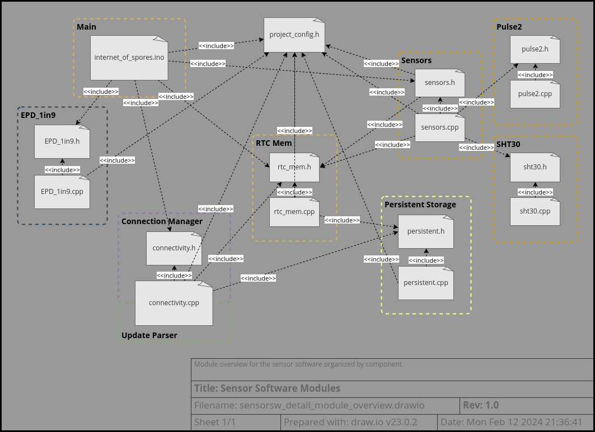

# Sensor Software Design
This outline is currently a work-in-progress.

## Table of Contents

* [Module Overview](#module-overview)
* [Project Configuration](#project-configuration)
* [Module Description](#module-description)
  - [Main Module](#main-module)
  - [RTC Mem](#rtc-mem)
  - [Persistent Storage](#persistent-storage)
  - [Connectivity](#connectivity)
  - [Sensors](#sensors)
  - [SHT30](#sht30)
  - [PPD42 Pulse Driver](#ppd42-pulse-driver)
  - [E-Paper Display Driver](#e-paper-display-driver)
* [Debugging and Unit Testing](#debugging-and-unit-testing)
  - [Development Mode](#development-mode)
  - [VCC Cal Mode](#vcc-cal-mode)
* [Future Improvements](#future-improvements)

---

## Module Overview

Refer to the [sensor software architecture](software_architecture.md) for an
overview of the component decomposition and logical architecture of the product.
The block diagram, repeated here, can serve as a high-level reference:  

In this overview, the correspondence between the logical architecture and the
individual software modules is indicated by the dashed-line regions.  
  
Later in the document, a detailed discussion of each module will be provided.

A couple of points are immediately apparent from examination of this diagram:
* project_config.h is a centralized locus of configuration information
* The RTC Mem component is more highly coupled than it should be
* connectivity.cpp is implementing two logical components

The later two points will be addressed in the
[future improvements section](#future-improvements).

---

## Project Configuration
- Describe configuration options, static modes, build ID
- Describe build system/toolchain

---

## Module Description
(configuration options, flow charts, classes, fault tolerance, notes, dependencies)
### Main Module
### RTC Mem
### Persistent Storage
### Connectivity
### Sensors
### SHT30
### PPD42 Pulse Driver
### E-Paper Display Driver

---

## Debugging and Unit Testing
### Development Mode
### VCC Cal Mode

---

## Future Improvements

