# System Architecture

## Table of Contents
* [Block Diagram](#block-diagrm)
* [Features](#features)
  - [Sensor Measurements](#sensor-measurements)
  - [Persistent Storage](#persistent-storage)
  - [Sensor Node Power Management](#sensor-node-power-management)
  - [Connectivity](#connectivity)
  - [Presentation](#presentation)
  - [FW Update](#fw-update)
* [System Modes](#system-modes)
  - [Reprogramming Mode](#reprogramming-mode)
  - [Configuration Mode](#configuration-mode)
  - [Normal Mode](#normal-mode)
  - [Deep Sleep](#deep-sleep)
  - [Upload Mode](#upload-mode)
  - [Download Mode](#download-mode)
* [Failure Modes](#failure-modes)
* [Cybersecurity](#cybersecurity)

---

## Block Diagram

Distributed sensor nodes are powered either by battery or by a USB power supply and communicate with a central server via WiFi.  
Sensor nodes act as WiFi stations and connect to a pre-configured access point. Sensors nodes are pre-configured with a DNS or IP address for the server on the local network.  
The server is running a [Node-RED](https://nodered.org/) instance which is listening for incoming connections. The Node-RED instance will parse out the sensor readings and store them in a time-series database like [InfluxDB](https://www.influxdata.com/).  
[Grafana](https://grafana.com/) can be used to provide a user-friendly interface to view the data. The Grafana instance could run on the same server or on a different server. Grafana provides an HTTP portal to view the data, so users can connect to it from other computers or smartphones that are connected to the network.

---

## Features
### Sensor Measurements
The following types of sensor measurement can be collected by the sensor nodes:
- Humidity  
  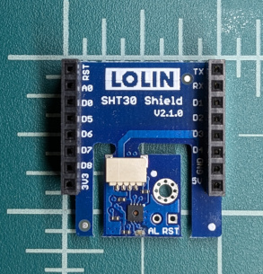
- Temperature
- Pressure  
  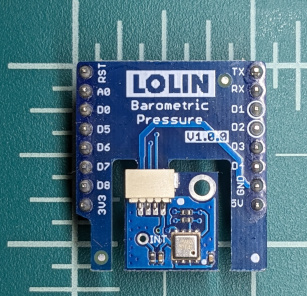
- Particle Counts  
  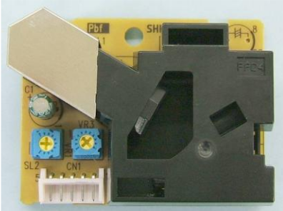
- Battery Level
- Uptime

Sensor nodes support a single point offset calibration for the different types of measurement that they can make. (Except for uptime.)  
A more advanced linear or quadratic calibration would be better, but it would require more burden for the end-user to perform the calibration and would not be likely to improve the overall experience since the sensor ICs have their own internal calibration depending on temperature that would conflict with the user calibration.

There is also a special timing constant that represents untracked time spent while entering and exiting deep-sleep. If necessary, this can also be calibrated.

The sensor nodes perform limited filtering in the form of averaging several measurements.  
This is necessary because the sensor ICs used are inexpensive and very noisy and because they are powered down in deep-sleep mode and don't have a lot of time to stabilize when the sensor node wakes up to take the measurement.

Additional filtering can be applied post-facto in Grafana.

### Persistent Storage
The following types of data are stored persistently within the sensor node's NOR Flash:
- Calibration values
- WiFi Credentials
- Configuration
  - Sensor Node Name
  - Node-RED server address and port
  - Upload interval (#of measurements to collect before uploading)
  - Sleep time (time between sensor readings)

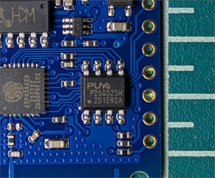

These configuration and calibration values can be modified over-the-air (see [FW Update](#fw-update) chapter) or by entering configuration mode (see [Connectivity](#configuration-mode) chapter).

Sensor readings are not stored in NOR flash and will be lost if power is removed from the unit.  
Sensor readings are stored in RTC RAM that is persistent through deep-sleep and only uploaded to the server occasionally (about every 20-30 minutes).

The sensor readings collected are stored in an InfluxDB time-series database.

### Sensor Node Power Management
Sensor nodes are primarily powered by battery.  
A LiFePO₄ battery can be use without any additional regulator circuitry as all components are tolerant of voltage between 2.9V - 3.6V.  

No battery charging capability is offered. Batteries should be removable so they can be replaced and recharged separately.

Sensor nodes can also be powered from a USB power supply.
The ME6211 LDO linear regulator on the Lolin D1 Mini board will step the voltage down to 3.3V.  
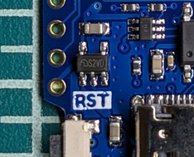

It is not recommended to power the board from USB while a battery is connected as it is likely that the LDO will attempt to "charge" the battery. This could overload the current capabilities of the LDO or could damage the battery.

Two types of firmware are supported:
1) Battery-powered - intended to use with a battery
2) Tethered - intended to use with an unlimited USB power source

#### Battery-powered
The battery-powered firmware will spend most of its time in deep sleep. Only waking up once per minute (configurable) to take sensor readings.

The sensor readings are stored in RTC RAM until the memory is full. This reduces the frequency of connecting to WiFi and allows sensor readings to be batched together to reduce transmission overhead.

When the battery is initially connected, it is often desirable to the user that they be able to see sensor readings updating immediately in their dashboard.  
To support this, the sensor node will transmit the first readings after one sleep period, the next batch after two sleep periods, then 4, 8, and so forth. Usually, the RTC memory will fill with readings once it exceeds 20-30 sleep periods and that becomes the limit for the delta time between uploads.

~Time (T) | ΔT     | #readings (ΣR)
----------|--------|---------------
T+1 min   | 1 min  | 2
T+2 min   | 1 min  | 3
T+4 min   | 2 min  | 5
T+8 min   | 4 min  | 9
T+16 min  | 8 min  | 17
T+32 min  | 16 min | 33
T+64 min  | 32 min | 65

Pressing the reset button will cause the sensor node to immediately wake from deep-sleep and collect another sensor reading.  
The sensor node has no mechanism to know how long it slept for, so waking it this way will cause inaccuracy in the measurement timestamps.

When the battery reaches a critically low voltage, the sensor node will enter deep-sleep permanently to avoid spurious sensor readings as the sensor ICs are only rated to work at 2.9V and above.  
This will also help to prevent under-voltage damage to the battery -- though, LiFePO₄ are relatively resistant to damage in this way.

#### Tethered
The tethered firmware supports the PPD42 particle sensor, which must remain powered (from 5V USB) to support proper airflow convection through the sensor.

The sensor node will connect to the WiFi and upload sensor readings immediately.  
The readings will only be stored in RTC RAM in case of connectivity issues that prevent uploading.

The sensor node will still use deep-sleep to implement a delay of 1 minute between readings (configurable).

### Connectivity
#### WiFi Manager Configuration
In [configuration mode](#configuration-mode), the sensor node will act as a soft access point and a WiFi connection can be made to it from a smartphone, tablet, or laptop computer.
Once connected, a "WiFi Manager" captive portal will be presented or will be accessible from the user's web browser by navigating to [http://192.168.4.1](http://192.168.4.1).

The captive portal allows configuration of the parameters for upload of the sensor readings.
- WiFi SSID
- WiFi password
- Node-RED server hostname
- Node-RED port

Connectivity to the access point will be tested before returning to normal mode.

#### Uploading Sensor Readings
The sensor node will periodically switch to [upload mode](#upload-mode) where it will configure itself as a WiFi station and connect to the configured access point. It will then create a TCP connection to the configured server and upload its readings.

The [Node-RED](https://nodered.org/) instance on the server is configured to listen for incoming connections on port 2880.  
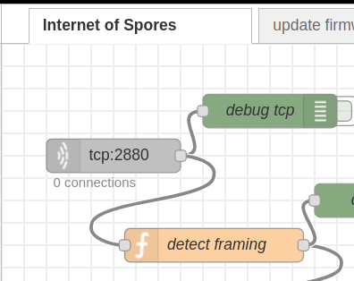

The Node-RED instance will reply with a status response including whether there are any firmware or configuration updates available for the sensor node. (See [FW Update](#fw-update) chapter below.)

The Node-RED instance will connect to InfluxDB on localhost port 8086 to store the sensor readings.  
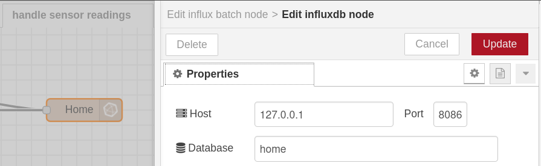

The Node-RED instance provides a web UI for configuration and programming via a web browser on port 1880.  
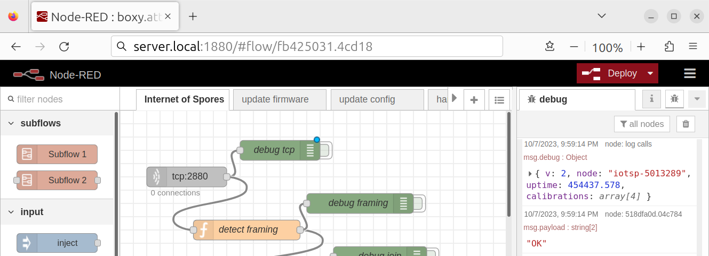

#### Grafana
[Grafana](https://grafana.com/) can be used to connect to the InfluxDB instance, either locally or remotely, using port 8086.

Grafana provides a web UI for a user to configure or view dashboards via a web browser on a configurable port (usually 80 or 8000).

### Presentation
#### Grafana
The primary means of presentation for the sensor readings is via a [Grafana](https://grafana.com/) dashboard, presented in the user's web browser.  
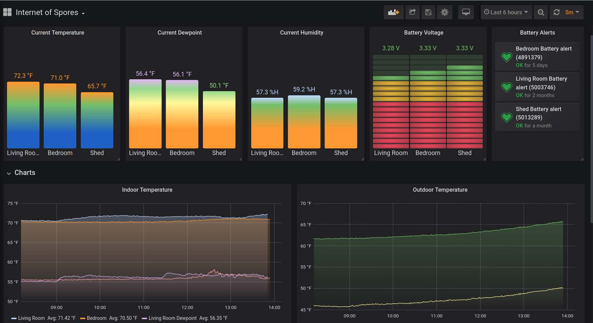

Grafana is highly configurable and has several pre-defined widgets available for charting time-series data, performing calculations with the data, and providing alerts.

The charts in Grafana are configurable, which provides a mechanism for giving friendly names to the individual sensor nodes.  
The sensor nodes have their own configurable name stored persistently, but this name is a key into the time-series database and changing it will break the continuity of the data over time.  
Additionally, it is simply easier to change the label in the Grafana dashboard as desired.

#### E-Paper Display
A Waveshare 1.9" Segmented E-Paper Display (EPD) is supported for live display of temperature and humidity readings and overall status.

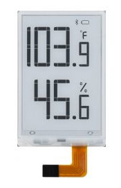

The display can be configured to display temperature readings in Celsius or Fahrenheit. This is currently a compile-time configuration.

The following status indications can be displayed:
- Connectivity  
  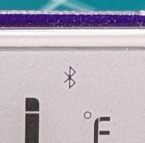
- Low Battery  
  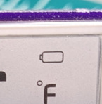
- °C/°F  
  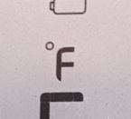
- Critically Low Batery
- Connection Failure  
  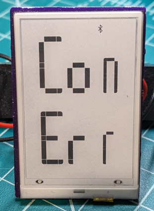
- Low Temperature

The EPD consumes no power when held in reset.

The EPD takes considerable time to refresh, especially at lower temperatures. Overall, it will reduce battery lifetime to approximately ⅓ of normal.

The EPD is not designed to work below 0°C. When a temperature below 0°C is detected, a final update to the display will be made to display a low temperature warning. After that, the display will be held in reset until temperatures rise above 0°C again.

(TODO: Photo of EPD)

When the battery voltage drops below a critical threshold, a final update to the display will be made to display a low battery message. After that the sensor node will enter deep-sleep until the battery is replaced.  
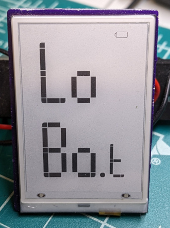

#### UART Logging
The USB port is connected to a CH340 USB-to-UART ASIC. This allows UART communication between a PC and the sensor node.

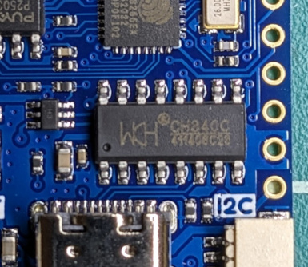

In the standard firmware, only a bare minimum of information is transmitted from the sensor node via UART. However, the software can be compiled with extra logging enabled, which will transmit the uncalibrated sensor readings along with information about WiFi connectivity.

> ⚠️ Caution: This additional logging will also expose the WiFi password.

The monitor.sh script can be used to easily monitor the sensor node UART from a typical PC shell.  
Alternately, there is a UART monitor built-in to the Arduino IDE.

The sensor node firmware ignores any received characters.

The UART is configured for 115200 baud, no parity, 1 stop bit.

### FW Update
#### USB Firmware Programming
Firmware in the sensor nodes can be updated via the USB port.  
See [reporgramming mode](#reprogramming-mode) for more details.

The flash.sh script can be used to program the firmware, as can the Arduino IDE.

#### Over-the-Air Firmware Programming
The sensor nodes support over-the-air (OTA) programming via special Node-RED flows.  
See [firmware download](#firmware-download) for more details.

Each build of the software includes a software fingerprint which is reported to Node-RED along with the sensor readings. This fingerprint is checked to see if any firmware updates are available.

An MD5 hash will be transmitted to the sensor node along with the firmware image. The sensor node will verify the hash and then program the firmware image into its NOR flash.

> ⚠️ Caution:  
> There is no authentication performed on the firmware images by the sensor node. An attacker with access to your WiFi network can trivially upload arbitrary firmware to the sensor nodes.

#### Over-the-Air Configuration
The sensor nodes support over-the-air (OTA) configuration updates via special Node-RED flows.
See [configuration download](#configuration-download) for more details.

A unique sensor node name (based on the ESP8266  serial number) is reported to Node-RED along with the sensor readings. Node-RED will check to see if there are any configuration files available for that sensor node.

An MD5 hash will be transmitted to the sensor node along with the configuration file. The sensor node will verify the hash and then program the firmware image into its SPI Flash File System (SPIFFS).

> ⚠️ Caution:  
> The sensor node name is also configurable. Care must be taken to ensure that it remains unique.

---

## System Modes
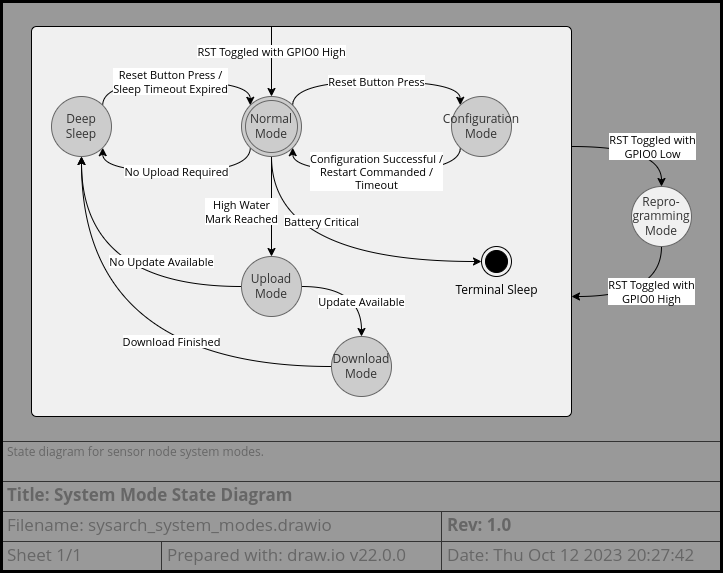

### Reprogramming Mode
The CH340 USB-to-UART ASIC has RTS and DTR signals that can be set by the PC terminal interface. These are used to hold GPIO0 low while toggling the ESP8266's reset pin, which [causes it to enter UART boot mode](https://docs.espressif.com/projects/esptool/en/latest/esp8266/esptool/entering-bootloader.html).

In the UART boot mode, [a SLIP-based protocol](https://docs.espressif.com/projects/esptool/en/latest/esp8266/advanced-topics/serial-protocol.html) is used to communicate with the ROM firmware and update the flash memory.  
In principle, 921600 baud is possible, but this seems to be buggy and most tools use 460800 baud.

The ESP8266 toolchain includes an esptool.py script to support reprogramming part or all of the SPI flash via this USB-to-UART interface.  
The flash.sh script in this project makes this easier by supplying many of the esoteric command line options necessary to use esptool.py properly.

### Configuration Mode
Pressing the reset button when the sensor node is not in deep-sleep will cause it to reboot into configuration mode.
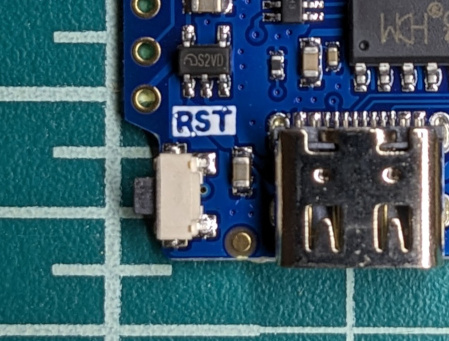
This is most effectively done by double-pressing the reset button since the sensor node is usually in deep-sleep.

In this mode, the sensor node is configured as a "Soft-AP" and will allow other devices to connect to it. Once connected, a "WiFi Manager" captive portal will be presented or will be accessible from the user's web browser by navigating to [http://192.168.4.1](http://192.168.4.1).  
The captive portal will allow modification of the configuration parameters.

Connectivity to the configured access point will be tested before returning to normal mode.  
A failsafe timeout will cause the sensor node to return to normal mode without saving the settings.

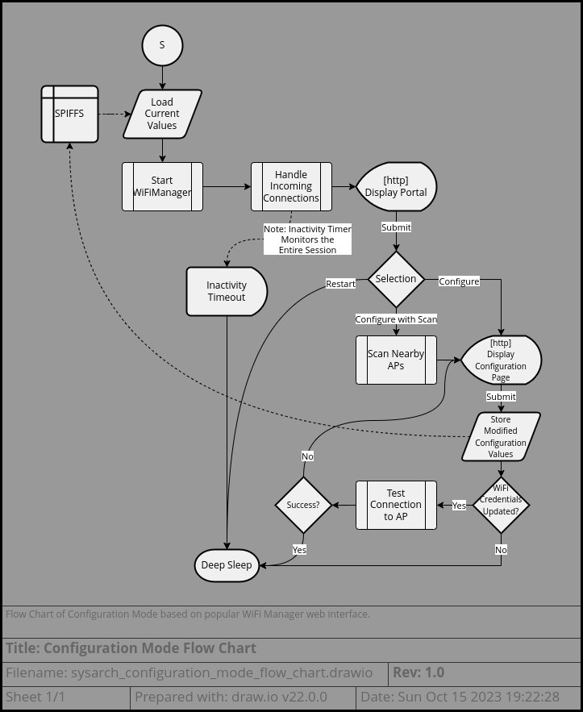

### Normal Mode
In normal mode, the sensor node reads and filters its sensors, stores the sensor readings in RTC RAM, and then enters deep sleep mode.  
During this time, some additional activities can happen:
* If it determines it is time to upload readings, it will enter upload mode.  
  This determination is made when the RTC RAM is sufficiently full or based on other factors described in [Sensor Node Power Management](#sensor-node-power-management)
* If the server reports that there are firmware updates or configuration updates available, it will enter download mode.
* If the RTC RAM is determined to be corrupted, it will be re-initialized.  
  This happens when power is first applied to the ESP8266 or after installing a firmware update.

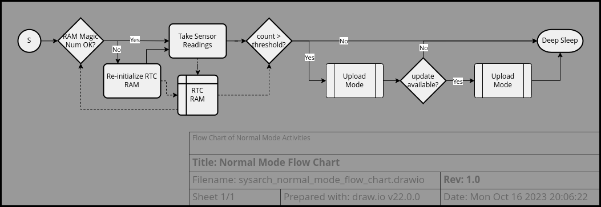

### Deep Sleep
The sensor node spends most of its time in deep sleep mode.  
In this mode, the processor is in its lowest power state with most peripherals disabled. Extra care is taken to disable the WiFi radio, even though this will result in extra time spent waking up and calibrating the radio when the next upload cycle is reached. The main processor peripheral still running is the RTC module.

This RTC module has a simple alarm timer and control of GPIO16, which it will pull low when the alarm expires. By connecting the link between GPIO16 and the reset pin, this will cause the processor to wake.
> 🪧 Note:  
> On the D1 Mini, a suitable resistor or Schottky diode should be used to link GPIO16 and RST or else the CH340 will not be able to pull the reset pin low and enter reprogramming mode automatically.

Upon waking, the processor will have gone through a reset. Only the RTC RAM is retained uninitialized, and this is used to maintain application state through the deep sleep mode.

### Upload Mode
The sensor node will periodically configure itself as a WiFi station and connect to the configured access point. It will then create a TCP connection to the configured server and upload its readings.

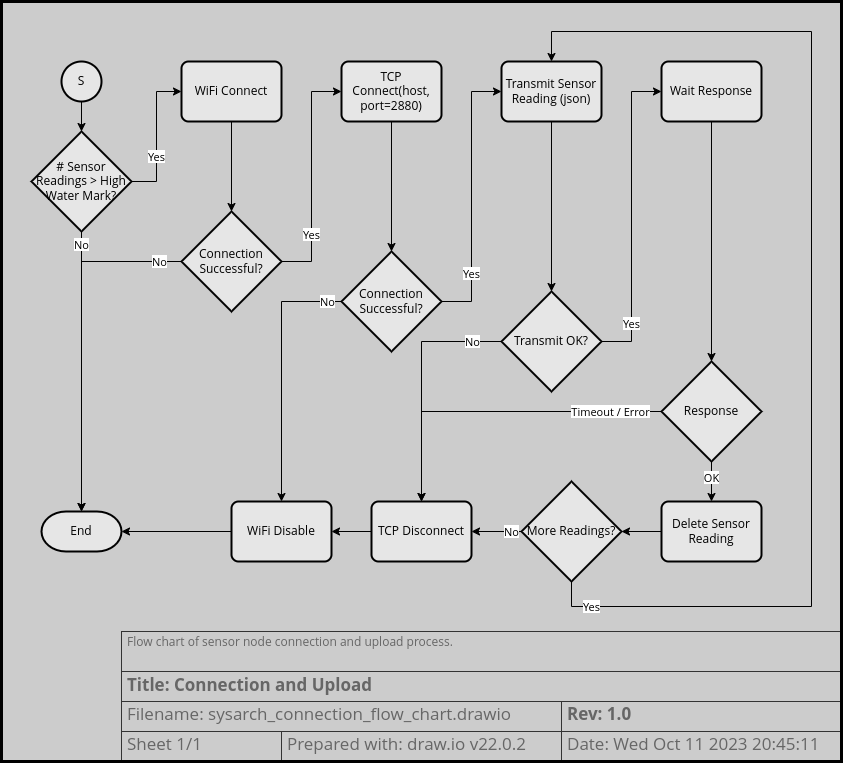

The sensor readings are uploaded as a json string that the Node-RED flows know how to parse.

The Node-RED instance will reply with a simple status string indicating whether each batch of sensor readings was received correctly and whether there are any firmware or configuration updates available for the sensor node.

The Node-RED instance will parse the sensor readings and format them for injection into the [InfluxDB](https://www.influxdata.com/) instance.  
In particular, it will compute the absolute timestamp for each sensor reading from the sensor node's provided delta timestamps.

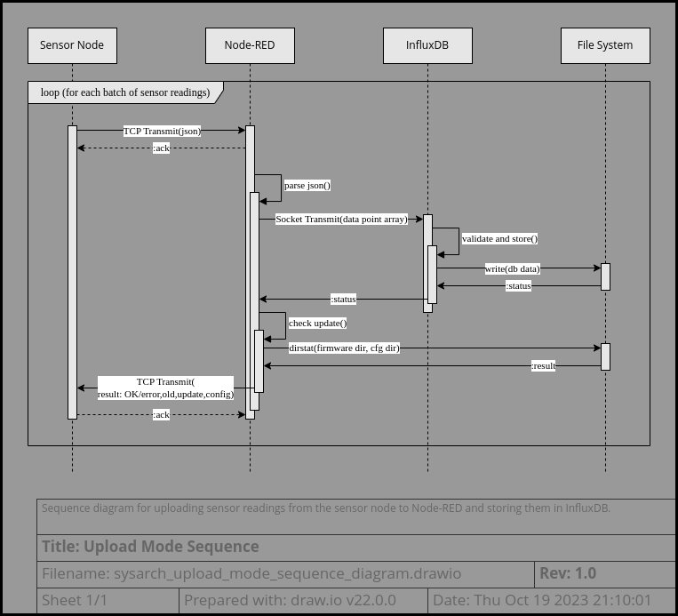

### Download Mode
The Node-RED server can respond with status strings that inform the sensor node that there are updates available for it. The sensor will then request these updates and apply them.  
There are 2 types of update:
1) [Firmware Updates](#firmware-download)
2) [Configuration Updates](#configuration-download)

#### Firmware Download
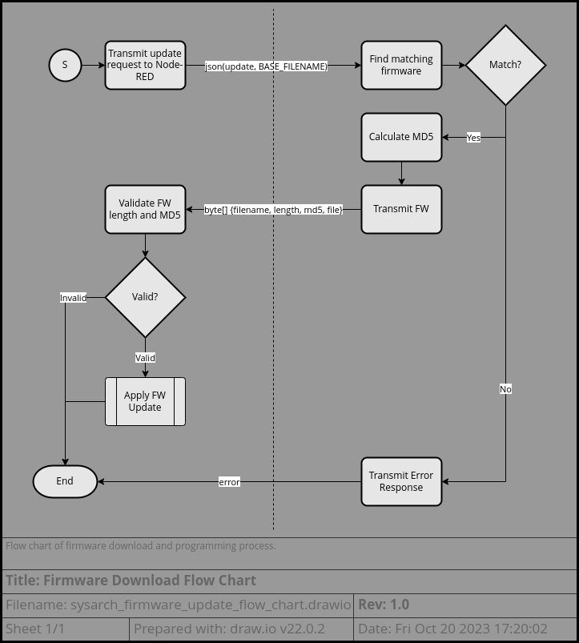

Each build of the software includes a software fingerprint which is reported to Node-RED along with the sensor readings.

Node-RED can compare the software fingerprint to the filenames in its "firmware/" directory. If the sensor node is not reporting a valid software fingerprint, the Node-RED flows will transmit a valid firmware image along with its MD5 hash to the sensor node.  
The sensor node will verify the MD5 hash and program the firmware image into its NOR flash memory.

> 🪧 Note:  
> The Node-RED flows will not update the firmware if there is a matching firmware binary present in the firmware/ directory. Old firmware images must be removed in order for the update process to be triggered.

> 🪧 Note:  
> The fingerprint used does not provide a deterministic ordering. If multiple firmware images are present, the one that is uploaded to the sensor node will essentially be determined at random.

> ⚠️ Caution:  
> There is no authentication performed on the firmware images by the sensor node. An attacker with access to your WiFi network can trivially upload arbitrary firmware to the sensor nodes.

#### Configuration Download
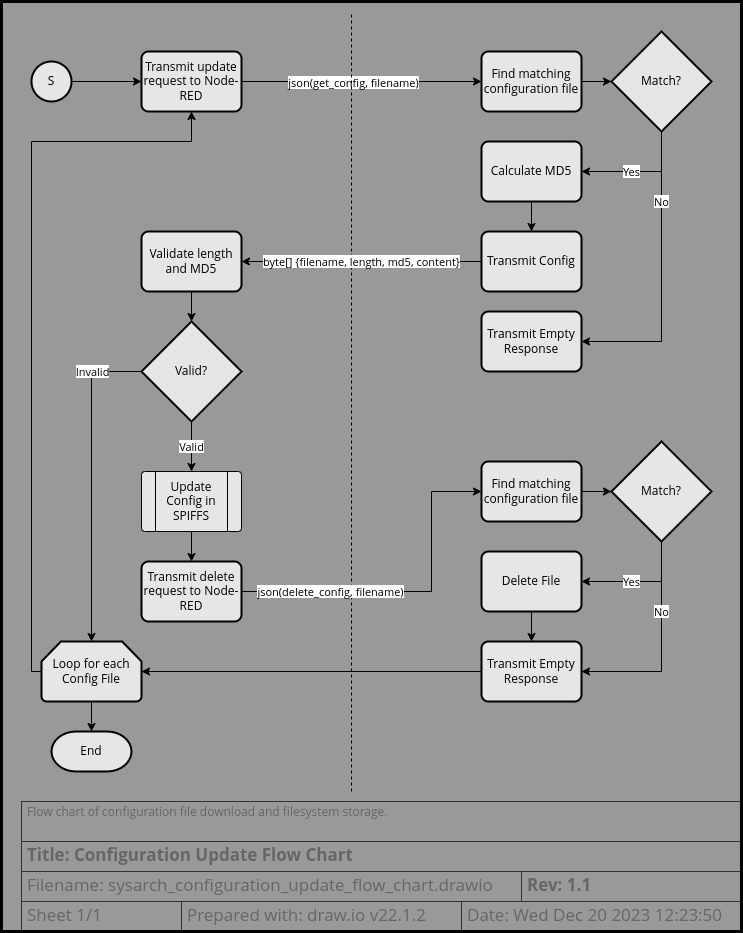

A unique sensor node name (based on the ESP8266  serial number) is reported to Node-RED along with the sensor readings. The Node-RED flows can check for configuration files for that sensor node in the "sensor-cfg/" directory. These files will be transmitted to the sensor node along with an MD5 hash  
The sensor node will verify the MD5 hash and then update the configuration value in its NOR flash memory.  
After the sensor node confirms that the update has been received, Node-RED will delete the configuration file.

> ⚠️ Caution:  
> The sensor node name is also configurable. Care must be taken to ensure that it remains unique.

---

## Failure Modes
### Server Connectivity Failure
The sensor node may fail to connect to the network or Node-RED server.

Impact:  
Sensor reading will not get uploaded and the sensor node's RTC memory may overrun.

Mitigation:  
The sensor node will replace the oldest sensor readings in its RTC memory when it overflows. Additionally, after 2 consecutive connection failures, it will begin doubling its sleep time with each consecutive failure.

This serves two purposes when faced with an extended connectivity outage:
1) It will preserve the battery life as repeated connection attempts (and associated retries) would otherwise drain the battery rapidly.
2) It will extend coverage of the fixed quantity of sensor readings stored in RTC memory over a longer period by increasing the time between readings.

Example:  
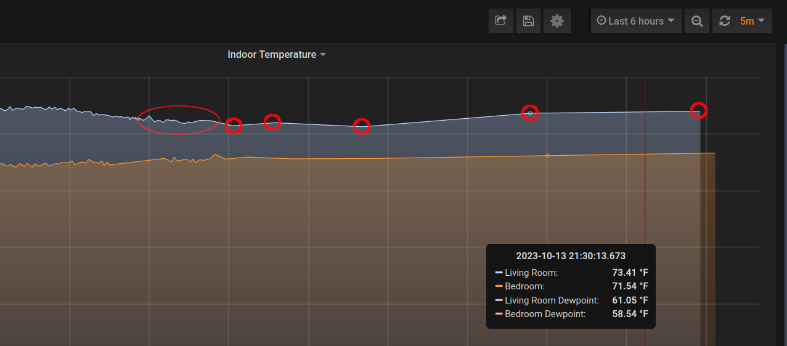  
(Note the circled readings spreading out over longer periods of time in order to maximize the RTC buffer in the face of several hours of connection failure.)

### Sensor Upload Failure
It is possible that the sensor node will connect to the Node-RED server but fail to upload all of its readings.

Impact:  
Sensor readings may get lost.

Mitigation:  
The sensor node will retain any readings that weren't successfully acknowledged by the server and attempt to upload them again later.

The reaction process from [above](#server-connectivity-failure) continues to apply, which is important if a connection to the server is made but repeatedly fail to transmit any readings successfully.

### Network Packet Corruption
#### Sensor Packet Corruption
The sensor readings could get corrupted when transmitting to the Node-RED server.

Impact:  
Sensor readings may get lost or be recorded incorrectly.

Mitigation:  
TCP checksum is generally considered sufficient to protect the sensor data packets.  
In case the packet is dropped, a timeout will allow the sensor to go back to sleep and retry the transmission later.  
In case the packet is received but fails to parse properly, the Node-RED server will reply with a NACK instead of an ACK. The sensor node will only clear readings that are acknowledged; other readings will be retained and retransmission will be attempted later.

#### Over-the-Air Update Failure
The update file transmitted from the Node-RED server may be corrupted in transmission.

Impact:  
Accepting a corrupted file could result in the sensor node crashing or behaving incorrectly.

Mitigation:  
The sensor node will verify the MD5 hash that is transmitted with the file before accepting it.

### Software Version Mismatch
The sensor nodes may have a version of software that is incompatible with the Node-RED server.

Impact:  
Server will not be able to parse the packets or may misinterpret them.

Mitigation:  
The sensor readings have an API version that the server can use to maintain backward-compatible message parsing and detect messages that it doesn't know how to interpret.  
The server will reply with a NACK response.

### Low Battery Failure
When the battery voltage drops it may go below the allowable range for proper operation.

Impact:  
There may not be enough power to properly connect to the WiFi network or refresh the E-Paper Display (EPD).
The sensor ICs may misbehave and record spurious readings.

Mitigation:  
Battery voltage is monitored and reported to the server.  
When battery drops to low levels, this can be monitored in the Grafana dashboard and alerts can also be configured to highlight the need for replacement. A low battery indicator will be enabled on the EPD.  
When battery drops to critical levels, a more obvious low battery warning will be displayed on the EPD and the sensor will enter a permanent deep-sleep.

### Failure to Report
Some unknown failure may occur or the sensor node could stop reporting due to low battery or other failure.

Impact:  
Extended periods without sensor readings may elapse before the user notices.

Mitigation:  
The Grafana server can be configured with alerts when no readings are received for a period of time.  
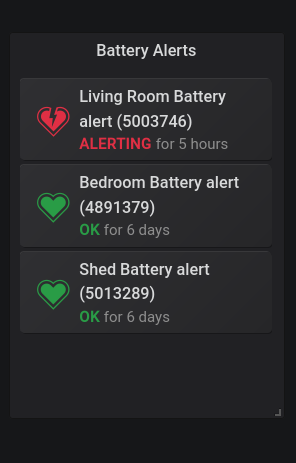

### Failure to Wake
If the RTC is unable to pull GPIO16 low or if some problem causes the alarm to fail, the processor will sleep indefinitely. The most common cause is corrosion on the reset and GPIO16 pins. I suspect that the use case here accelerates this corrosion, especially in humid environments. Possibly some units have abnormally high leakage currents in sleep mode that cause this corrosion.

Impact:  
The sensor node will not report in and the reset button will have to be pressed manually to wake it.

Mitigation:  
The situation is handled much the same as [Failure to Report](#failure-to-report) above. Monitoring in the dashboard can catch nodes that haven't reported recently and a pattern of failures may indicate hardware replacement.  
Cleaning with 99% isopropyl alcohol can remove the corrosion and restore service temporarily. A conformal coating or non-conductive lacquer may prevent corrosion.

### Node-RED Server Failure
The Node-RED server may freeze, crash, or get stuck in a busy-loop.

Impact:  
The server will not be able to accept incoming connections.

Mitigation:  
The Node-RED flows include a periodic state-of-health message that is printed to the console. The provided soh-monitor.sh script can monitor the systemd journal for these state-of-health messages and restart the Node-RED server if a timeout is exceeded.

---

## Cybersecurity
> ⚠️ Caution:  
> Very little attention has been paid to cybersecurity implications of this system.  
> It is strongly encouraged to only run it on a local network and preferably only give the sensor nodes access to a "guest" WiFi AP which has restricted access to the rest of your network.  
> While the Grafana dashboard supports login credentials, it is unknown to this author whether Grafana's security is adequate for exposure to the public internet.

### WiFi Credential Storage on Sensor Nodes
The ESP8266 does not have any security for the storage of WiFi credentials. Anyone with physical access to the sensor nodes can trivially read out the WiFi SSID and password. These credentials are stored in external SPI flash memory, which can be easily dumped with low cost tools. Additionally, the firmware can be easily replaced via USB [see above](#usb-firmware-programming), so a program can be loaded to simply print out the stored credentials.
> ⚠️ Caution:  
> Don't leave sensor nodes outdoors where physical access is available to the public who can trivially dump your WiFi credentials and gain access to your internal network.  
> **I call this "the evil gardener" attack.**

### Security of Sensor Readings
#### Insecurity of Transmitted Sensor Readings
The sensor readings are transmitted from the sensor nodes in cleartext without authentication of the server.

Anyone with access to the network can sniff the network traffic and observe the sensor readings.

It is probably also easy to get the sensor nodes to connect to an attacker-controlled Node-RED server, either by intercepting and redirecting the traffic, by subverting the hostname lookup, or by providing a WiFi AP with the same SSID that the server may connect to preferentially.

The default Node-RED configuration allows anyone to log in to the flow editor (on port 1880) and view the debug information, which includes raw sensor readings.

> ⚠️ Caution: Only run Node-RED in a trusted local network environment.

#### Personal Implications of Insecure Sensor Readings
It may seem that the availability of sensor readings do not pose a serious concern. However, in many cases the sensor readings can serve as an effective human presence detector. With even limited knowledge, an attacker may be able to identify and track individuals based on the sensor readings.  
Further, access to the InfluxDB or Grafana dashboard could provide extensive historical data that could be mined to understand individual behavior patterns.

Individuals or organizations intending to deploy sensors of this type will need to perform their own threat analysis and risk assessment.

> ⚠️ Caution:  
> In situations where knowledge of the movement or presence of personnel could pose a threat to operational security, these sensors should not be used.

> 🪧 Note:  
> Persons or organizations that have restrictions regarding the storage of personally-identifiable-information should conduct an assessment of whether the transmission or storage of sensor readings will violate any data privacy laws.

### Node-RED Security
By default, the Node-RED flow editor is unsecured. Anyone with access to the network can modify its behavior and responses to the sensor nodes. As mentioned [above](#insecurity-of-transmitted-sensor-readings), anyone with access can trivially monitor the incoming sensor readings.

> ⚠️ Caution: Only run Node-RED in a trusted local network environment.

This page, [Securing Node-RED](https://nodered.org/docs/user-guide/runtime/securing-node-red), provides some information on how to improve the security of Node-RED and add user-authentication. However, it is still probably unwise to expose Node-RED to the public internet.

> 🪧 Corollary:  
> Without implementing the mentioned additional security, it is advisable to only run Node-RED on a separate network from the WiFi AP that the sensor nodes connect to. The use of a network tunnel can still allow the sensor nodes to upload their readings without exposing the admin interface on the high-risk WiFi network.

The TCP connection on port 2880 between the sensor nodes and Node-RED is unauthenticated. The sensor nodes will connect to any server and believe that it is the correct destination.  
Further, the sensor nodes will obey any response received from the Node-RED server -- including [firmware updates](#over-the-air-firmware-programming). This makes it relatively trivial for an attacker with access to the WiFi network (or who can spoof the network) to upload arbitrary firmware to the sensor nodes.  
The implications of this threat are unexplored by the author of this document.

> 🪧 Note:  
> It is probably advisable to regularly audit the firmware loaded on each sensor node and to regularly change the WiFi credentials.  
> Where possible, use a "guest" WiFi AP to isolate the sensor nodes from the rest of your internal network and only allow them access to port 2880 of the Node-RED server.

### InfluxDB Security
By default, the InfluxDB instance is listening on TCP port 8086 for incoming connections without any authentication. An attacker could issue arbitrary queries or inject their own data.

If Node-RED and Grafana are running locally, InfluxDB could be configured to only listen on localhost or an appropriate firewall configuration could prevent access from outside network interfaces.

This page, [Manage security and authorization](https://docs.influxdata.com/influxdb/v2/security/), may provide tips for setting up authentication within InfluxDB. However, it is still probably unwise to expose InfluxDB to the public internet.

> 🪧 Corollary:  
> Without implementing the mentioned additional security, it is advisable to only run InfluxDB on a separate network from the WiFi AP that the sensor nodes connect to.

### Grafana Security
By default, the Grafana server does not require user authentication. Anyone with access to the local network can view the sensor readings.  
Typically, users can also create their own dashboards to execute arbitrary queries to the InfluxDB database. The implications of this threat are unexplored by the author of this document.

This page, [Configure security](https://grafana.com/docs/grafana/latest/setup-grafana/configure-security/), provides some information about securing a Grafana instance. However, it is probably unwise to expose Grafana to the public internet.

> 🪧 Corollary:  
> Without implementing the mentioned additional security, it is advisable to only run Grafana on a separate network from the WiFi AP that the sensor nodes connect to.
