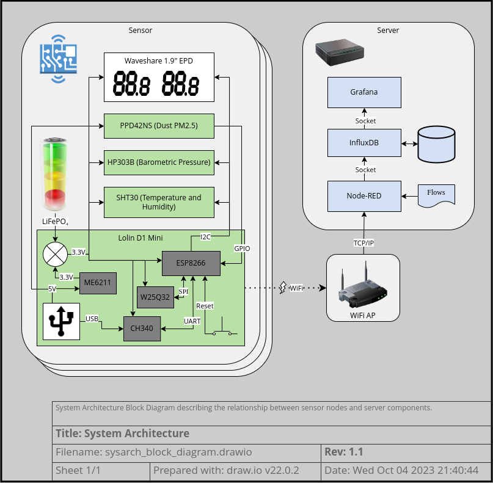

# System Architecture
This outline is currently a work-in-progress.

## Block Diagram

## Features
### Sensor Measurements
- Humidity
- Temperature
- Pressure
- Particle Counts
- Battery Level
- Uptime
- Calibration (single point offset calibration)
- Filtering

### Persistent Storage
- Calibration values
- WiFi Credentials
- Configuration
  - Sensor Node Name
  - Node-red server address and port
  - Celsius vs Fahrenheit display
  - Sleep time
- InfluxDB (Sensor Readings)

### Sensor Power Management
- Battery Power (LiFePO4)
- Deep Sleep
- USB Power
- Reset Button

### Connectivity
- WiFi Setup (Soft AP) with WiFi Manager
- WiFi STA
- Sensor to Node-red connectivity (including port #)
- Node-red to InfluxDB
- Grafana to InfluxDB

### Presentation
- Grafana Dashboard
  - Node Names
- E-Paper Display
  - Connectivity
  - Celsius vs Fahrenheit
  - Low Battery
  - Connection Failure
  - Low Temperature

### FW Update
- USB Update
- OTA FW Update
- OTA Calibration (configuration?) Update

## Failure Modes
- Server Connectivity
- Sensor Upload
- OTA Reception
- Grafana Sensor Alert (monitoring)
- Node-red packet parsing
- Node-red SOH monitoring

## Cybersecurity
- WiFi Credential Storage (insecure)
- InfluxDB Security (??, not explored)
- Grafana Security (login, not explored)
- Node-red Security (none, even for FW OTA)
- Note about PII (many sensors act as effective human presense detectors)
- Note about leaving sensors outside (or the evil gardener attack)

